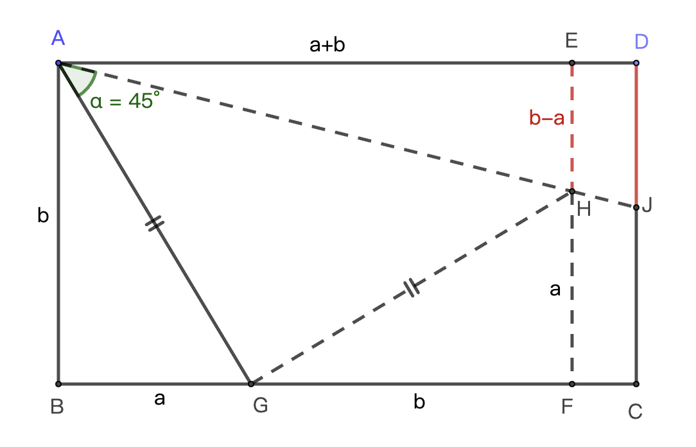
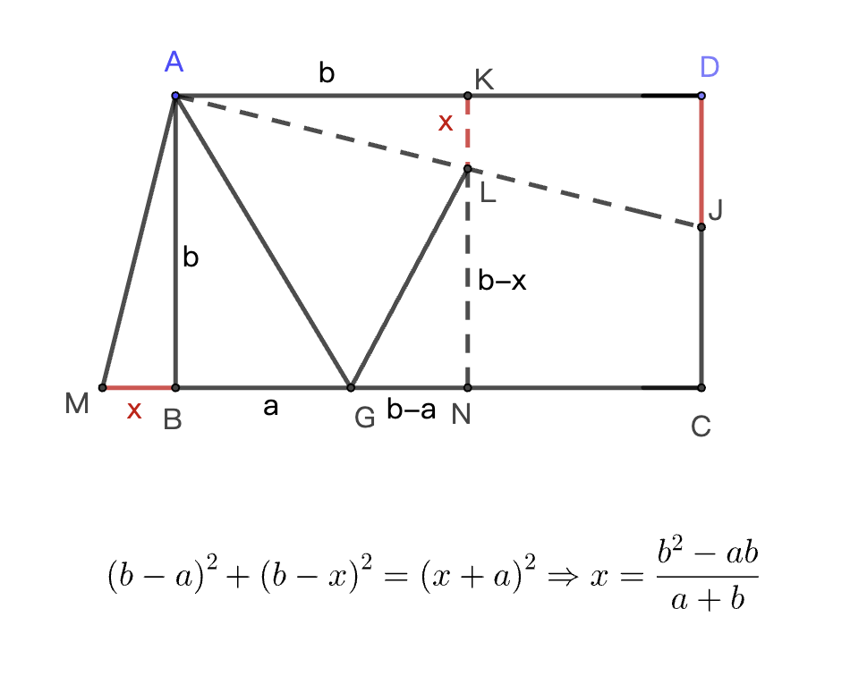

# 12345 模型

一个直角，被分成3个角，其中一个是45度，其它两个角的tan值为 1/2 和 1/3。这3个条件是知二推一。相当于一个特殊型，通过这个特殊型，我们在不使用高中三角函数的前提下来探究一下更通用的规律。

# 通用解1

\begin{equation}
\begin{aligned}
&思路：在直线AD上找到一个点E，使|AE|=a+b。E有可能在D左侧，也有可能在D右侧。\\
&我们只关注一点：|AE|=a+b \\
&易证\triangle ABG \cong \triangle GFH \Rightarrow |EH|=b-a \\
&再利用\triangle AEH \sim \triangle ADJ，得出|DJ| 的值
\end{aligned}
\end{equation}

# 通用解2

# 总结

其实是构造了三垂直模型/半角构造出全等三角形后，进一步使用相似三角型的求出题目所要求的线段长。
