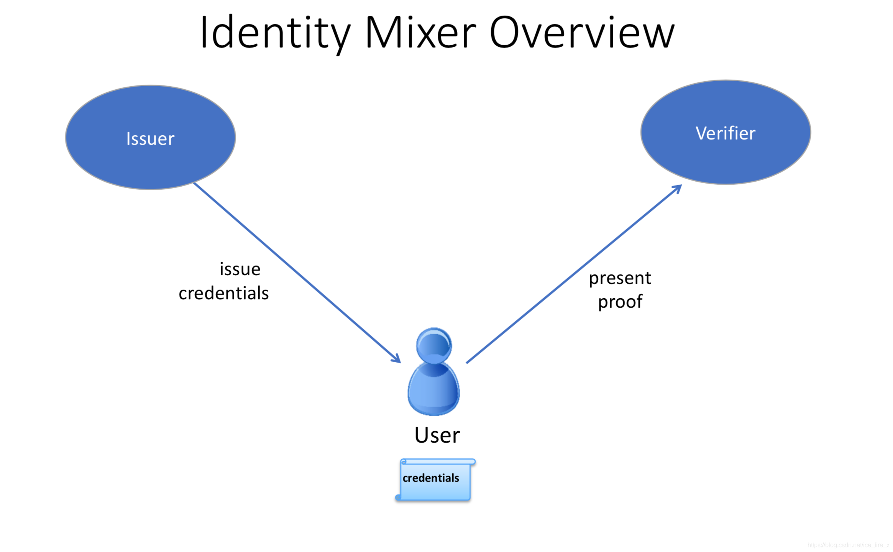
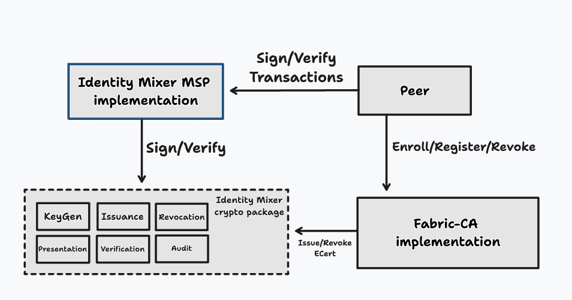
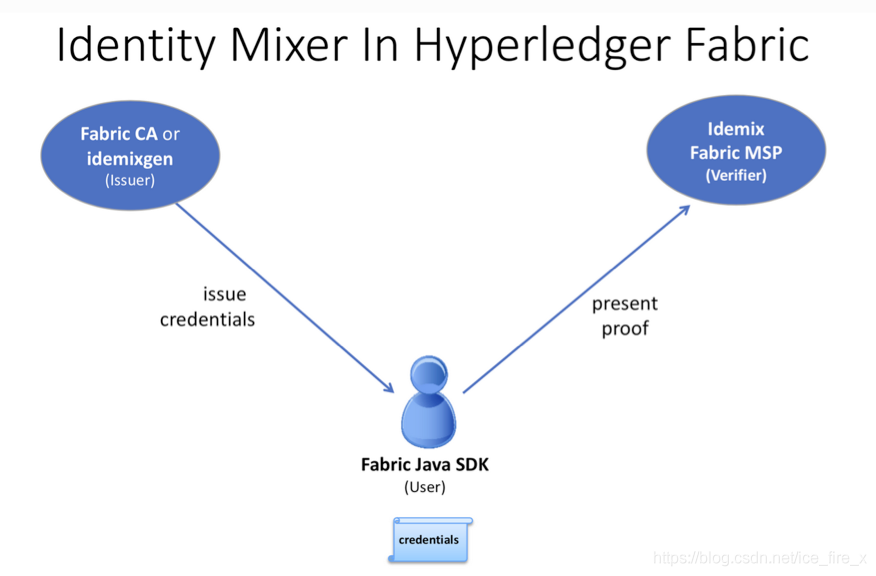
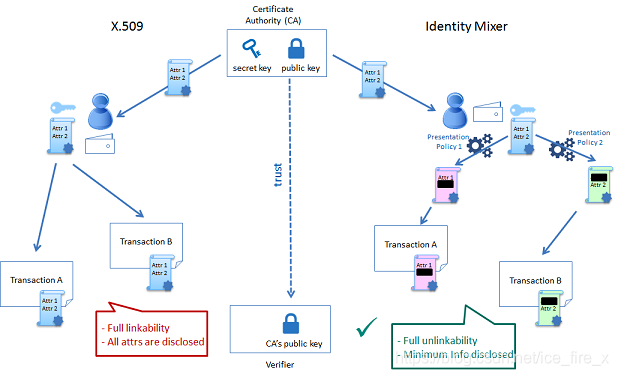
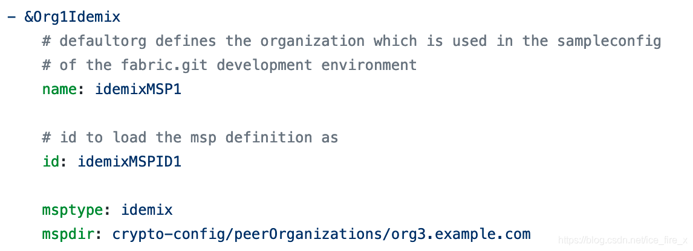

[抄自这个链接](https://blog.csdn.net/ice_fire_x/article/details/104639727)
# Idemix是什么
Idemix(Identity Mixer)的核心是零知识证明(Zero Knowledge Proof)，用户无需暴露私有数据以及任何有用的信息，也能证明自己拥有这些私有数据，对方能够进行有效验证，这就是零知识证明。

Idemix是一个密码协议套件(X.509+加密算法)，保留隐私实现匿名性，交易时不用透露交易者的身份，而且交易间是无关联的，不可往前追溯。

Identity包含三个角色，包括用户(User)、发行者(Issuer)、验证者(Verifier)，各自作用如下：
- 用户：通过Idemix生成一个proof，证明自己知道某个秘密
- 发行者：(Fabric CA或idemixgen工具)验证用户的隶属属性，然后颁发一个证书
- 验证者：(fabric MSP)验证proof

# Idemix的实现
Fabric中Peer通过Fabric CA进行Enroll、Register、Revoke的操作、还可以通过Identity Mixer对交易进行签名验签的操作；Identity Mixer和Fabric CA都需要调用加密包进行具体的流程。

## 带有Identity Mixer的MSP
除了X.509证书外，还可以通过发行Idemix凭据来实现MSP。fabric MSP作为验证者（Verifier），发行者为用户颁发数字证书，用户生成Idenmix凭据后向验证者提供proof，用于验证属性是否正确。目前Idemix凭据只支持3个属性，包括：
- OU
- isAdmin
- Enrollment ID

# Idemix的特性
Idemix与X.509的相同点：
- 一组属性被签名，且签名不可伪造
- 凭证通过密码学的方式绑定到一个密钥

Idemix与X.509的不同点：
- Idemix通过零知识证明来确保不会泄露知识或信息，并且用户拥有凭证密钥；而X.509通过最初签名的公钥来验证，知道私钥的人才能生成证明；
- Idemix是各个信息间是无关联的，且不可往回追溯；而X.509显示所有属性，因此所有用于签发交易的X.509证书使用都是关联的。

Idemix与X.509是可以共存的，可以通过在configtx.yam里面指定“msptype: idemix”来支持Idemix，如下所示：

Idemix仍然有一些局限性：

- 只支持固定的属性，例如OU、Role attribute、Enrollment ID、Revocation Handle attribute等；
- 不支持Idemix的撤销
- Peers还不能使用Idemix来进行背书，目前Peers的Idemix MSP只是用来验证签名，Idemix签名只能通过客户端SDK来进行；
- 建议每个channel或每个网络只使用一个基于Idemix的MSP，因为Idemix当前仅提供同一组织（MSP）中client的匿名性。