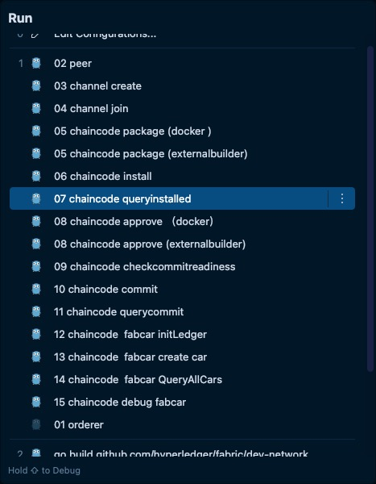

基本抄袭自[Goland/Vscode调试Hyperledger Fabric 2.0源码、单机网络（傻瓜式调试）](https://blog.51cto.com/u_14834727/3031542)
# 引言
fabric代码修改后，想要在本地调试，搭建调试环境觉得都挺麻烦的。官方文档结合谷歌，记录一下`solo`模式的一个方案。目前官方最新版的fabric代码已经不支持`solo`模式了。所以，本文适合支持`solo`模式的`Fabric`版本。

## 目标：
- 启动一个`peer`和一个`orderer`
- 使用fabric/sampleconfig下的配置文件（一个组织SampleOrg）,生成创世块和通道配置
- 创建通道`myc`, `peer` 加入通道
- 用`fabric-sample`中的`fabcar`作为例子，打包、安装、审核、提交链码，再初始化账本，创建一辆`car`,查询所有`car`。
- 所有命令执行都使用`debug`模式，无需手动输入任何`peer`命令。
- 可调试链码

# 准备工作

## fabric代码
拉取代码后，在代码目录下创建配置文件目录
    ```shell
    cd fabric
    mkidr -p dev-network/config
    ```
## 拷贝配置文件、外部构建程序、链码demo
    ```shell
    cp -r sampleconfig/* dev-network/
    cp -r integration/externalbuilders dev-network/
    cp -r $GOPATH/src/github.com/hyperledger/fabric-samples/chaincode $GOPATH/src/github.com/hyperledger/fabric/dev-network/
    ```
## 拷贝完后dev-network目录结构如下:
    ```
    ├── chaincode
    │   ├── abac
    │   ├── abstore
    │   ├── fabcar
    │   ├── marbles02
    │   ├── marbles02_private
    │   └── sacc
    ├── config
    ├── configtx.yaml
    ├── core.yaml
    ├── externalbuilders
    │   ├── binary
    │   └── golang
    ├── msp
    │   ├── admincerts
    │   ├── cacerts
    │   ├── config.yaml
    │   ├── keystore
    │   ├── signcerts
    │   ├── tlscacerts
    │   └── tlsintermediatecerts
    └── orderer.yaml
    ```
## 修改peer配置文件dev-network/core.yaml
找到fileSystemPath，修改存储路径
```yaml
peer:
    fileSystemPath: $GOPATH/src/github.com/hyperledger/fabric/dev-network/production/peer
```

使用docker跑链码配置（不支持调试chaincode）：peer会调用docker api执行构建、运行链码等操作。
找到vm,修改endpoint和docker配置（请根据实际情况，修改成你自己docker配置）**这个没验证过**
```yaml
vm:
    endpoint: tcp://192.168.99.100:2376
    docker:
        tls:
            enabled: true
            ca:
                file: /Users/USER/.docker/machine/machines/demo/ca.pem
            cert:
                file: /Users/USER/.docker/machine/machines/demo/cert.pem
            key:
                file: /Users/USER/.docker/machine/machines/demo/key.pem
```

外部跑链码配置（支持调试chaincode)
```yaml
chaincode:
    externalBuilders:
    - path: $GOPATH/src/github.com/hyperledger/fabric/dev-network/externalbuilders/golang
    name: external-golang
    environmentWhitelist:
    - GOPROXY
    - GOCACHE
    - GOPATH
```

>注意：package的时候label标签需要以-external结尾，eg:--label fabcarv1-external，如果需要修改默认的规则，请修改dev-network/externalbuilders/golang/bin/detect脚本
```shell
if [[ "$(jq -r .label "$2/metadata.json")" != *-external* ]]; then
    >&2 echo "only golang chaincode named with an '-external' suffix is supported"
    exit 1
fi
```

## 修改orderer配置文件dev-network/orderer.yaml

    修改创世块文件位置（OPT，可不修改，后面01 orderer调试配置中有环境变量ORDERER_GENERAL_GENESISMETHOD和ORDERER_GENERAL_GENESISFILE指定了创世块的位置）
    ```yaml
    General:
        BootstrapFile: $GOPATH/src/github.com/hyperledger/fabric/dev-network/config/orderer.block
    ```
    修改账本数据目录
    ```yaml
    FileLedger:
        Location: $GOPATH/src/github.com/hyperledger/fabric/dev-network/production/orderer
    ```
## 生成创世块和通道配置
    ```shell
    cd dev-netwok
    # 创世块
    $GOPATH/src/github.com/hyperledger/fabric/build/bin/configtxgen -profile SampleDevModeSolo -channelID sys-channel -outputBlock ./config/orderer.block
    # 通道配置
    $GOPATH/src/github.com/hyperledger/fabric/build/bin/configtxgen -profile SampleSingleMSPChannel -outputCreateChannelTx ./config/myc.tx -channelID myc
    ```
## 导入项目
  - 用goland打开`$GOPATH/src/github.com/hyperledger/fabric`目录，会在当前目录下自动生成`.idea`目录
  - 修改golang项目配置
    ```shell
    cd $GOPATH/src/github.com/hyperledger/fabric
    vim .idea/workspace.xml
    ```
  - 在`workspace.xml`中的`project`节点下添加RunManager组件（用于调试或运行peer 和orderer等相关命令）
    ```xml
    <component name="RunManager" selected="Go Build.14 chaincode  fabcar QueryAllCars">
        <configuration name="01 orderer" type="GoApplicationRunConfiguration" factoryName="Go Application">
        <module name="fabric" />
        <working_directory value="$PROJECT_DIR$/" />
        <envs>
            <env name="FABRIC_CFG_PATH" value="dev-network" />
            <env name="ORDERER_GENERAL_LOCALMSPID" value="SampleOrg" />
            <env name="ORDERER_GENERAL_GENESISFILE" value="config/orderer.block" />
            <env name="ORDERER_GENERAL_GENESISMETHOD" value="file" />
            <env name="ORDERER_GENERAL_LISTENADDRESS" value="0.0.0.0" />
        </envs>
        <kind value="FILE" />
        <filePath value="$PROJECT_DIR$/cmd/orderer/main.go" />
        <package value="github.com/hyperledger/fabric" />
        <directory value="$PROJECT_DIR$/" />
        <method v="2" />
        </configuration>
        <configuration name="02 peer" type="GoApplicationRunConfiguration" factoryName="Go Application">
        <module name="fabric" />
        <working_directory value="$PROJECT_DIR$/" />
        <parameters value="node start --peer-chaincodedev=true" />
        <envs>
            <env name="CORE_PEER_LOCALMSPID" value="SampleOrg" />
            <env name="CORE_PEER_ID" value="peer" />
            <env name="CORE_PEER_ADDRESS" value="192.168.2.5:7051" />
            <env name="FABRIC_CFG_PATH" value="dev-network" />
            <env name="GOCACHE" value="$USER_HOME$/Library/Caches/go-build" />
        </envs>
        <kind value="FILE" />
        <filePath value="$PROJECT_DIR$/cmd/peer/main.go" />
        <package value="github.com/hyperledger/fabric" />
        <directory value="$PROJECT_DIR$/" />
        <method v="2" />
        </configuration>
        <configuration name="03 channel create " type="GoApplicationRunConfiguration" factoryName="Go Application">
        <module name="fabric" />
        <working_directory value="$PROJECT_DIR$/" />
        <parameters value="channel create -c myc -f dev-network/config/myc.tx -o 127.0.0.1:7050" />
        <envs>
            <env name="CORE_PEER_LOCALMSPID" value="SampleOrg" />
            <env name="CORE_PEER_ID" value="cli" />
            <env name="CORE_PEER_ADDRESS" value="127.0.0.1:7051" />
            <env name="FABRIC_CFG_PATH" value="dev-network" />
        </envs>
        <kind value="FILE" />
        <filePath value="cmd/peer/main.go" />
        <package value="github.com/hyperledger/fabric" />
        <directory value="$PROJECT_DIR$/" />
        <method v="2" />
        </configuration>
        <configuration name="04 channel join " type="GoApplicationRunConfiguration" factoryName="Go Application">
        <module name="fabric" />
        <working_directory value="$PROJECT_DIR$/" />
        <parameters value="channel join -b myc.block" />
        <envs>
            <env name="CORE_PEER_LOCALMSPID" value="SampleOrg" />
            <env name="CORE_PEER_ID" value="cli" />
            <env name="CORE_PEER_ADDRESS" value="127.0.0.1:7051" />
            <env name="FABRIC_CFG_PATH" value="dev-network" />
        </envs>
        <kind value="FILE" />
        <filePath value="cmd/peer/main.go" />
        <package value="github.com/hyperledger/fabric" />
        <directory value="$PROJECT_DIR$/" />
        <method v="2" />
        </configuration>
        <configuration name="05 chaincode package (docker )" type="GoApplicationRunConfiguration" factoryName="Go Application">
        <module name="fabric" />
        <working_directory value="$PROJECT_DIR$/" />
        <useCustomBuildTags value="true" />
        <parameters value="lifecycle chaincode package fabcar.tar.gz --path $PROJECT_DIR$/dev-network/chaincode/fabcar/go --lang golang --label fabcarv1" />
        <envs>
            <env name="CORE_PEER_LOCALMSPID" value="SampleOrg" />
            <env name="CORE_PEER_ID" value="cli" />
            <env name="CORE_PEER_ADDRESS" value="127.0.0.1:7051" />
            <env name="FABRIC_CFG_PATH" value="dev-network" />
        </envs>
        <kind value="FILE" />
        <filePath value="cmd/peer/main.go" />
        <package value="github.com/hyperledger/fabric" />
        <directory value="$PROJECT_DIR$/" />
        <method v="2" />
        </configuration>
        <configuration name="05 chaincode package (externalbuilder)" type="GoApplicationRunConfiguration" factoryName="Go Application">
        <module name="fabric" />
        <working_directory value="$PROJECT_DIR$/" />
        <useCustomBuildTags value="true" />
        <parameters value="lifecycle chaincode package fabcar.tar.gz --path $PROJECT_DIR$/dev-network/chaincode/fabcar/go --lang golang --label fabcarv1-external" />
        <envs>
            <env name="CORE_PEER_LOCALMSPID" value="SampleOrg" />
            <env name="CORE_PEER_ID" value="cli" />
            <env name="CORE_PEER_ADDRESS" value="127.0.0.1:7051" />
            <env name="FABRIC_CFG_PATH" value="dev-network" />
        </envs>
        <kind value="FILE" />
        <filePath value="cmd/peer/main.go" />
        <package value="github.com/hyperledger/fabric" />
        <directory value="$PROJECT_DIR$/" />
        <method v="2" />
        </configuration>
        <configuration name="06 chaincode install" type="GoApplicationRunConfiguration" factoryName="Go Application">
        <module name="fabric" />
        <working_directory value="$PROJECT_DIR$/" />
        <useCustomBuildTags value="true" />
        <parameters value="lifecycle chaincode install fabcar.tar.gz" />
        <envs>
            <env name="CORE_PEER_LOCALMSPID" value="SampleOrg" />
            <env name="CORE_PEER_ID" value="cli" />
            <env name="CORE_PEER_ADDRESS" value="127.0.0.1:7051" />
            <env name="FABRIC_CFG_PATH" value="dev-network" />
        </envs>
        <kind value="FILE" />
        <filePath value="cmd/peer/main.go" />
        <package value="github.com/hyperledger/fabric" />
        <directory value="$PROJECT_DIR$/" />
        <method v="2" />
        </configuration>
        <configuration name="07 chaincode queryinstalled" type="GoApplicationRunConfiguration" factoryName="Go Application">
        <module name="fabric" />
        <working_directory value="$PROJECT_DIR$/" />
        <useCustomBuildTags value="true" />
        <parameters value="lifecycle chaincode queryinstalled" />
        <envs>
            <env name="CORE_PEER_LOCALMSPID" value="SampleOrg" />
            <env name="CORE_PEER_ID" value="cli" />
            <env name="CORE_PEER_ADDRESS" value="127.0.0.1:7051" />
            <env name="FABRIC_CFG_PATH" value="dev-network" />
        </envs>
        <kind value="FILE" />
        <filePath value="cmd/peer/main.go" />
        <package value="github.com/hyperledger/fabric" />
        <directory value="$PROJECT_DIR$/" />
        <method v="2" />
        </configuration>
        <configuration name="08 chaincode approve (externalbuilder)" type="GoApplicationRunConfiguration" factoryName="Go Application">
        <module name="fabric" />
        <working_directory value="$PROJECT_DIR$/" />
        <useCustomBuildTags value="true" />
        <parameters value="lifecycle chaincode approveformyorg --channelID myc --name fabcar --version 1.0 --init-required --package-id fabcarv1-external:71e92900aae6b5ed64d53f83940608c9235cd41decf370b346f4833cf3b83345 --sequence 1 --waitForEvent" />
        <envs>
            <env name="CORE_PEER_LOCALMSPID" value="SampleOrg" />
            <env name="CORE_PEER_ID" value="cli" />
            <env name="CORE_PEER_ADDRESS" value="127.0.0.1:7051" />
            <env name="FABRIC_CFG_PATH" value="dev-network" />
        </envs>
        <kind value="FILE" />
        <filePath value="cmd/peer/main.go" />
        <package value="github.com/hyperledger/fabric" />
        <directory value="$PROJECT_DIR$/" />
        <method v="2" />
        </configuration>
        <configuration name="08 chaincode approve （docker）" type="GoApplicationRunConfiguration" factoryName="Go Application">
        <module name="fabric" />
        <working_directory value="$PROJECT_DIR$/" />
        <useCustomBuildTags value="true" />
        <parameters value="lifecycle chaincode approveformyorg --channelID myc --name fabcar --version 1.0 --init-required --package-id fabcarv1:759e143166fb106f7f150c1e99ee7236eb57fd328b6d9d43b004afbeca9aa475 --sequence 1 --waitForEvent" />
        <envs>
            <env name="CORE_PEER_LOCALMSPID" value="SampleOrg" />
            <env name="CORE_PEER_ID" value="cli" />
            <env name="CORE_PEER_ADDRESS" value="127.0.0.1:7051" />
            <env name="FABRIC_CFG_PATH" value="dev-network" />
        </envs>
        <kind value="FILE" />
        <filePath value="cmd/peer/main.go" />
        <package value="github.com/hyperledger/fabric" />
        <directory value="$PROJECT_DIR$/" />
        <method v="2" />
        </configuration>
        <configuration name="09 chaincode checkcommitreadiness" type="GoApplicationRunConfiguration" factoryName="Go Application">
        <module name="fabric" />
        <working_directory value="$PROJECT_DIR$/" />
        <useCustomBuildTags value="true" />
        <parameters value="lifecycle chaincode checkcommitreadiness --channelID myc --name fabcar --version 1.0 --init-required --sequence 1" />
        <envs>
            <env name="CORE_PEER_LOCALMSPID" value="SampleOrg" />
            <env name="CORE_PEER_ID" value="cli" />
            <env name="CORE_PEER_ADDRESS" value="127.0.0.1:7051" />
            <env name="FABRIC_CFG_PATH" value="dev-network" />
        </envs>
        <kind value="FILE" />
        <filePath value="cmd/peer/main.go" />
        <package value="github.com/hyperledger/fabric" />
        <directory value="$PROJECT_DIR$/" />
        <method v="2" />
        </configuration>
        <configuration name="10 chaincode commit" type="GoApplicationRunConfiguration" factoryName="Go Application">
        <module name="fabric" />
        <working_directory value="$PROJECT_DIR$/" />
        <useCustomBuildTags value="true" />
        <parameters value="lifecycle chaincode commit --channelID myc --name fabcar --version 1.0 --sequence 1 --init-required --waitForEvent" />
        <envs>
            <env name="CORE_PEER_LOCALMSPID" value="SampleOrg" />
            <env name="CORE_PEER_ID" value="cli" />
            <env name="CORE_PEER_ADDRESS" value="127.0.0.1:7051" />
            <env name="FABRIC_CFG_PATH" value="dev-network" />
        </envs>
        <kind value="FILE" />
        <filePath value="cmd/peer/main.go" />
        <package value="github.com/hyperledger/fabric" />
        <directory value="$PROJECT_DIR$/" />
        <method v="2" />
        </configuration>
        <configuration name="11 chaincode querycommit" type="GoApplicationRunConfiguration" factoryName="Go Application">
        <module name="fabric" />
        <working_directory value="$PROJECT_DIR$/" />
        <useCustomBuildTags value="true" />
        <parameters value="lifecycle chaincode querycommitted --channelID myc --output json" />
        <envs>
            <env name="CORE_PEER_LOCALMSPID" value="SampleOrg" />
            <env name="CORE_PEER_ID" value="cli" />
            <env name="CORE_PEER_ADDRESS" value="127.0.0.1:7051" />
            <env name="FABRIC_CFG_PATH" value="dev-network" />
        </envs>
        <kind value="FILE" />
        <filePath value="cmd/peer/main.go" />
        <package value="github.com/hyperledger/fabric" />
        <directory value="$PROJECT_DIR$/" />
        <method v="2" />
        </configuration>
        <configuration name="12 chaincode  fabcar initLedger" type="GoApplicationRunConfiguration" factoryName="Go Application">
        <module name="fabric" />
        <working_directory value="$PROJECT_DIR$/" />
        <useCustomBuildTags value="true" />
        <parameters value="chaincode invoke -C myc -n fabcar --isInit -c &quot;{\&quot;function\&quot;:\&quot;initLedger\&quot;,\&quot;Args\&quot;:[\&quot;\&quot;]}&quot;" />
        <envs>
            <env name="CORE_PEER_LOCALMSPID" value="SampleOrg" />
            <env name="CORE_PEER_ID" value="cli" />
            <env name="CORE_PEER_ADDRESS" value="127.0.0.1:7051" />
            <env name="FABRIC_CFG_PATH" value="dev-network" />
        </envs>
        <kind value="FILE" />
        <filePath value="cmd/peer/main.go" />
        <package value="github.com/hyperledger/fabric" />
        <directory value="$PROJECT_DIR$/" />
        <method v="2" />
        </configuration>
        <configuration name="13 chaincode  fabcar create car" type="GoApplicationRunConfiguration" factoryName="Go Application">
        <module name="fabric" />
        <working_directory value="$PROJECT_DIR$/" />
        <useCustomBuildTags value="true" />
        <parameters value="chaincode invoke -C myc -n fabcar -c &quot;{\&quot;function\&quot;:\&quot;CreateCar\&quot;,\&quot;Args\&quot;:[\&quot;CAR9\&quot;,\&quot;BYD\&quot;,\&quot;唐dm\&quot;,\&quot;Red\&quot;,\&quot;Pld\&quot;]}&quot;" />
        <envs>
            <env name="CORE_PEER_LOCALMSPID" value="SampleOrg" />
            <env name="CORE_PEER_ID" value="cli" />
            <env name="CORE_PEER_ADDRESS" value="127.0.0.1:7051" />
            <env name="FABRIC_CFG_PATH" value="dev-network" />
        </envs>
        <kind value="FILE" />
        <filePath value="cmd/peer/main.go" />
        <package value="github.com/hyperledger/fabric" />
        <directory value="$PROJECT_DIR$/" />
        <method v="2" />
        </configuration>
        <configuration name="14 chaincode  fabcar QueryAllCars" type="GoApplicationRunConfiguration" factoryName="Go Application">
        <module name="fabric" />
        <working_directory value="$PROJECT_DIR$/" />
        <useCustomBuildTags value="true" />
        <parameters value="chaincode invoke -C myc -n fabcar -c &quot;{\&quot;function\&quot;:\&quot;QueryAllCars\&quot;,\&quot;Args\&quot;:[\&quot;\&quot;]}&quot;" />
        <envs>
            <env name="CORE_PEER_LOCALMSPID" value="SampleOrg" />
            <env name="CORE_PEER_ID" value="cli" />
            <env name="CORE_PEER_ADDRESS" value="127.0.0.1:7051" />
            <env name="FABRIC_CFG_PATH" value="dev-network" />
        </envs>
        <kind value="FILE" />
        <filePath value="cmd/peer/main.go" />
        <package value="github.com/hyperledger/fabric" />
        <directory value="$PROJECT_DIR$/" />
        <method v="2" />
        </configuration>
        <configuration name="15 chaincode debug fabcar" type="GoApplicationRunConfiguration" factoryName="Go Application">
        <module name="fabric" />
        <working_directory value="$PROJECT_DIR$/dev-network/chaincode/fabcar/go" />
        <useCustomBuildTags value="true" />
        <parameters value="-peer.address=192.168.2.5:7052" />
        <envs>
            <env name="CORE_CHAINCODE_ID_NAME" value="fabcarv1-external:71e92900aae6b5ed64d53f83940608c9235cd41decf370b346f4833cf3b83345" />
            <env name="CORE_PEER_TLS_ENABLED" value="false" />
        </envs>
        <kind value="FILE" />
        <filePath value="fabcar.go" />
        <package value="github.com/hyperledger/fabric" />
        <directory value="$PROJECT_DIR$/" />
        <method v="2" />
        </configuration>
        <list>
        <item itemvalue="Go Build.01 orderer" />
        <item itemvalue="Go Build.02 peer" />
        <item itemvalue="Go Build.03 channel create " />
        <item itemvalue="Go Build.04 channel join " />
        <item itemvalue="Go Build.05 chaincode package (docker )" />
        <item itemvalue="Go Build.05 chaincode package (externalbuilder)" />
        <item itemvalue="Go Build.06 chaincode install" />
        <item itemvalue="Go Build.07 chaincode queryinstalled" />
        <item itemvalue="Go Build.08 chaincode approve （docker）" />
        <item itemvalue="Go Build.08 chaincode approve (externalbuilder)" />
        <item itemvalue="Go Build.09 chaincode checkcommitreadiness" />
        <item itemvalue="Go Build.10 chaincode commit" />
        <item itemvalue="Go Build.11 chaincode querycommit" />
        <item itemvalue="Go Build.12 chaincode  fabcar initLedger" />
        <item itemvalue="Go Build.13 chaincode  fabcar create car" />
        <item itemvalue="Go Build.14 chaincode  fabcar QueryAllCars" />
        <item itemvalue="Go Build.15 chaincode debug fabcar" />
        </list>
    </component> 
    ```
    如果没问题的话，在goland中的 Run/Debug Configurations框中会出现下图：
    

>vscode的调试配置不想抄了，顶部链接的原文中去看吧

# 开始调试

    依次运行01~14配置，在需要的地方设置断点，观察控制台变化
  - 将配置02 peer中环境变量CORE_PEER_ADDRESS的值修改成你网卡ip地址（不能使用127.0.0.1之类的回环地址），否则链码无法连接到peer链码服务
  - 将配置02 peer中环境变量GOCACHE的值修改成go env GOCACHE获取的值，否则externalbuilder无法build
  - 05 chaincode package 有两个配置，需要调试链码请跑externalbuilder
  - 执行06 chaincode install或07 chaincode queryinstalled 后需记录下Package ID，执行08 chaincode approve替换package-id的值,链码和标签修改都会导致package-id发生变化
  - 如果使用docker跑链码，执行10 chaincode commit后，执行docker ps查看链码容器是否启动，如果没有启动链码无法调用；如果使用externalbuilder跑链码，执行ps -ef | grep fabcarv1-external检查链码进程是否启动

>调试链码相关的也不想抄了，看顶部链接的原文吧，我只是想能调试运行帮助阅读fabric源码而已