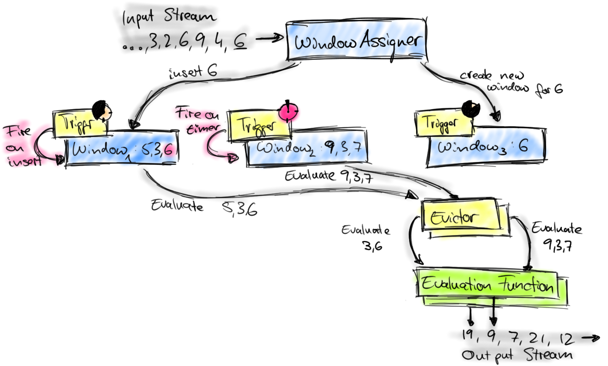
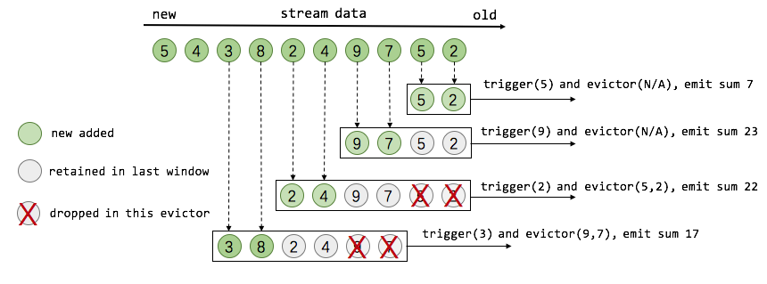

# 简介

Flink 认为 Batch 是 Streaming 的一个特例，所以 Flink 底层引擎是一个流式引擎，在上面实现了流处理和批处理。而窗口（window）就是从 Streaming 到 Batch 的一个桥梁。Flink 提供了非常完善的窗口机制，这是我认为的 Flink 最大的亮点之一（其他的亮点包括消息乱序处理，和 checkpoint 机制）。本文我们将介绍流式处理中的窗口概念，介绍 Flink 内建的一些窗口和 Window API，最后讨论下窗口在底层是如何实现的。


# 什么是 Window

在流处理应用中，数据是连续不断的，因此我们不可能等到所有数据都到了才开始处理。当然我们可以每来一个消息就处理一次，但是有时我们需要做一些聚合类的处理，例如：在过去的1分钟内有多少用户点击了我们的网页。在这种情况下，我们必须定义一个窗口，用来收集最近一分钟内的数据，并对这个窗口内的数据进行计算。

窗口可以是时间驱动的（Time Window，例如：每30秒钟），也可以是数据驱动的（Count Window，例如：每一百个元素）。一种经典的窗口分类可以分成：翻滚窗口（Tumbling Window，无重叠），滚动窗口（Sliding Window，有重叠），和会话窗口（Session Window，活动间隙）。

我们举个具体的场景来形象地理解不同窗口的概念。假设，淘宝网会记录每个用户每次购买的商品个数，我们要做的是统计不同窗口中用户购买商品的总数。下图给出了几种经典的窗口切分概述图：


上图中，raw data stream 代表用户的购买行为流，圈中的数字代表该用户本次购买的商品个数，事件是按时间分布的，所以可以看出事件之间是有time gap的。Flink 提供了上图中所有的窗口类型，下面我们会逐一进行介绍。


# Time Window

就如名字所说的，Time Window 是根据时间对数据流进行分组的。这里我们涉及到了流处理中的时间问题，时间问题和消息乱序问题是紧密关联的，这是流处理中现存的难题之一，我们将在后续的 EventTime 和消息乱序处理 中对这部分问题进行深入探讨。这里我们只需要知道 Flink 提出了三种时间的概念，分别是event time（事件时间：事件发生时的时间），ingestion time（摄取时间：事件进入流处理系统的时间），processing time（处理时间：消息被计算处理的时间）。Flink 中窗口机制和时间类型是完全解耦的，也就是说当需要改变时间类型时不需要更改窗口逻辑相关的代码。

## Tumbling Time Window

如上图，我们需要统计每一分钟中用户购买的商品的总数，需要将用户的行为事件按每一分钟进行切分，这种切分被成为翻滚时间窗口（Tumbling Time Window）。翻滚窗口能将数据流切分成不重叠的窗口，每一个事件只能属于一个窗口。通过使用 DataStream API，我们可以这样实现：

```scala
// Stream of (userId, buyCnt)
val buyCnts: DataStream[(Int, Int)] = ...

val tumblingCnts: DataStream[(Int, Int)] = buyCnts
  // key stream by userId
  .keyBy(0) 
  // tumbling time window of 1 minute length
  .timeWindow(Time.minutes(1))
  // compute sum over buyCnt
  .sum(1)
```

## Sliding Time Window

但是对于某些应用，它们需要的窗口是不间断的，需要平滑地进行窗口聚合。比如，我们可以每30秒计算一次最近一分钟用户购买的商品总数。这种窗口我们称为滑动时间窗口（Sliding Time Window）。在滑窗中，一个元素可以对应多个窗口。通过使用 DataStream API，我们可以这样实现：

```scala
val slidingCnts: DataStream[(Int, Int)] = buyCnts
  .keyBy(0) 
  // sliding time window of 1 minute length and 30 secs trigger interval
  .timeWindow(Time.minutes(1), Time.seconds(30))
  .sum(1)
```

# Count Window

Count Window 是根据元素个数对数据流进行分组的。

## Tumbling Count Window

当我们想要每100个用户购买行为事件统计购买总数，那么每当窗口中填满100个元素了，就会对窗口进行计算，这种窗口我们称之为翻滚计数窗口（Tumbling Count Window），上图所示窗口大小为3个。通过使用 DataStream API，我们可以这样实现：

```scala
// Stream of (userId, buyCnts)
val buyCnts: DataStream[(Int, Int)] = ...

val tumblingCnts: DataStream[(Int, Int)] = buyCnts
  // key stream by sensorId
  .keyBy(0)
  // tumbling count window of 100 elements size
  .countWindow(100)
  // compute the buyCnt sum 
  .sum(1)
```

## Sliding Count Window

当然Count Window 也支持 Sliding Window，虽在上图中未描述出来，但和Sliding Time Window含义是类似的，例如每10个元素计算一次最近100个元素的总和，代码示例如下。

```scala
val slidingCnts: DataStream[(Int, Int)] = vehicleCnts
  .keyBy(0)
  // sliding count window of 100 elements size and 10 elements trigger interval
  .countWindow(100, 10)
  .sum(1)
```

# Session Window

在这种用户交互事件流中，我们首先想到的是将事件聚合到会话窗口中（一段用户持续活跃的周期），由非活跃的间隙分隔开。如上图所示，就是需要计算每个用户在活跃期间总共购买的商品数量，如果用户30秒没有活动则视为会话断开（假设raw data stream是单个用户的购买行为流）。Session Window 的示例代码如下：

```scala
// Stream of (userId, buyCnts)
val buyCnts: DataStream[(Int, Int)] = ...
    
val sessionCnts: DataStream[(Int, Int)] = vehicleCnts
    .keyBy(0)
    // session window based on a 30 seconds session gap interval 
    .window(ProcessingTimeSessionWindows.withGap(Time.seconds(30)))
    .sum(1)
```

一般而言，window 是在无限的流上定义了一个有限的元素集合。这个集合可以是基于时间的，元素个数的，时间和个数结合的，会话间隙的，或者是自定义的。Flink 的 DataStream API 提供了简洁的算子来满足常用的窗口操作，同时提供了通用的窗口机制来允许用户自己定义窗口分配逻辑。下面我们会对 Flink 窗口相关的 API 进行剖析。

# 剖析 Window API

得益于 Flink Window API 松耦合设计，我们可以非常灵活地定义符合特定业务的窗口。Flink 中定义一个窗口主要需要以下三个组件。

- Window Assigner：用来决定某个元素被分配到哪个/哪些窗口中去。

  如下类图展示了目前内置实现的 Window Assigners：

  

- Trigger：触发器。决定了一个窗口何时能够被计算或清除，每个窗口都会拥有一个自己的Trigger。

  如下类图展示了目前内置实现的 Triggers：
  

- Evictor：可以译为“驱逐者”。在Trigger触发之后，在窗口被处理之前，Evictor（如果有Evictor的话）会用来剔除窗口中不需要的元素，相当于一个filter。

  如下类图展示了目前内置实现的 Evictors：
  

上述三个组件的不同实现的不同组合，可以定义出非常复杂的窗口。Flink 中内置的窗口也都是基于这三个组件构成的，当然内置窗口有时候无法解决用户特殊的需求，所以 Flink 也暴露了这些窗口机制的内部接口供用户实现自定义的窗口。下面我们将基于这三者探讨窗口的实现机制。


# Window 的实现

下图描述了 Flink 的窗口机制以及各组件之间是如何相互工作的。



首先上图中的组件都位于一个算子（window operator）中，数据流源源不断地进入算子，每一个到达的元素都会被交给 WindowAssigner。WindowAssigner 会决定元素被放到哪个或哪些窗口（window），可能会创建新窗口。因为一个元素可以被放入多个窗口中，所以同时存在多个窗口是可能的。注意，Window本身只是一个ID标识符，其内部可能存储了一些元数据，如TimeWindow中有开始和结束时间，但是并不会存储窗口中的元素。窗口中的元素实际存储在 Key/Value State 中，key为Window，value为元素集合（或聚合值）。为了保证窗口的容错性，该实现依赖了 Flink 的 State 机制（参见 [state 文档](https://ci.apache.org/projects/flink/flink-docs-master/apis/streaming/state.html?spm=a2c6h.12873639.article-detail.8.571d3dd5xKjhTf)）。


每一个窗口都拥有一个属于自己的 Trigger，Trigger上会有定时器，用来决定一个窗口何时能够被计算或清除。每当有元素加入到该窗口，或者之前注册的定时器超时了，那么Trigger都会被调用。Trigger的返回结果可以是 continue（不做任何操作），fire（处理窗口数据），purge（移除窗口和窗口中的数据），或者 fire + purge。一个Trigger的调用结果只是fire的话，那么会计算窗口并保留窗口原样，也就是说窗口中的数据仍然保留不变，等待下次Trigger fire的时候再次执行计算。一个窗口可以被重复计算多次直到它被 purge 了。在purge之前，窗口会一直占用着内存。

当Trigger fire了，窗口中的元素集合就会交给Evictor（如果指定了的话）。Evictor 主要用来遍历窗口中的元素列表，并决定最先进入窗口的多少个元素需要被移除。剩余的元素会交给用户指定的函数进行窗口的计算。如果没有 Evictor 的话，窗口中的所有元素会一起交给函数进行计算。

计算函数收到了窗口的元素（可能经过了 Evictor 的过滤），并计算出窗口的结果值，并发送给下游。窗口的结果值可以是一个也可以是多个。DataStream API 上可以接收不同类型的计算函数，包括预定义的sum(),min(),max()，还有 ReduceFunction，FoldFunction，还有WindowFunction。WindowFunction 是最通用的计算函数，其他的预定义的函数基本都是基于该函数实现的。

Flink 对于一些聚合类的窗口计算（如sum,min）做了优化，因为聚合类的计算不需要将窗口中的所有数据都保存下来，只需要保存一个result值就可以了。每个进入窗口的元素都会执行一次聚合函数并修改result值。这样可以大大降低内存的消耗并提升性能。但是如果用户定义了 Evictor，则不会启用对聚合窗口的优化，因为 Evictor 需要遍历窗口中的所有元素，必须要将窗口中所有元素都存下来。

# 源码分析

上述的三个组件构成了 Flink 的窗口机制。为了更清楚地描述窗口机制，以及解开一些疑惑（比如 purge 和 Evictor 的区别和用途），我们将一步步地解释 Flink 内置的一些窗口（Time Window，Count Window，Session Window）是如何实现的。

## Count Window 实现

Count Window 是使用三组件的典范，我们可以在 KeyedStream 上创建 Count Window，其源码如下所示：

```java
// tumbling count window
public WindowedStream<T, KEY, GlobalWindow> countWindow(long size) {
    return window(GlobalWindows.create())  // create window stream using GlobalWindows
        .trigger(PurgingTrigger.of(CountTrigger.of(size))); // trigger is window size
}
// sliding count window
public WindowedStream<T, KEY, GlobalWindow> countWindow(long size, long slide) {
    return window(GlobalWindows.create())
        .evictor(CountEvictor.of(size))  // evictor is window size
        .trigger(CountTrigger.of(slide)); // trigger is slide size
}
```

第一个函数是申请翻滚计数窗口，参数为窗口大小。第二个函数是申请滑动计数窗口，参数分别为窗口大小和滑动大小。它们都是基于 GlobalWindows 这个 WindowAssigner 来创建的窗口，该assigner会将所有元素都分配到同一个global window中，所有GlobalWindows的返回值一直是 GlobalWindow 单例。基本上自定义的窗口都会基于该assigner实现。

翻滚计数窗口并不带evictor，只注册了一个trigger。该trigger是带purge功能的 CountTrigger。也就是说每当窗口中的元素数量达到了 window-size，trigger就会返回fire+purge，窗口就会执行计算并清空窗口中的所有元素，再接着储备新的元素。从而实现了tumbling的窗口之间无重叠。

滑动计数窗口的各窗口之间是有重叠的，但我们用的 GlobalWindows assinger 从始至终只有一个窗口，不像 sliding time assigner 可以同时存在多个窗口。所以trigger结果不能带purge，也就是说计算完窗口后窗口中的数据要保留下来（供下个滑窗使用）。另外，trigger的间隔是slide-size，evictor的保留的元素个数是window-size。也就是说，每个滑动间隔就触发一次窗口计算，并保留下最新进入窗口的window-size个元素，剔除旧元素。

假设有一个滑动计数窗口，每2个元素计算一次最近4个元素的总和，那么窗口工作示意图如下所示：



图中所示的各个窗口逻辑上是不同的窗口，但在物理上是同一个窗口。该滑动计数窗口，trigger的触发条件是元素个数达到2个（每进入2个元素就会触发一次），evictor保留的元素个数是4个，每次计算完窗口总和后会保留剩余的元素。所以第一次触发trigger是当元素5进入，第三次触发trigger是当元素2进入，并驱逐5和2，计算剩余的4个元素的总和（22）并发送出去，保留下2,4,9,7元素供下个逻辑窗口使用。

## Time Window 实现

同样的，我们也可以在 KeyedStream 上申请 Time Window，其源码如下所示：

```java
// tumbling time window
public WindowedStream<T, KEY, TimeWindow> timeWindow(Time size) {
    if (environment.getStreamTimeCharacteristic() == TimeCharacteristic.ProcessingTime) {
        return window(TumblingProcessingTimeWindows.of(size));
    } else {
        return window(TumblingEventTimeWindows.of(size));
    }
}
// sliding time window
public WindowedStream<T, KEY, TimeWindow> timeWindow(Time size, Time slide) {
    if (environment.getStreamTimeCharacteristic() == TimeCharacteristic.ProcessingTime) {
        return window(SlidingProcessingTimeWindows.of(size, slide));
    } else {
        return window(SlidingEventTimeWindows.of(size, slide));
    }
}
```

在方法体内部会根据当前环境注册的时间类型，使用不同的WindowAssigner创建window。可以看到，EventTime和IngestTime都使用了XXXEventTimeWindows这个assigner，因为EventTime和IngestTime在底层的实现上只是在Source处为Record打时间戳的实现不同，在window operator中的处理逻辑是一样的。

这里我们主要分析sliding process time window，如下是相关源码：

```java
public class SlidingProcessingTimeWindows extends WindowAssigner<Object, TimeWindow> {
    private static final long serialVersionUID = 1L;

    private final long size;

    private final long slide;

    private SlidingProcessingTimeWindows(long size, long slide) {
        this.size = size;
        this.slide = slide;
    }

    @Override
    public Collection<TimeWindow> assignWindows(Object element, long timestamp) {
        timestamp = System.currentTimeMillis();
        List<TimeWindow> windows = new ArrayList<>((int) (size / slide));
        // 对齐时间戳
        long lastStart = timestamp - timestamp % slide;
        for (long start = lastStart;
            start > timestamp - size;
            start -= slide) {
            // 当前时间戳对应了多个window
            windows.add(new TimeWindow(start, start + size));
        }
        return windows;
    }
    ...
}
public class ProcessingTimeTrigger extends Trigger<Object, TimeWindow> {
    @Override
    // 每个元素进入窗口都会调用该方法
    public TriggerResult onElement(Object element, long timestamp, TimeWindow window, TriggerContext ctx) {
        // 注册定时器，当系统时间到达window end timestamp时会回调该trigger的onProcessingTime方法
        ctx.registerProcessingTimeTimer(window.getEnd());
        return TriggerResult.CONTINUE;
    }

    @Override
    // 返回结果表示执行窗口计算并清空窗口
    public TriggerResult onProcessingTime(long time, TimeWindow window, TriggerContext ctx) {
        return TriggerResult.FIRE_AND_PURGE;
    }
    ...
}
```

首先，SlidingProcessingTimeWindows会对每个进入窗口的元素根据系统时间分配到(size / slide)个不同的窗口，并会在每个窗口上根据窗口结束时间注册一个定时器（相同窗口只会注册一份），当定时器超时时意味着该窗口完成了，这时会回调对应窗口的Trigger的onProcessingTime方法，返回FIRE_AND_PURGE，也就是会执行窗口计算并清空窗口。整个过程示意图如下：


如上图所示横轴代表时间戳（为简化问题，时间戳从0开始），第一条record会被分配到[-5,5)和[0,10)两个窗口中，当系统时间到5时，就会计算[-5,5)窗口中的数据，并将结果发送出去，最后清空窗口中的数据，释放该窗口资源。

