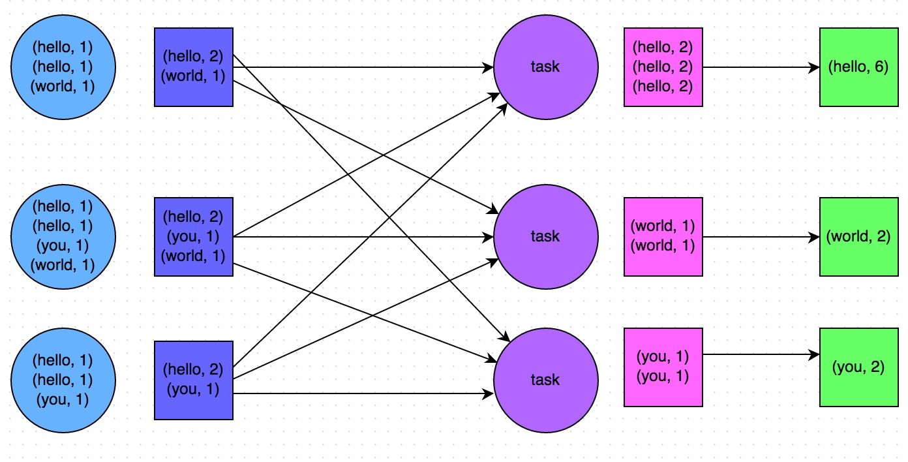

# 简介
PySpark是Python调用Spark的接口，可以通过调用Python API的方式来编写Spark程序，它支持了大多数的Spark功能，比如SparkDataFrame、Spark SQL、Streaming、MLlib等等。

# 基础概念
## RDD
RDD的全称是Resilient Distributed Datasets，这是Spark的一种数据抽象集合，它可以被执行在分布式的集群上进行各种操作，而且有较强的容错机制。RDD可以被分为若干个分区，每一个分区就是一个数据集片段，从而可以支持分布式计算。

## RDD运行时相关的关键名词
简单来说可以有Client、Job、Master、Worker、Driver、Stage、Task以及Executor，这几个东西在调优的时候也会经常遇到的。

- Client: 指的是客户端进程，主要负责提交job到Master；
- Job: Job来自于我们编写的程序，Application包含一个或多个job，job包含各种RDD操作；
- Master: 指的是Standalone模式中的主控节点，负责接收来自Client的job，并管理着worker，可以给worker分配任务和资源（主要是dirver和executor资源）；
- Worker: 指的是Standalone模式中的slave节点，负责管理本节点的资源，同时受Master管理，需要定期给Master回报heartbeat（心跳），启动Driver和Executor；
- Driver: 指的是job（作业）的主进程，一般每个Spark作业都会有一个Driver进程，负责整个作业的运行，包括job的解析、Stage的生成、调度Task到Executor上去执行；
- Stage: 中文名是：阶段，是Job的基本调度单位，因为每个Job会分成若干组Task，每组task就被称为Stage；
- Task: 任务，指的是直接运行在executor上的东西，是executor上的一个线程；
- Executor: 指的是执行器，顾名思义就是真正执行任务的地方了，一个集群可以被配置若干个Executor，每个Executor接收来自Driver的Task，并执行它（可同时执行多个Task）。

## DAG
全称是Directed Acyclic Graph, 中文名是：有向无环图。Spark就是借用了DAG对RDD之间的关系进行了建模，用来描述RDD之间的因果依赖关系。因为在一个Spark作业调度中，多个作业任务之间也是相互依赖的，有些任务需要在一些任务执行完成了才可以执行的。在Spark调度中就是有DAGscheduler，它负责将job分成若干组Task组成的Stage。


## Spark运行模式
主要有local模式、Standalone模式、Mesos模式、YARN模式。
- Standalone:  独立模式，Spark 原生的简单集群管理器， 自带完整的服务， 可单独部署到一个集群中，无需依赖任何其他资源管理系统， 使用 Standalone 可以很方便地搭建一个集群，一般在公司内部没有搭建其他资源管理框架的时候才会使用。
- Mesos: 一个强大的分布式资源管理框架，它允许多种不同的框架部署在其上，包括 yarn，由于mesos这种方式目前应用的比较少。
- YARN: 统一的资源管理机制， 在上面可以运行多套计算框架， 如map reduce、storm 等， 根据 driver 在集群中的位置不同，分为 yarn client 和 yarn cluster。
实际上Spark内部为了方便用户测试，自身也提供了一些部署模式。由于在实际工厂环境下使用的绝大多数的集群管理器是 Hadoop YARN，因此我们关注的重点是 Hadoop YARN 模式下的 Spark 集群部署。

Spark 的运行模式取决于传递给 SparkContext 的 MASTER 环境变量的值， 个别模式还需要辅助的程序接口来配合使用，目前支持的 Master 字符串及 URL 包括：

| Master URL | Meaning |
| -- | -- |
| local | 在本地运行，只有一个工作进程，无并行计算能力 |
| local[K] | 在本地运行，只有K个工作进程，通常设置K为机器的CPU核心数量 |
| local[*] | 在本地运行，工作进程数量等于机器的CPU核心数量 |
| spark://host:port | 以 Standalone 模式运行，这是 Spark 自身提供的集群运行模式，默认端口号: 7077 |
| mesos://host:port | 在 Mesos 集群上运行，Driver 进程和 Worker 进程运行在 Mesos 集群上，部署模式必须使用固定值:--deploy-mode cluster |
| yarn-client | 在 Yarn 集群上运行，Driver 进程在本地， Work 进程在 Yarn 集群上， 部署模式必须使用固定值:--deploy-modeclient。Yarn 集群地址必须在HADOOP_CONF_DIRorYARN_CONF_DIR 变量里定义。|
| yarn-cluster | yarn-cluster 效率比yarn-client高。在 Yarn 集群上运行，Driver 进程在 Yarn 集群上，Work 进程也在 Yarn 集群上，部署模式必须使用固定值:--deploy-mode cluster。Yarn 集群地址必须在HADOOP_CONF_DIR or YARN_CONF_DIR 变量里定义。|

**用户在提交任务给 Spark 处理时，以下两个参数共同决定了 Spark 的运行方式。**

- master MASTER_URL: 决定了 Spark 任务提交给哪种集群处理。
- deploy-mode DEPLOY_MODE: 决定了 Driver 的运行方式，可选值为 Client
或者 Cluster。

### Standalone模式运行机制

Standalone 集群有四个重要组成部分，分别是：

1. Driver： 是一个进程，我们编写的 Spark 应用程序就运行在 Driver 上， 由Driver 进程执行；
2. Master：是一个进程，主要负责资源的调度和分配，并进行集群的监控等职责；
3. Worker：是一个进程，一个 Worker 运行在集群中的一台服务器上，主要负责两个职责，一个是用自己的内存存储 RDD 的某个或某些 partition；另一个是启动其他进程和线程（Executor） ，对 RDD 上的 partition 进行并行的处理和计算。
4. Executor：是一个进程， 一个 Worker 上可以运行多个 Executor， Executor 通过启动多个线程（task）来执行对 RDD 的 partition 进行并行计算，也就是执行我们对 RDD 定义的例如 map、flatMap、reduce 等算子操作。

#### Standalone Client模式

在 Standalone Client 模式下，Driver 在任务提交的本地机器上运行，Driver 启动后向 Master 注册应用程序，Master 根据 submit 脚本的资源需求找到内部资源至少可以启动一个 Executor 的所有 Worker，然后在这些 Worker 之间分配 Executor，Worker 上的 Executor 启动后会向 Driver 反向注册，所有的 Executor 注册完成后，Driver 开始执行 main 函数，之后执行到 Action 算子时，开始划分 stage，每个 stage 生成对应的 taskSet，之后将 task 分发到各个 Executor 上执行。

#### Standalone Cluster模式

在 Standalone Cluster 模式下，任务提交后，Master 会找到一个 Worker 启动 Driver进程， Driver 启动后向 Master 注册应用程序， Master 根据 submit 脚本的资源需求找到内部资源至少可以启动一个 Executor 的所有 Worker，然后在这些 Worker 之间分配 Executor，Worker 上的 Executor 启动后会向 Driver 反向注册，所有的 Executor 注册完成后，Driver 开始执行 main 函数，之后执行到 Action 算子时，开始划分 stage，每个 stage 生成对应的 taskSet，之后将 task 分发到各个 Executor 上执行。

> 注意， Standalone 的两种模式下（ client/cluster）， Master 在接到 Driver 注册
Spark 应用程序的请求后，会获取其所管理的剩余资源能够启动一个 Executor 的所有 Worker， 然后在这些 Worker 之间分发 Executor，此时的分发只考虑 Worker 上的资源是否足够使用，直到当前应用程序所需的所有 Executor 都分配完毕， Executor 反向注册完毕后，Driver 开始执行 main 程序。

### YARN模式运行机制

#### YARN Client模式

1. Driver在任务提交的本地机器上运行，Driver启动后会和ResourceManager通讯申请启动ApplicationMaster；
2. 随后ResourceManager分配Container，在合适的NodeManager上启动ApplicationMaster，此时的ApplicationMaster的功能相当于一个ExecutorLaucher，只负责向ResourceManager申 请Executor内存；
3. ResourceManager接到ApplicationMaster的资源申请后会分配Container，然后ApplicationMaster在资源分配指定的NodeManager上启动Executor进程；
4. Executor进程启动后会向Driver反向注册，Executor全部注册完成后Driver开始执行main函数；
5. 之后执行到Action算子时，触发一个Job，并根据宽依赖开始划分Stage，每个Stage生成对应的TaskSet，之后将Task分发到各个Executor上执行。


#### YARN Cluster 模式

1. 任务提交后会和ResourceManager通讯申请启动ApplicationMaster;
2. 随后ResourceManager分配Container，在合适的NodeManager上启动ApplicationMaster，此时的ApplicationMaster就是Driver；
3. Driver启动后向ResourceManager申请Executor内存，ResourceManager接到ApplicationMaster的资源申请后会分配Container,然后在合适的NodeManager上启动Executor进程;
4. Executor进程启动后会向Driver反向注册;
5. Executor全部注册完成后Driver开始执行main函数，之后执行到Action算子时，触发一个job，并根据宽依赖开始划分stage，每个stage生成对应的taskSet，之后将task分发到各个Executor上执行;


## Shuffle操作是什么

Shuffle指的是数据从Map端到Reduce端的数据传输过程，Shuffle性能的高低会直接影响程序的性能。因为Reduce task需要跨节点去拉分布在不同节点上的Map task计算结果，这一个过程是需要有磁盘IO消耗以及数据网络传输的消耗的，所以需要根据实际数据情况进行适当调整。另外，Shuffle可以分为两部分，分别是Map阶段的数据准备与Reduce阶段的数据拷贝处理，在Map端我们叫Shuffle Write，在Reduce端我们叫Shuffle Read。

## 什么是惰性执行

这是RDD的一个特性，在RDD中的算子可以分为Transform算子和Action算子，其中Transform算子的操作都不会真正执行，只会记录一下依赖关系，直到遇见了Action算子，在这之前的所有Transform操作才会被触发计算，这就是所谓的惰性执行。具体哪些是Transform和Action算子，可以看下一节。

## 常用函数

常用的算子大概可以分为以下几种：

### Transformations

- map
- flatmap
- filter
- distinct
- reduceByKey
- mapPartitions
- sortBy

### Actions

- collect
- collectAsMap
- reduce
- countByKey/countByValue
- take
- first

### 代码示例

```python
import os
import pyspark
from pyspark import SparkContext, SparkConf

conf = SparkConf().setAppName("test_spark_app").setMaster("local[4]")
sc = SparkContext(conf=conf)

# 使用 parallelize方法直接实例化一个RDD
rdd = sc.parallelize(range(1,11),4) # 这里的 4 指的是分区数量
rdd.take(100)
# [1, 2, 3, 4, 5, 6, 7, 8, 9, 10]


"""
----------------------------------------------
                Transform算子解析
----------------------------------------------
"""
# 以下的操作由于是Transform操作，因为我们需要在最后加上一个collect算子用来触发计算。
# 1. map: 和python差不多，map转换就是对每一个元素进行一个映射
rdd = sc.parallelize(range(1, 11), 4)
rdd_map = rdd.map(lambda x: x*2)
print("原始数据：", rdd.collect())
print("扩大2倍：", rdd_map.collect())
# 原始数据： [1, 2, 3, 4, 5, 6, 7, 8, 9, 10]
# 扩大2倍： [2, 4, 6, 8, 10, 12, 14, 16, 18, 20]

# 2. flatMap: 这个相比于map多一个flat（压平）操作，顾名思义就是要把高维的数组变成一维
rdd2 = sc.parallelize(["hello SamShare", "hello PySpark"])
print("原始数据：", rdd2.collect())
print("直接split之后的map结果：", rdd2.map(lambda x: x.split(" ")).collect())
print("直接split之后的flatMap结果：", rdd2.flatMap(lambda x: x.split(" ")).collect())
# 直接split之后的map结果： [['hello', 'SamShare'], ['hello', 'PySpark']]
# 直接split之后的flatMap结果： ['hello', 'SamShare', 'hello', 'PySpark']

# 3. filter: 过滤数据
rdd = sc.parallelize(range(1, 11), 4)
print("原始数据：", rdd.collect())
print("过滤奇数：", rdd.filter(lambda x: x % 2 == 0).collect())
# 原始数据： [1, 2, 3, 4, 5, 6, 7, 8, 9, 10]
# 过滤奇数： [2, 4, 6, 8, 10]

# 4. distinct: 去重元素
rdd = sc.parallelize([2, 2, 4, 8, 8, 8, 8, 16, 32, 32])
print("原始数据：", rdd.collect())
print("去重数据：", rdd.distinct().collect())
# 原始数据： [2, 2, 4, 8, 8, 8, 8, 16, 32, 32]
# 去重数据： [4, 8, 16, 32, 2]

# 5. reduceByKey: 根据key来映射数据
from operator import add
rdd = sc.parallelize([("a", 1), ("b", 1), ("a", 1)])
print("原始数据：", rdd.collect())
print("原始数据：", rdd.reduceByKey(add).collect())
# 原始数据： [('a', 1), ('b', 1), ('a', 1)]
# 原始数据： [('b', 1), ('a', 2)]

# 6. mapPartitions: 根据分区内的数据进行映射操作
# 把数据集发成两个分区，在分区内进行求和操作
rdd = sc.parallelize([1, 2, 3, 4], 2)
def f(iterator):
    yield sum(iterator)
print(rdd.collect())
print(rdd.mapPartitions(f).collect())
# [1, 2, 3, 4]
# [3, 7]

# 7. sortBy: 根据规则进行排序
tmp = [('a', 1), ('b', 2), ('1', 3), ('d', 4), ('2', 5)]
print(sc.parallelize(tmp).sortBy(lambda x: x[0]).collect())
print(sc.parallelize(tmp).sortBy(lambda x: x[1]).collect())
# [('1', 3), ('2', 5), ('a', 1), ('b', 2), ('d', 4)]
# [('a', 1), ('b', 2), ('1', 3), ('d', 4), ('2', 5)]

# 8. subtract: 数据集相减, Return each value in self that is not contained in other.
x = sc.parallelize([("a", 1), ("b", 4), ("b", 5), ("a", 3)])
y = sc.parallelize([("a", 3), ("c", None)])
print(sorted(x.subtract(y).collect()))
# [('a', 1), ('b', 4), ('b', 5)]

# 9. union: 合并两个RDD
rdd = sc.parallelize([1, 1, 2, 3])
print(rdd.union(rdd).collect())
# [1, 1, 2, 3, 1, 1, 2, 3]

# 10. intersection: 取两个RDD的交集，同时有去重的功效
rdd1 = sc.parallelize([1, 10, 2, 3, 4, 5, 2, 3])
rdd2 = sc.parallelize([1, 6, 2, 3, 7, 8])
print(rdd1.intersection(rdd2).collect())
# [1, 2, 3]

# 11. cartesian: 生成笛卡尔积
rdd = sc.parallelize([1, 2])
print(sorted(rdd.cartesian(rdd).collect()))
# [(1, 1), (1, 2), (2, 1), (2, 2)]

# 12. zip: 拉链合并，需要两个RDD具有相同的长度以及分区数量
x = sc.parallelize(range(0, 5))
y = sc.parallelize(range(1000, 1005))
print(x.collect())
print(y.collect())
print(x.zip(y).collect())
# [0, 1, 2, 3, 4]
# [1000, 1001, 1002, 1003, 1004]
# [(0, 1000), (1, 1001), (2, 1002), (3, 1003), (4, 1004)]

# 13. zipWithIndex: 将RDD和一个从0开始的递增序列按照拉链方式连接。
rdd_name = sc.parallelize(["LiLei", "Hanmeimei", "Lily", "Lucy", "Ann", "Dachui", "RuHua"])
rdd_index = rdd_name.zipWithIndex()
print(rdd_index.collect())
# [('LiLei', 0), ('Hanmeimei', 1), ('Lily', 2), ('Lucy', 3), ('Ann', 4), ('Dachui', 5), ('RuHua', 6)]

# 14. groupByKey: 按照key来聚合数据
rdd = sc.parallelize([("a", 1), ("b", 1), ("a", 1)])
print(rdd.collect())
print(sorted(rdd.groupByKey().mapValues(len).collect()))
print(sorted(rdd.groupByKey().mapValues(list).collect()))
# [('a', 1), ('b', 1), ('a', 1)]
# [('a', 2), ('b', 1)]
# [('a', [1, 1]), ('b', [1])]

# 15. sortByKey:
tmp = [('a', 1), ('b', 2), ('1', 3), ('d', 4), ('2', 5)]
print(sc.parallelize(tmp).sortByKey(True, 1).collect())
# [('1', 3), ('2', 5), ('a', 1), ('b', 2), ('d', 4)]

# 16. join:
x = sc.parallelize([("a", 1), ("b", 4)])
y = sc.parallelize([("a", 2), ("a", 3)])
print(sorted(x.join(y).collect()))
# [('a', (1, 2)), ('a', (1, 3))]

# 17. leftOuterJoin/rightOuterJoin
x = sc.parallelize([("a", 1), ("b", 4)])
y = sc.parallelize([("a", 2)])
print(sorted(x.leftOuterJoin(y).collect()))
# [('a', (1, 2)), ('b', (4, None))]

"""
----------------------------------------------
                Action算子解析
----------------------------------------------
"""
# 1. collect: 指的是把数据都汇集到driver端，便于后续的操作
rdd = sc.parallelize(range(0, 5))
rdd_collect = rdd.collect()
print(rdd_collect)
# [0, 1, 2, 3, 4]

# 2. first: 取第一个元素
sc.parallelize([2, 3, 4]).first()
# 2

# 3. collectAsMap: 转换为dict，使用这个要注意了，不要对大数据用，不然全部载入到driver端会爆内存
m = sc.parallelize([(1, 2), (3, 4)]).collectAsMap()
m
# {1: 2, 3: 4}

# 4. reduce: 逐步对两个元素进行操作
rdd = sc.parallelize(range(10),5)
print(rdd.reduce(lambda x,y:x+y))
# 45

# 5. countByKey/countByValue:
rdd = sc.parallelize([("a", 1), ("b", 1), ("a", 1)])
print(sorted(rdd.countByKey().items()))
print(sorted(rdd.countByValue().items()))
# [('a', 2), ('b', 1)]
# [(('a', 1), 2), (('b', 1), 1)]

# 6. take: 相当于取几个数据到driver端
rdd = sc.parallelize([("a", 1), ("b", 1), ("a", 1)])
print(rdd.take(5))
# [('a', 1), ('b', 1), ('a', 1)]

# 7. saveAsTextFile: 保存rdd成text文件到本地
text_file_path = "./data/rdd"
shutil.rmtree(text_file_path, True)
rdd = sc.parallelize(range(5))
rdd.saveAsTextFile(text_file_path)

# 8. takeSample: 随机取数
rdd = sc.textFile("./samples/zipcodes.csv", 4)  # 这里的 4 指的是分区数量
rdd_sample = rdd.takeSample(True, 2, 0)  # withReplacement 参数1：代表是否是有放回抽样
print(rdd_sample)

# 9. foreach: 对每一个元素执行某种操作，不生成新的RDD
rdd = sc.parallelize(range(10), 5)
accum = sc.accumulator(0)
rdd.foreach(lambda x: accum.add(x))
print(accum.value)

```

## Spark SQL使用

在讲Spark SQL前，先解释下这个模块。这个模块是Spark中用来处理结构化数据的，提供一个叫SparkDataFrame的东西并且自动解析为分布式SQL查询数据。用过Python的Pandas库，也大致了解了DataFrame，这个其实和它没有太大的区别，只是调用的API可能有些不同罢了。

我们通过使用Spark SQL来处理数据，会让我们更加熟悉，比如可以用SQL语句、用SparkDataFrame的API或者Datasets API，我们可以按照需求随心转换，通过SparkDataFrame API 和 SQL 写的逻辑，会被Spark优化器Catalyst自动优化成RDD。

## 创建SparkDataFrame

开始讲SparkDataFrame，我们先学习下几种创建的方法，分别是使用RDD来创建、使用pandas的DataFrame来创建、使用List来创建、读取数据文件来创建、通过读取数据库来创建。

### 使用RDD来创建

主要使用RDD的toDF方法

```python
rdd = sc.parallelize([("Sam", 28, 88), ("Flora", 28, 90), ("Run", 1, 60)])
df = rdd.toDF(["name", "age", "score"])
df.show()
df.printSchema()

# +-----+---+-----+
# | name|age|score|
# +-----+---+-----+
# |  Sam| 28|   88|
# |Flora| 28|   90|
# |  Run|  1|   60|
# +-----+---+-----+
# root
#  |-- name: string (nullable = true)
#  |-- age: long (nullable = true)
#  |-- score: long (nullable = true)
```

### 使用pandas的DataFrame来创建

```python
df = pd.DataFrame([['Sam', 28, 88], ['Flora', 28, 90], ['Run', 1, 60]],
                  columns=['name', 'age', 'score'])
print(">> 打印DataFrame:")
print(df)
print("\n")
Spark_df = spark.createDataFrame(df)
print(">> 打印SparkDataFrame:")
Spark_df.show()
# >> 打印DataFrame:
#     name  age  score
# 0    Sam   28     88
# 1  Flora   28     90
# 2    Run    1     60
# >> 打印SparkDataFrame:
# +-----+---+-----+
# | name|age|score|
# +-----+---+-----+
# |  Sam| 28|   88|
# |Flora| 28|   90|
# |  Run|  1|   60|
# +-----+---+-----+
```

### 使用List来创建

```python
list_values = [['Sam', 28, 88], ['Flora', 28, 90], ['Run', 1, 60]]
Spark_df = spark.createDataFrame(list_values, ['name', 'age', 'score'])
Spark_df.show()
# +-----+---+-----+
# | name|age|score|
# +-----+---+-----+
# |  Sam| 28|   88|
# |Flora| 28|   90|
# |  Run|  1|   60|
# +-----+---+-----+
```

### 读取数据文件来创建

```python
# CSV文件
df = spark.read.option("header", "true") \
    .option("inferSchema", "true") \
    .option("delimiter", ",") \
    .csv("./samples/breast_homo_test.csv")
df.show(5)
df.printSchema()

# json文件
df = spark.read.json("./samples/zipcodes.json")
df.show(5)
df.printSchema()

df = spark.read.option("multiline", "true").json("./samples/multiline-zipcode.json")
df.show(5)
df.printSchema()
```

### 通过读取数据库来创建

```python
# 读取hive数据
spark.sql("CREATE TABLE IF NOT EXISTS src (key INT, value STRING) USING hive")
spark.sql("LOAD DATA LOCAL INPATH 'data/kv1.txt' INTO TABLE src")
df = spark.sql("SELECT key, value FROM src WHERE key < 10 ORDER BY key")
df.show(5)

# 读取mysql数据
url = "jdbc:mysql://localhost:3306/test"
df = spark.read.format("jdbc") \
 .option("url", url) \
 .option("dbtable", "runoob_tbl") \
 .option("user", "root") \
 .option("password", "8888") \
 .load()\
df.show()
```

## 常用的SparkDataFrame API

这里我大概是分成了几部分来看这些APIs，分别是查看DataFrame的APIs、简单处理DataFrame的APIs、DataFrame的列操作APIs、DataFrame的一些思路变换操作APIs、DataFrame的一些统计操作APIs，这样子也有助于我们了解这些API的功能，以后遇见实际问题的时候可以解决。

首先我们这小节全局用到的数据集如下：

```python
from pyspark.sql import functions as F
from pyspark.sql import SparkSession
# SparkSQL的许多功能封装在SparkSession的方法接口中, SparkContext则不行的。
spark = SparkSession.builder \
    .appName("test_spark_app") \
    .config("master", "local[4]") \
    .enableHiveSupport() \
    .getOrCreate()
sc = spark.sparkContext

# 创建一个SparkDataFrame
rdd = sc.parallelize([("Sam", 28, 88, "M"),
                      ("Flora", 28, 90, "F"),
                      ("Run", 1, 60, None),
                      ("Peter", 55, 100, "M"),
                      ("Mei", 54, 95, "F")])
df = rdd.toDF(["name", "age", "score", "sex"])
df.show()
df.printSchema()

# +-----+---+-----+----+
# | name|age|score| sex|
# +-----+---+-----+----+
# |  Sam| 28|   88|   M|
# |Flora| 28|   90|   F|
# |  Run|  1|   60|null|
# |Peter| 55|  100|   M|
# |  Mei| 54|   95|   F|
# +-----+---+-----+----+
# root
#  |-- name: string (nullable = true)
#  |-- age: long (nullable = true)
#  |-- score: long (nullable = true)
#  |-- sex: string (nullable = true)
```

### 查看DataFrame的APIs

```python
# DataFrame.collect
# 以列表形式返回行
df.collect()
# [Row(name='Sam', age=28, score=88, sex='M'),
# Row(name='Flora', age=28, score=90, sex='F'),
# Row(name='Run', age=1, score=60, sex=None),
# Row(name='Peter', age=55, score=100, sex='M'),
# Row(name='Mei', age=54, score=95, sex='F')]

# DataFrame.count
df.count()
# 5

# DataFrame.columns
df.columns
# ['name', 'age', 'score', 'sex']

# DataFrame.dtypes
df.dtypes
# [('name', 'string'), ('age', 'bigint'), ('score', 'bigint'), ('sex', 'string')]

# DataFrame.describe
# 返回列的基础统计信息
df.describe(['age']).show()
# +-------+------------------+
# |summary|               age|
# +-------+------------------+
# |  count|                 5|
# |   mean|              33.2|
# | stddev|22.353970564532826|
# |    min|                 1|
# |    max|                55|
# +-------+------------------+
df.describe().show()
# +-------+-----+------------------+------------------+----+
# |summary| name|               age|             score| sex|
# +-------+-----+------------------+------------------+----+
# |  count|    5|                 5|                 5|   4|
# |   mean| null|              33.2|              86.6|null|
# | stddev| null|22.353970564532826|15.582040944625966|null|
# |    min|Flora|                 1|                60|   F|
# |    max|  Sam|                55|               100|   M|
# +-------+-----+------------------+------------------+----+

# DataFrame.select
# 选定指定列并按照一定顺序呈现
df.select("sex", "score").show()

# DataFrame.first
# DataFrame.head
# 查看第1条数据
df.first()
# Row(name='Sam', age=28, score=88, sex='M')
df.head(1)
# [Row(name='Sam', age=28, score=88, sex='M')]


# DataFrame.freqItems
# 查看指定列的枚举值
df.freqItems(["age","sex"]).show()
# +---------------+-------------+
# |  age_freqItems|sex_freqItems|
# +---------------+-------------+
# |[55, 1, 28, 54]|      [M, F,]|
# +---------------+-------------+

# DataFrame.summary
df.summary().show()
# +-------+-----+------------------+------------------+----+
# |summary| name|               age|             score| sex|
# +-------+-----+------------------+------------------+----+
# |  count|    5|                 5|                 5|   4|
# |   mean| null|              33.2|              86.6|null|
# | stddev| null|22.353970564532826|15.582040944625966|null|
# |    min|Flora|                 1|                60|   F|
# |    25%| null|                28|                88|null|
# |    50%| null|                28|                90|null|
# |    75%| null|                54|                95|null|
# |    max|  Sam|                55|               100|   M|
# +-------+-----+------------------+------------------+----+

# DataFrame.sample
# 按照一定规则从df随机抽样数据
df.sample(0.5).show()
# +-----+---+-----+----+
# | name|age|score| sex|
# +-----+---+-----+----+
# |  Sam| 28|   88|   M|
# |  Run|  1|   60|null|
# |Peter| 55|  100|   M|
# +-----+---+-----+----+
```

### 简单处理DataFrame的APIs

```python
# DataFrame.distinct
# 对数据集进行去重
df.distinct().show()

# DataFrame.dropDuplicates
# 对指定列去重
df.dropDuplicates(["sex"]).show()
# +-----+---+-----+----+
# | name|age|score| sex|
# +-----+---+-----+----+
# |Flora| 28|   90|   F|
# |  Run|  1|   60|null|
# |  Sam| 28|   88|   M|
# +-----+---+-----+----+

# DataFrame.exceptAll
# DataFrame.subtract
# 根据指定的df对df进行去重
df1 = spark.createDataFrame(
        [("a", 1), ("a", 1), ("b",  3), ("c", 4)], ["C1", "C2"])
df2 = spark.createDataFrame([("a", 1), ("b", 3)], ["C1", "C2"])
df3 = df1.exceptAll(df2)  # 没有去重的功效
df4 = df1.subtract(df2)  # 有去重的奇效
df1.show()
df2.show()
df3.show()
df4.show()
# +---+---+
# | C1| C2|
# +---+---+
# |  a|  1|
# |  a|  1|
# |  b|  3|
# |  c|  4|
# +---+---+
# +---+---+
# | C1| C2|
# +---+---+
# |  a|  1|
# |  b|  3|
# +---+---+
# +---+---+
# | C1| C2|
# +---+---+
# |  a|  1|
# |  c|  4|
# +---+---+
# +---+---+
# | C1| C2|
# +---+---+
# |  c|  4|
# +---+---+

# DataFrame.intersectAll
# 返回两个DataFrame的交集
df1 = spark.createDataFrame(
        [("a", 1), ("a", 1), ("b",  3), ("c", 4)], ["C1", "C2"])
df2 = spark.createDataFrame([("a", 1), ("b", 4)], ["C1", "C2"])
df1.intersectAll(df2).show()
# +---+---+
# | C1| C2|
# +---+---+
# |  a|  1|
# +---+---+

# DataFrame.drop
# 丢弃指定列
df.drop('age').show()

# DataFrame.withColumn
# 新增列
df1 = df.withColumn("birth_year", 2021 - df.age)
df1.show()
# +-----+---+-----+----+----------+
# | name|age|score| sex|birth_year|
# +-----+---+-----+----+----------+
# |  Sam| 28|   88|   M|      1993|
# |Flora| 28|   90|   F|      1993|
# |  Run|  1|   60|null|      2020|
# |Peter| 55|  100|   M|      1966|
# |  Mei| 54|   95|   F|      1967|
# +-----+---+-----+----+----------+

# DataFrame.withColumnRenamed
# 重命名列名
df1 = df.withColumnRenamed("sex", "gender")
df1.show()
# +-----+---+-----+------+
# | name|age|score|gender|
# +-----+---+-----+------+
# |  Sam| 28|   88|     M|
# |Flora| 28|   90|     F|
# |  Run|  1|   60|  null|
# |Peter| 55|  100|     M|
# |  Mei| 54|   95|     F|
# +-----+---+-----+------+


# DataFrame.dropna
# 丢弃空值，DataFrame.dropna(how='any', thresh=None, subset=None)
df.dropna(how='all', subset=['sex']).show()
# +-----+---+-----+---+
# | name|age|score|sex|
# +-----+---+-----+---+
# |  Sam| 28|   88|  M|
# |Flora| 28|   90|  F|
# |Peter| 55|  100|  M|
# |  Mei| 54|   95|  F|
# +-----+---+-----+---+

# DataFrame.fillna
# 空值填充操作
df1 = spark.createDataFrame(
        [("a", None), ("a", 1), (None,  3), ("c", 4)], ["C1", "C2"])
# df2 = df1.na.fill({"C1": "d", "C2": 99})
df2 = df1.fillna({"C1": "d", "C2": 99})
df1.show()
df2.show()

# DataFrame.filter
# 根据条件过滤
df.filter(df.age>50).show()
# +-----+---+-----+---+
# | name|age|score|sex|
# +-----+---+-----+---+
# |Peter| 55|  100|  M|
# |  Mei| 54|   95|  F|
# +-----+---+-----+---+
df.where(df.age==28).show()
# +-----+---+-----+---+
# | name|age|score|sex|
# +-----+---+-----+---+
# |  Sam| 28|   88|  M|
# |Flora| 28|   90|  F|
# +-----+---+-----+---+
df.filter("age<18").show()
# +----+---+-----+----+
# |name|age|score| sex|
# +----+---+-----+----+
# | Run|  1|   60|null|
# +----+---+-----+----+


# DataFrame.join
# 这个不用多解释了，直接上案例来看看具体的语法即可，DataFrame.join(other, on=None, how=None)
df1 = spark.createDataFrame(
        [("a", 1), ("d", 1), ("b",  3), ("c", 4)], ["id", "num1"])
df2 = spark.createDataFrame([("a", 1), ("b", 3)], ["id", "num2"])
df1.join(df2, df1.id == df2.id, 'left').select(df1.id.alias("df1_id"),
                                               df1.num1.alias("df1_num"),
                                               df2.num2.alias("df2_num")
                                               ).sort(["df1_id"], ascending=False)\
    .show()


# DataFrame.agg(*exprs)
# 聚合数据，可以写多个聚合方法，如果不写groupBy的话就是对整个DF进行聚合
# DataFrame.alias
# 设置列或者DataFrame别名
# DataFrame.groupBy
# 根据某几列进行聚合，如有多列用列表写在一起，如 df.groupBy(["sex", "age"])
df.groupBy("sex").agg(F.min(df.age).alias("最小年龄"),
                      F.expr("avg(age)").alias("平均年龄"),
                      F.expr("collect_list(name)").alias("姓名集合")
                      ).show()
# +----+--------+--------+------------+
# | sex|最小年龄|平均年龄|    姓名集合|
# +----+--------+--------+------------+
# |   F|      28|    41.0|[Flora, Mei]|
# |null|       1|     1.0|       [Run]|
# |   M|      28|    41.5|[Sam, Peter]|
# +----+--------+--------+------------+


# DataFrame.foreach
# 对每一行进行函数方法的应用
def f(person):
    print(person.name)
df.foreach(f)
# Peter
# Run
# Sam
# Flora
# Mei

# DataFrame.replace
# 修改df里的某些值
df1 = df.na.replace({"M": "Male", "F": "Female"})
df1.show()

# DataFrame.union
# 相当于SQL里的union all操作
df1 = spark.createDataFrame(
        [("a", 1), ("d", 1), ("b",  3), ("c", 4)], ["id", "num"])
df2 = spark.createDataFrame([("a", 1), ("b", 3)], ["id", "num"])
df1.union(df2).show()
df1.unionAll(df2).show()
# 这里union没有去重，不知道为啥，有知道的朋友麻烦解释下，谢谢了。
# +---+---+
# | id|num|
# +---+---+
# |  a|  1|
# |  d|  1|
# |  b|  3|
# |  c|  4|
# |  a|  1|
# |  b|  3|
# +---+---+

# DataFrame.unionByName
# 根据列名来进行合并数据集
df1 = spark.createDataFrame([[1, 2, 3]], ["col0", "col1", "col2"])
df2 = spark.createDataFrame([[4, 5, 6]], ["col1", "col2", "col0"])
df1.unionByName(df2).show()
# +----+----+----+
# |col0|col1|col2|
# +----+----+----+
# |   1|   2|   3|
# |   6|   4|   5|
# +----+----+----+
```

### DataFrame的列操作APIs

这里主要针对的是列进行操作，比如说重命名、排序、空值判断、类型判断等

```python
Column.alias(*alias, **kwargs)  # 重命名列名
Column.asc()  # 按照列进行升序排序
Column.desc()  # 按照列进行降序排序
Column.astype(dataType)  # 类型转换
Column.cast(dataType)  # 强制转换类型
Column.between(lowerBound, upperBound)  # 返回布尔值，是否在指定区间范围内
Column.contains(other)  # 是否包含某个关键词
Column.endswith(other)  # 以什么结束的值，如 df.filter(df.name.endswith('ice')).collect()
Column.isNotNull()  # 筛选非空的行
Column.isNull()
Column.isin(*cols)  # 返回包含某些值的行 df[df.name.isin("Bob", "Mike")].collect()
Column.like(other)  # 返回含有关键词的行
Column.when(condition, value)  # 给True的赋值
Column.otherwise(value)  # 与when搭配使用，df.select(df.name, F.when(df.age > 3, 1).otherwise(0)).show()
Column.rlike(other)  # 可以使用正则的匹配 df.filter(df.name.rlike('ice$')).collect()
Column.startswith(other)  # df.filter(df.name.startswith('Al')).collect()
Column.substr(startPos, length)  # df.select(df.name.substr(1, 3).alias("col")).collect()
```

### DataFrame的一些思路变换操作APIs

```python
# DataFrame.createOrReplaceGlobalTempView
# DataFrame.dropGlobalTempView
# 创建全局的试图，注册后可以使用sql语句来进行操作，生命周期取决于Spark application本身
df.createOrReplaceGlobalTempView("people")
spark.sql("select * from global_temp.people where sex = 'M' ").show()
# +-----+---+-----+---+
# | name|age|score|sex|
# +-----+---+-----+---+
# |  Sam| 28|   88|  M|
# |Peter| 55|  100|  M|
# +-----+---+-----+---+

# DataFrame.createOrReplaceTempView
# DataFrame.dropTempView
# 创建本地临时试图，生命周期取决于用来创建此数据集的SparkSession
df.createOrReplaceTempView("tmp_people")
spark.sql("select * from tmp_people where sex = 'F' ").show()
# +-----+---+-----+---+
# | name|age|score|sex|
# +-----+---+-----+---+
# |Flora| 28|   90|  F|
# |  Mei| 54|   95|  F|
# +-----+---+-----+---+

# DataFrame.cache\DataFrame.persist
# 可以把一些数据放入缓存中，default storage level (MEMORY_AND_DISK).
df.cache()
df.persist()
df.unpersist()

# DataFrame.crossJoin
# 返回两个DataFrame的笛卡尔积关联的DataFrame
df1 = df.select("name", "sex")
df2 = df.select("name", "sex")
df3 = df1.crossJoin(df2)
print("表1的记录数", df1.count())
print("表2的记录数", df2.count())
print("笛卡尔积后的记录数", df3.count())
# 表1的记录数 5
# 表2的记录数 5
# 笛卡尔积后的记录数 25

# DataFrame.toPandas
# 把SparkDataFrame转为 Pandas的DataFrame
df.toPandas()

# DataFrame.rdd
# 把SparkDataFrame转为rdd，这样子可以用rdd的语法来操作数据
df.rdd
```

### DataFrame的一些统计操作APIs

```python
# DataFrame.cov
# 计算指定两列的样本协方差
df.cov("age", "score")
# 324.59999999999997

# DataFrame.corr
# 计算指定两列的相关系数，DataFrame.corr(col1, col2, method=None)，目前method只支持Pearson相关系数
df.corr("age", "score", method="pearson")
# 0.9319004030498815

# DataFrame.cube
# 创建多维度聚合的结果，通常用于分析数据，比如我们指定两个列进行聚合，比如name和age，那么这个函数返回的聚合结果会
# groupby("name", "age")
# groupby("name")
# groupby("age")
# groupby(all)
# 四个聚合结果的union all 的结果

df1 = df.filter(df.name != "Run")
print(df1.show())
df1.cube("name", "sex").count().show()
# +-----+---+-----+---+
# | name|age|score|sex|
# +-----+---+-----+---+
# |  Sam| 28|   88|  M|
# |Flora| 28|   90|  F|
# |Peter| 55|  100|  M|
# |  Mei| 54|   95|  F|
# +-----+---+-----+---+
# cube 聚合之后的结果
# +-----+----+-----+
# | name| sex|count|
# +-----+----+-----+
# | null|   F|    2|
# | null|null|    4|
# |Flora|null|    1|
# |Peter|null|    1|
# | null|   M|    2|
# |Peter|   M|    1|
# |  Sam|   M|    1|
# |  Sam|null|    1|
# |  Mei|   F|    1|
# |  Mei|null|    1|
# |Flora|   F|    1|
# +-----+----+-----+
```

## 保存数据/写入数据库

这里的保存数据主要是保存到Hive中的栗子，主要包括了overwrite、append等方式。

### 当结果集为SparkDataFrame的时候

```python
import pandas as pd
from datetime import datetime
from pyspark import SparkConf
from pyspark import SparkContext
from pyspark.sql import HiveContext

conf = SparkConf()\
      .setAppName("test")\
      .set("hive.exec.dynamic.partition.mode", "nonstrict") # 动态写入hive分区表
sc = SparkContext(conf=conf)
hc = HiveContext(sc)
sc.setLogLevel("ERROR")
    
list_values = [['Sam', 28, 88], ['Flora', 28, 90], ['Run', 1, 60]]
Spark_df = spark.createDataFrame(list_values, ['name', 'age', 'score'])
print(Spark_df.show())
save_table = "tmp.samshare_pyspark_savedata"

# 方式1:直接写入到Hive
Spark_df.write.format("hive").mode("overwrite").saveAsTable(save_table) # 或者改成append模式
print(datetime.now().strftime("%y/%m/%d %H:%M:%S"), "测试数据写入到表" + save_table)

# 方式2:注册为临时表，使用SparkSQL来写入分区表
Spark_df.createOrReplaceTempView("tmp_table")
write_sql = """
insert overwrite table {0} partitions (pt_date='{1}')
select * from tmp_table
""".format(save_table, "20210520")
hc.sql(write_sql)
print(datetime.now().strftime("%y/%m/%d %H:%M:%S"), "测试数据写入到表" + save_table)
```

### 当结果集为Python的DataFrame的时候

如果是Python的DataFrame，我们就需要多做一步把它转换为SparkDataFrame，其余操作就一样了。

```python
import pandas as pd
from datetime import datetime
from pyspark import SparkConf
from pyspark import SparkContext
from pyspark.sql import HiveContext

conf = SparkConf()\
      .setAppName("test")\
      .set("hive.exec.dynamic.partition.mode", "nonstrict") # 动态写入hive分区表
sc = SparkContext(conf=conf)
hc = HiveContext(sc)
sc.setLogLevel("ERROR")
    
result_df = pd.DataFrame([1,2,3], columns=['a'])
save_table = "tmp.samshare_pyspark_savedata"

# 获取DataFrame的schema
c1 = list(result_df.columns)
# 转为SparkDataFrame
result = hc.createDataFrame(result_df.astype(str), c1)
result.write.format("hive").mode("overwrite").saveAsTable(save_table) # 或者改成append模式
print(datetime.now().strftime("%y/%m/%d %H:%M:%S"), "测试数据写入到表" + save_table)
```

## Spark 调优思路


### 开发习惯优化

#### 尽可能使用同一RDD，避免重复创建，并且适当持久化数据

这种开发习惯是需要我们对于即将要开发的应用逻辑有比较深刻的思考，并且可以通过code review来发现的，讲白了就是要记得我们创建过啥数据集，可以复用的尽量广播（broadcast）下，能很好提升性能。

```python
# 最低级写法，相同数据集重复创建。
rdd1 = sc.textFile("./test/data/hello_samshare.txt", 4) # 这里的 4 指的是分区数量
rdd2 = sc.textFile("./test/data/hello_samshare.txt", 4) # 这里的 4 指的是分区数量
print(rdd1.take(10))
print(rdd2.map(lambda x:x[0:1]).take(10))

# 稍微进阶一些，复用相同数据集，但因中间结果没有缓存，数据会重复计算
rdd1 = sc.textFile("./test/data/hello_samshare.txt", 4) # 这里的 4 指的是分区数量
print(rdd1.take(10))
print(rdd1.map(lambda x:x[0:1]).take(10))

# 相对比较高效，使用缓存来持久化数据
rdd = sc.parallelize(range(1, 11), 4).cache()  # 或者persist()
rdd_map = rdd.map(lambda x: x*2)
rdd_reduce = rdd.reduce(lambda x, y: x+y)
print(rdd_map.take(10))
print(rdd_reduce)
```

下面我们就来对比一下使用缓存能给我们的Spark程序带来多大的效率提升吧，我们先构造一个程序运行时长测量器。

```python
import time
# 统计程序运行时间
def time_me(info="used"):
    def _time_me(fn):
        @functools.wraps(fn)
        def _wrapper(*args, **kwargs):
            start = time.time()
            fn(*args, **kwargs)
            print("%s %s %s" % (fn.__name__, info, time.time() - start), "second")
        return _wrapper
    return _time_me
```

下面我们运行下面的代码，看下使用了cache带来的效率提升：

```python
@time_me()
def test(types=0):
    if types == 1:
        print("使用持久化缓存")
        rdd = sc.parallelize(range(1, 10000000), 4)
        rdd1 = rdd.map(lambda x: x*x + 2*x + 1).cache()  # 或者 persist(StorageLevel.MEMORY_AND_DISK_SER)
        print(rdd1.take(10))
        rdd2 = rdd1.reduce(lambda x, y: x+y)
        rdd3 = rdd1.reduce(lambda x, y: x + y)
        rdd4 = rdd1.reduce(lambda x, y: x + y)
        rdd5 = rdd1.reduce(lambda x, y: x + y)
        print(rdd5)
    else:
        print("不使用持久化缓存")
        rdd = sc.parallelize(range(1, 10000000), 4)
        rdd1 = rdd.map(lambda x: x * x + 2 * x + 1)
        print(rdd1.take(10))
        rdd2 = rdd1.reduce(lambda x, y: x + y)
        rdd3 = rdd1.reduce(lambda x, y: x + y)
        rdd4 = rdd1.reduce(lambda x, y: x + y)
        rdd5 = rdd1.reduce(lambda x, y: x + y)
        print(rdd5)

        
test()   # 不使用持久化缓存
time.sleep(10)
test(1)  # 使用持久化缓存
# output:
# 使用持久化缓存
# [4, 9, 16, 25, 36, 49, 64, 81, 100, 121]
# 333333383333334999999
# test used 26.36529278755188 second
# 使用持久化缓存
# [4, 9, 16, 25, 36, 49, 64, 81, 100, 121]
# 333333383333334999999
# test used 17.49532413482666 second
```

因为我们的代码是需要重复调用RDD1的，当没有对RDD1进行持久化的时候，每次当它被action算子消费了之后，就释放了，等下一个算子计算的时候要用，就从头开始计算一下RDD1。代码中需要重复调用RDD1 五次，所以没有缓存的话，差不多每次都要6秒，总共需要耗时26秒左右，但是，做了缓存，每次就只需要3s不到，总共需要耗时17秒左右。

另外，这里需要提及一下一个知识点，那就是持久化的级别，一般cache的话就是放入内存中，就没有什么好说的，需要讲一下的就是另外一个 persist()，它的持久化级别是可以被我们所配置的：
| 存储级别 | 说明 |
| -- | -- |
| MEMORY_ONLY | 使用未序列化的Java对象格式，将数据保存在内存中。如果内存不够存放所有的数据，则数据可能就不会进行持久化。那么下次对这个RDD执行算子操作时，那些没有被持久化的数据，需要从源头处重新计算一遍。这是默认的持久化策略，使用cache()方法时，实际就是使用的这种持久化策略。 |
| MEMORY_AND_DISK | 使用未序列化的Java对象格式，优先尝试将数据保存在内存中。如果内存不够存放所有的数据，会将数据写入磁盘文件中，下次对这个RDD执行算子时，持久化在磁盘文件中的数据会被读取出来使用。 |
| MEMORY_ONLY_SER | 基本含义同MEMORY_ONLY。唯一的区别是，会将RDD中的数据进行序列化，RDD的每个partition会被序列化成一个字节数组。这种方式更加节省内存，从而可以避免持久化的数据占用过多内存导致频繁GC。 |
| MEMORY_AND_DISK_SER | 基本含义同MEMORY_AND_DISK。唯一的区别是，会将RDD中的数据进行序列化，RDD的每个partition会被序列化成一个字节数组。这种方式更加节省内存，从而可以避免持久化的数据占用过多内存导致频繁GC。|
| DISK_ONLY | 使用未序列化的Java对象格式，将数据全部写入磁盘文件中。 |
| MEMORY_ONLY_2，MEMORY_AND_DISK_2，等等 | 对于上述任意一种持久化策略，如果加上后缀_2，代表的是将每个持久化的数据，都复制一份副本，并将副本保存到其他节点上。这种基于副本的持久化机制主要用于进行容错。假如某个节点挂掉，节点的内存或磁盘中的持久化数据丢失了，那么后续对RDD计算时还可以使用该数据在其他节点上的副本。如果没有副本的话，就只能将这些数据从源头处重新计算一遍了。 |

#### 尽量避免使用低性能算子

shuffle类算子算是低性能算子的一种代表，如果有可能的话，要尽量避免使用shuffle类算子。因为Spark作业运行过程中，最消耗性能的地方就是shuffle过程。shuffle过程，简单来说，就是将分布在集群中多个节点上的同一个key，拉取到同一个节点上，进行聚合或join等操作。比如reduceByKey、join等算子，都会触发shuffle操作。

shuffle过程中，各个节点上的相同key都会先写入本地磁盘文件中，然后其他节点需要通过网络传输拉取各个节点上的磁盘文件中的相同key。而且相同key都拉取到同一个节点进行聚合操作时，还有可能会因为一个节点上处理的key过多，导致内存不够存放，进而溢写到磁盘文件中。因此在shuffle过程中，可能会发生大量的磁盘文件读写的IO操作，以及数据的网络传输操作。磁盘IO和网络数据传输也是shuffle性能较差的主要原因。

因此在我们的开发过程中，能避免则尽可能避免使用reduceByKey、join、distinct、repartition等会进行shuffle的算子，尽量使用map类的非shuffle算子。这样的话，没有shuffle操作或者仅有较少shuffle操作的Spark作业，可以大大减少性能开销。

###### Broadcast与map进行join代码示例

```scala
// 传统的join操作会导致shuffle操作。
// 因为两个RDD中，相同的key都需要通过网络拉取到一个节点上，由一个task进行join操作。
val rdd3 = rdd1.join(rdd2)

// Broadcast+map的join操作，不会导致shuffle操作。
// 使用Broadcast将一个数据量较小的RDD作为广播变量。
val rdd2Data = rdd2.collect()
val rdd2DataBroadcast = sc.broadcast(rdd2Data)

// 在rdd1.map算子中，可以从rdd2DataBroadcast中，获取rdd2的所有数据。
// 然后进行遍历，如果发现rdd2中某条数据的key与rdd1的当前数据的key是相同的，那么就判定可以进行join。
// 此时就可以根据自己需要的方式，将rdd1当前数据与rdd2中可以连接的数据，拼接在一起（String或Tuple）。
val rdd3 = rdd1.map(rdd2DataBroadcast...)

// 注意，以上操作，建议仅仅在rdd2的数据量比较少（比如几百M，或者一两G）的情况下使用。
// 因为每个Executor的内存中，都会驻留一份rdd2的全量数据。

```

```python
# 原则2：尽量避免使用低性能算子
rdd1 = sc.parallelize([('A1', 211), ('A1', 212), ('A2', 22), ('A4', 24), ('A5', 25)])
rdd2 = sc.parallelize([('A1', 11), ('A2', 12), ('A3', 13), ('A4', 14)])
# 低效的写法，也是传统的写法，直接join
rdd_join = rdd1.join(rdd2)
print(rdd_join.collect())
# [('A4', (24, 14)), ('A2', (22, 12)), ('A1', (211, 11)), ('A1', (212, 11))]
rdd_left_join = rdd1.leftOuterJoin(rdd2)
print(rdd_left_join.collect())
# [('A4', (24, 14)), ('A2', (22, 12)), ('A5', (25, None)), ('A1', (211, 11)), ('A1', (212, 11))]
rdd_full_join = rdd1.fullOuterJoin(rdd2)
print(rdd_full_join.collect())
# [('A4', (24, 14)), ('A3', (None, 13)), ('A2', (22, 12)), ('A5', (25, None)), ('A1', (211, 11)), ('A1', (212, 11))]

# 高效的写法，使用广播+map来实现相同效果
# tips1: 这里需要注意的是，用来broadcast的RDD不可以太大，最好不要超过1G
# tips2: 这里需要注意的是，用来broadcast的RDD不可以有重复的key的
rdd1 = sc.parallelize([('A1', 11), ('A2', 12), ('A3', 13), ('A4', 14)])
rdd2 = sc.parallelize([('A1', 211), ('A1', 212), ('A2', 22), ('A4', 24), ('A5', 25)])

# step1： 先将小表进行广播，也就是collect到driver端，然后广播到每个Executor中去。
rdd_small_bc = sc.broadcast(rdd1.collect())

# step2：从Executor中获取存入字典便于后续map操作
rdd_small_dict = dict(rdd_small_bc.value)

# step3：定义join方法
def broadcast_join(line, rdd_small_dict, join_type):
    k = line[0]
    v = line[1]
    small_table_v = rdd_small_dict[k] if k in rdd_small_dict else None
    if join_type == 'join':
        return (k, (v, small_table_v)) if k in rdd_small_dict else None
    elif join_type == 'left_join':
        return (k, (v, small_table_v if small_table_v is not None else None))
    else:
        print("not support join type!")

# step4：使用 map 实现 两个表join的功能
rdd_join = rdd2.map(lambda line: broadcast_join(line, rdd_small_dict, "join")).filter(lambda line: line is not None)
rdd_left_join = rdd2.map(lambda line: broadcast_join(line, rdd_small_dict, "left_join")).filter(lambda line: line is not None)
print(rdd_join.collect())
print(rdd_left_join.collect())
# [('A1', (211, 11)), ('A1', (212, 11)), ('A2', (22, 12)), ('A4', (24, 14))]
# [('A1', (211, 11)), ('A1', (212, 11)), ('A2', (22, 12)), ('A4', (24, 14)), ('A5', (25, None))]
```

上面的RDD join被改写为 broadcast+map的PySpark版本实现，不过里面有两个点需要注意：

- tips1: 用来broadcast的RDD不可以太大，最好不要超过1G
- tips2: 用来broadcast的RDD不可以有重复的key的

#### 使用map-side预聚合的shuffle操作

如果因为业务需要，一定要使用shuffle操作，无法用map类的算子来替代，那么尽量使用可以map-side预聚合的算子。

所谓的map-side预聚合，说的是在每个节点本地对相同的key进行一次聚合操作，类似于MapReduce中的本地combiner。map-side预聚合之后，每个节点本地就只会有一条相同的key，因为多条相同的key都被聚合起来了。其他节点在拉取所有节点上的相同key时，就会大大减少需要拉取的数据数量，从而也就减少了磁盘IO以及网络传输开销。通常来说，在可能的情况下，建议使用reduceByKey或者aggregateByKey算子来替代掉groupByKey算子。因为reduceByKey和aggregateByKey算子都会使用用户自定义的函数对每个节点本地的相同key进行预聚合。而groupByKey算子是不会进行预聚合的，全量的数据会在集群的各个节点之间分发和传输，性能相对来说比较差。

比如下两幅图，就是典型的例子，分别基于reduceByKey和groupByKey进行单词计数。其中第一张图是groupByKey的原理图，可以看到，没有进行任何本地聚合时，所有数据都会在集群节点之间传输；第二张图是reduceByKey的原理图，可以看到，每个节点本地的相同key数据，都进行了预聚合，然后才传输到其他节点上进行全局聚合。




#### 尽量使用高性能算子

除了shuffle相关的算子有优化原则之外，其他的算子也都有着相应的优化原则。

##### 使用reduceByKey/aggregateByKey替代groupByKey

详情见：使用map-side预聚合的shuffle操作。

##### 使用mapPartitions替代普通map

mapPartitions类的算子，一次函数调用会处理一个partition所有的数据，而不是一次函数调用处理一条，性能相对来说会高一些。但是有的时候，使用mapPartitions会出现OOM（内存溢出）的问题。因为单次函数调用就要处理掉一个partition所有的数据，如果内存不够，垃圾回收时是无法回收掉太多对象的，很可能出现OOM异常。所以使用这类操作时要慎重！

##### 使用foreachPartitions替代foreach

原理类似于“使用mapPartitions替代map”，也是一次函数调用处理一个partition的所有数据，而不是一次函数调用处理一条数据。在实践中发现，foreachPartitions类的算子，对性能的提升还是很有帮助的。比如在foreach函数中，将RDD中所有数据写MySQL，那么如果是普通的foreach算子，就会一条数据一条数据地写，每次函数调用可能就会创建一个数据库连接，此时就势必会频繁地创建和销毁数据库连接，性能是非常低下；但是如果用foreachPartitions算子一次性处理一个partition的数据，那么对于每个partition，只要创建一个数据库连接即可，然后执行批量插入操作，此时性能是比较高的。实践中发现，对于1万条左右的数据量写MySQL，性能可以提升30%以上。

##### 使用filter之后进行coalesce操作

通常对一个RDD执行filter算子过滤掉RDD中较多数据后（比如30%以上的数据），建议使用coalesce算子，手动减少RDD的partition数量，将RDD中的数据压缩到更少的partition中去。因为filter之后，RDD的每个partition中都会有很多数据被过滤掉，此时如果照常进行后续的计算，其实每个task处理的partition中的数据量并不是很多，有一点资源浪费，而且此时处理的task越多，可能速度反而越慢。因此用coalesce减少partition数量，将RDD中的数据压缩到更少的partition之后，只要使用更少的task即可处理完所有的partition。在某些场景下，对于性能的提升会有一定的帮助。

##### 使用repartitionAndSortWithinPartitions替代repartition与sort类操作

repartitionAndSortWithinPartitions是Spark官网推荐的一个算子，官方建议，如果需要在repartition重分区之后，还要进行排序，建议直接使用repartitionAndSortWithinPartitions算子。因为该算子可以一边进行重分区的shuffle操作，一边进行排序。shuffle与sort两个操作同时进行，比先shuffle再sort来说，性能可能是要高的。

#### 广播大变量

有时在开发过程中，会遇到需要在算子函数中使用外部变量的场景（尤其是大变量，比如100M以上的大集合），那么此时就应该使用Spark的广播（Broadcast）功能来提升性能。

在算子函数中使用到外部变量时，默认情况下，Spark会将该变量复制多个副本，通过网络传输到task中，此时每个task都有一个变量副本。如果变量本身比较大的话（比如100M，甚至1G），那么大量的变量副本在网络中传输的性能开销，以及在各个节点的Executor中占用过多内存导致的频繁GC，都会极大地影响性能。

因此对于上述情况，如果使用的外部变量比较大，建议使用Spark的广播功能，对该变量进行广播。广播后的变量，会保证每个Executor的内存中，只驻留一份变量副本，而Executor中的task执行时共享该Executor中的那份变量副本。这样的话，可以大大减少变量副本的数量，从而减少网络传输的性能开销，并减少对Executor内存的占用开销，降低GC的频率。

##### python示例

```python
# 原则4：广播大变量
rdd1 = sc.parallelize([('A1', 11), ('A2', 12), ('A3', 13), ('A4', 14)])
rdd1_broadcast = sc.broadcast(rdd1.collect())
print(rdd1.collect())
print(rdd1_broadcast.value)
# [('A1', 11), ('A2', 12), ('A3', 13), ('A4', 14)]
# [('A1', 11), ('A2', 12), ('A3', 13), ('A4', 14)]
```

##### scala示例

```scala
// 以下代码在算子函数中，使用了外部的变量。
// 此时没有做任何特殊操作，每个task都会有一份list1的副本。
val list1 = ...
rdd1.map(list1...)

// 以下代码将list1封装成了Broadcast类型的广播变量。
// 在算子函数中，使用广播变量时，首先会判断当前task所在Executor内存中，是否有变量副本。
// 如果有则直接使用；如果没有则从Driver或者其他Executor节点上远程拉取一份放到本地Executor内存中。
// 每个Executor内存中，就只会驻留一份广播变量副本。
val list1 = ...
val list1Broadcast = sc.broadcast(list1)
rdd1.map(list1Broadcast...)
```

#### 使用Kryo优化序列化性能

在Spark中，主要有三个地方涉及到了序列化：

- 在算子函数中使用到外部变量时，该变量会被序列化后进行网络传输（见：广播大变量”中的讲解）。
- 将自定义的类型作为RDD的泛型类型时（比如JavaRDD，Student是自定义类型），所有自定义类型对象，都会进行序列化。因此这种情况下，也要求自定义的类必须实现Serializable接口。
- 使用可序列化的持久化策略时（比如MEMORY_ONLY_SER），Spark会将RDD中的每个partition都序列化成一个大的字节数组。

对于这三种出现序列化的地方，我们都可以通过使用Kryo序列化类库，来优化序列化和反序列化的性能。Spark默认使用的是Java的序列化机制，也就是ObjectOutputStream/ObjectInputStream API来进行序列化和反序列化。但是Spark同时支持使用Kryo序列化库，Kryo序列化类库的性能比Java序列化类库的性能要高很多。官方介绍，Kryo序列化机制比Java序列化机制，性能高10倍左右。Spark之所以默认没有使用Kryo作为序列化类库，是因为Kryo要求最好要注册所有需要进行序列化的自定义类型，因此对于开发者来说，这种方式比较麻烦。

以下是使用Kryo的代码示例，我们只要设置序列化类，再注册要序列化的自定义类型即可（比如算子函数中使用到的外部变量类型、作为RDD泛型类型的自定义类型等）：

```scala
// 创建SparkConf对象。
val conf = new SparkConf().setMaster(...).setAppName(...)
// 设置序列化器为KryoSerializer。
conf.set("spark.serializer", "org.apache.spark.serializer.KryoSerializer")
// 注册要序列化的自定义类型。
conf.registerKryoClasses(Array(classOf[MyClass1], classOf[MyClass2]))
```

#### Spark作业基本原理

如果要进行资源调优，我们就必须先知道Spark运行的机制与流程。


详细原理见上图。我们使用spark-submit提交一个Spark作业之后，这个作业就会启动一个对应的Driver进程。根据你使用的部署模式（deploy-mode）不同，Driver进程可能在本地启动，也可能在集群中某个工作节点上启动。Driver进程本身会根据我们设置的参数，占有一定数量的内存和CPU core。而Driver进程要做的第一件事情，就是向集群管理器（可以是Spark Standalone集群，也可以是其他的资源管理集群）申请运行Spark作业需要使用的资源，这里的资源指的就是Executor进程。YARN集群管理器会根据我们为Spark作业设置的资源参数，在各个工作节点上，启动一定数量的Executor进程，每个Executor进程都占有一定数量的内存和CPU core。

在申请到了作业执行所需的资源之后，Driver进程就会开始调度和执行我们编写的作业代码了。Driver进程会将我们编写的Spark作业代码分拆为多个stage，每个stage执行一部分代码片段，并为每个stage创建一批task，然后将这些task分配到各个Executor进程中执行。**task是最小的计算单元，负责执行一模一样的计算逻辑（也就是我们自己编写的某个代码片段），只是每个task处理的数据不同而已。**一个stage的所有task都执行完毕之后，会在各个节点本地的磁盘文件中写入计算中间结果，然后Driver就会调度运行下一个stage。下一个stage的task的输入数据就是上一个stage输出的中间结果。如此循环往复，直到将我们自己编写的代码逻辑全部执行完，并且计算完所有的数据，得到我们想要的结果为止。

**Spark是根据shuffle类算子来进行stage的划分。**如果我们的代码中执行了某个shuffle类算子（比如reduceByKey、join等），那么就会在该算子处，划分出一个stage界限来。可以大致理解为，shuffle算子执行之前的代码会被划分为一个stage，shuffle算子执行以及之后的代码会被划分为下一个stage。因此一个stage刚开始执行的时候，**它的每个task可能都会从上一个stage的task所在的节点，去通过网络传输拉取需要自己处理的所有key，然后对拉取到的所有相同的key使用我们自己编写的算子函数执行聚合操作（比如reduceByKey()算子接收的函数）。这个过程就是shuffle。**

当我们在代码中执行了cache/persist等持久化操作时，根据我们选择的持久化级别的不同，每个task计算出来的数据也会保存到Executor进程的内存或者所在节点的磁盘文件中。

因此Executor的内存主要分为三块：

- 第一块是让task执行我们自己编写的代码时使用，默认是占Executor总内存的20%；
- 第二块是让task通过shuffle过程拉取了上一个stage的task的输出后，进行聚合等操作时使用，默认也是占Executor总内存的20%；
- 第三块是让RDD持久化时使用，默认占Executor总内存的60%。

task的执行速度是跟每个Executor进程的CPU core数量有直接关系的。一个CPU core同一时间只能执行一个线程。而每个Executor进程上分配到的多个task，都是以每个task一条线程的方式，多线程并发运行的。如果CPU core数量比较充足，而且分配到的task数量比较合理，那么通常来说，可以比较快速和高效地执行完这些task线程。

以上就是Spark作业的基本运行原理的说明，大家可以结合上图来理解。理解作业基本原理，是我们进行资源参数调优的基本前提。

#### 资源参数调优

了解完了Spark作业运行的基本原理之后，对资源相关的参数就容易理解了。所谓的Spark资源参数调优，其实主要就是对Spark运行过程中各个使用资源的地方，通过调节各种参数，来优化资源使用的效率，从而提升Spark作业的执行性能。以下参数就是Spark中主要的资源参数，每个参数都对应着作业运行原理中的某个部分，我们同时也给出了一个调优的参考值。

##### num-executors

- 参数说明：该参数用于设置Spark作业总共要用多少个Executor进程来执行。Driver在向YARN集群管理器申请资源时，YARN集群管理器会尽可能按照你的设置来在集群的各个工作节点上，启动相应数量的Executor进程。这个参数非常之重要，如果不设置的话，默认只会给你启动少量的Executor进程，此时你的Spark作业的运行速度是非常慢的。
- 参数调优建议：每个Spark作业的运行一般设置`50~100`个左右的Executor进程比较合适，设置太少或太多的Executor进程都不好。设置的太少，无法充分利用集群资源；设置的太多的话，大部分队列可能无法给予充分的资源。

##### executor-memory

- 参数说明：该参数用于设置每个Executor进程的内存。Executor内存的大小，很多时候直接决定了Spark作业的性能，而且跟常见的JVM OOM异常，也有直接的关联。
- 参数调优建议：每个Executor进程的内存设置`4G~8G`较为合适。但是这只是一个参考值，具体的设置还是得根据不同部门的资源队列来定。可以看看自己团队的资源队列的最大内存限制是多少，num-executors乘以executor-memory，是不能超过队列的最大内存量的。此外，如果你是跟团队里其他人共享这个资源队列，那么申请的内存量最好不要超过资源队列最大总内存的`1/3~1/2`，避免你自己的Spark作业占用了队列所有的资源，导致别的同学的作业无法运行。

##### executor-cores

- 参数说明：该参数用于设置每个Executor进程的CPU core数量。这个参数决定了每个Executor进程并行执行task线程的能力。因为每个CPU core同一时间只能执行一个task线程，因此每个Executor进程的CPU core数量越多，越能够快速地执行完分配给自己的所有task线程。
- 参数调优建议：Executor的CPU core数量设置为`2~4`个较为合适。同样得根据不同部门的资源队列来定，可以看看自己的资源队列的最大CPU core限制是多少，再依据设置的Executor数量，来决定每个Executor进程可以分配到几个CPU core。同样建议，如果是跟他人共享这个队列，那么num-executors * executor-cores不要超过队列总CPU core的`1/3~1/2`左右比较合适，也是避免影响其它业务的作业运行。

##### driver-memory

- 参数说明：该参数用于设置Driver进程的内存。
- 参数调优建议：Driver的内存通常来说不设置，或者设置1G左右应该就够了。唯一需要注意的一点是，如果需要使用collect算子将RDD的数据全部拉取到Driver上进行处理，那么必须确保Driver的内存足够大，否则会出现OOM内存溢出的问题。

##### spark.default.parallelism

- 参数说明：该参数用于设置每个stage的默认task数量。这个参数极为重要，如果不设置可能会直接影响你的Spark作业性能。
- 参数调优建议：Spark作业的默认task数量为`500~1000`个较为合适。很多同学常犯的一个错误就是不去设置这个参数，那么此时就会导致Spark自己根据底层HDFS的block数量来设置task的数量，默认是一个HDFS block对应一个task。通常来说，Spark默认设置的数量是偏少的（比如就几十个task），如果task数量偏少的话，就会导致你前面设置好的Executor的参数都前功尽弃。试想一下，无论你的Executor进程有多少个，内存和CPU有多大，但是task只有1个或者10个，那么90%的Executor进程可能根本就没有task执行，也就是白白浪费了资源！因此Spark官网建议的设置原则是，设置该参数为num-executors * executor-cores的`2~3`倍较为合适，比如Executor的总CPU core数量为300个，那么设置1000个task是可以的，此时可以充分地利用Spark集群的资源。

##### spark.storage.memoryFraction

- 参数说明：该参数用于设置RDD持久化数据在Executor内存中能占的比例，默认是0.6。也就是说，默认Executor 60%的内存，可以用来保存持久化的RDD数据。根据你选择的不同的持久化策略，如果内存不够时，可能数据就不会持久化，或者数据会写入磁盘。
- 参数调优建议：如果Spark作业中，有较多的RDD持久化操作，该参数的值可以适当提高一些，保证持久化的数据能够容纳在内存中。避免内存不够缓存所有的数据，导致数据只能写入磁盘中，降低了性能。但是如果Spark作业中的shuffle类操作比较多，而持久化操作比较少，那么这个参数的值适当降低一些比较合适。此外，如果发现作业由于频繁的gc导致运行缓慢（通过spark web ui可以观察到作业的gc耗时），意味着task执行用户代码的内存不够用，那么同样建议调低这个参数的值。

##### spark.shuffle.memoryFraction

- 参数说明：该参数用于设置shuffle过程中一个task拉取到上个stage的task的输出后，进行聚合操作时能够使用的Executor内存的比例，默认是0.2。也就是说，Executor默认只有20%的内存用来进行该操作。shuffle操作在进行聚合时，如果发现使用的内存超出了这个20%的限制，那么多余的数据就会溢写到磁盘文件中去，此时就会极大地降低性能。
- 参数调优建议：如果Spark作业中的RDD持久化操作较少，shuffle操作较多时，建议降低持久化操作的内存占比，提高shuffle操作的内存占比比例，避免shuffle过程中数据过多时内存不够用，必须溢写到磁盘上，降低了性能。此外，如果发现作业由于频繁的gc导致运行缓慢，意味着task执行用户代码的内存不够用，那么同样建议调低这个参数的值。

>资源参数的调优，没有一个固定的值，需要同学们根据自己的实际情况（包括Spark作业中的shuffle操作数量、RDD持久化操作数量以及spark web ui中显示的作业gc情况），同时参考本篇文章中给出的原理以及调优建议，合理地设置上述参数。

#### 资源参数参考示例

以下是一份spark-submit命令的示例，大家可以参考一下，并根据自己的实际情况进行调节：

```shell
./bin/spark-submit \
  --master yarn-cluster \
  --num-executors 100 \
  --executor-memory 6G \
  --executor-cores 4 \
  --driver-memory 1G \
  --conf spark.default.parallelism=1000 \
  --conf spark.storage.memoryFraction=0.5 \
  --conf spark.shuffle.memoryFraction=0.3 \
```

