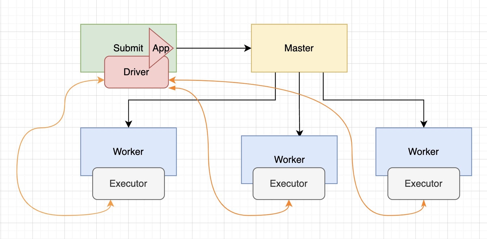
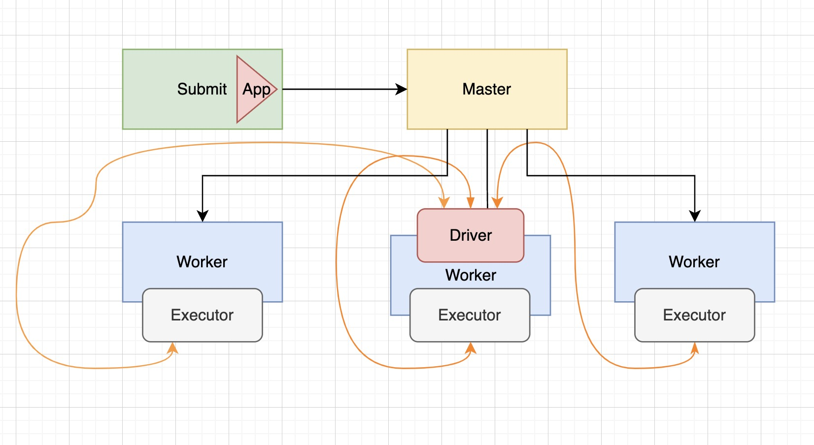

# 简介

`Spark Application`提交运行时的部署模式`Deploy Mode`，表示的是`Driver Program`运行的地方。
- `client`:Driver Program 运行在`提交应用的Client`上
- `cluster`:要么就是集群中从节点`(Standalone：Worker，YARN：NodeManager)`。

默认值为`client`，当在实际的开发环境中，尤其是生产环境，使用`cluster`部署模式提交应用运行。

# Client 模式

以`Spark Application`运行到`Standalone`集群上为例，前面提交运行圆周率PI或者词频统计`WordCount程序`时，默认 `DeployMode`为`Client`，表示应用`Driver Program`运行在提交应用的`Client 主机`上（启动 JVM Process 进程），示意图如下：


# Cluster 模式

如果采用cluster模式运行应用，应用Driver Program运行在集群从节点Worker某台机器上，示意图如下：



```scala
package cn.kaizi.spark

import org.apache.spark.rdd.RDD
import org.apache.spark.{SparkConf, SparkContext}


/**
 * 基于Scala语言使用SparkCore编程实现词频统计：WordCount
 * 从HDFS上读取数据，统计WordCount，将结果保存到HDFS上
 **/

object SparkWordCount {

  // TODO: 当应用运行在集群上的时候，MAIN函数就是Driver Program，必须创建SparkContext对象
  def main(args: Array[String]): Unit = {
    // 创建SparkConf对象，设置应用的配置信息，比如应用名称和应用运行模式
    val sparkConf: SparkConf = new SparkConf()
      .setMaster("local[2]")  // 设置运行本地模式
      .setAppName("SparkWordCount")
    // 构建SparkContext上下文实例对象，读取数据和调度Job执行
    val sc: SparkContext = new SparkContext(sparkConf)

    // ************第一步、读取数据:在Spark的Executor中执行***************
    // 封装到RDD集合，认为列表List
    val inputRDD: RDD[String] = sc.textFile("/datas/wordcount.data")
    // ***************************************************************

    // ************第二步、处理数据:在Spark的Executor中执行***************
    // 调用RDD中函数，认为调用列表中的函数
    // a. 每行数据分割为单词
    val wordsRDD = inputRDD.flatMap(line => line.split("\\s+"))
    // b. 转换为二元组，表示每个单词出现一次
    val tuplesRDD: RDD[(String, Int)] = wordsRDD.map(word => (word, 1))
    // c. 按照Key分组聚合
    val wordCountsRDD: RDD[(String, Int)] = tuplesRDD.reduceByKey((tmp, item) => tmp + item)
    // ***************************************************************

    // ************第三步、输出数据:在Spark的Executor中执行****************
    wordCountsRDD.foreach(println)
    // 保存到为存储系统，比如HDFS
    wordCountsRDD.saveAsTextFile(s"/datas/swc-output-${System.currentTimeMillis()}")
    // ***************************************************************

    // 为了测试，线程休眠，查看WEB UI界面
    Thread.sleep(10000000)
    // TODO：应用程序运行接收，关闭资源
    sc.stop()
  }
}

```

> main方法中一开始的创建SparkContext对象和最后的关闭SparkContext资源，都是在Driver Program中执行的，代码中的第一步加载数据、第二步处理数据、第三步输出数据都是在Executor上执行。

综上所述Spark Application中Job执行有两个主要点：
- RDD输出函数分类两类
    - 第一类：返回值给`Driver Progam`，比如`count`、`first`、`take`、`collect`等
    - 第二类：没有返回值，比如直接打印结果、保存至外部存储系统（HDFS文件）等
- 在`Job`中从读取数据封装为`RDD`和一切`RDD调用方法`都是在`Executor`中执行，其他代码都是在`Driver Program`中执行
    - `SparkContext`创建与关闭、其他变量创建等在`Driver Program`中执行
    - `RDD调用函数`都是在Executors中执行


# Client模式和Cluster模式的区别

Cluster和Client模式最本质的区别是：Driver程序运行在哪里。
- cluster模式：生产环境中使用该模式
  - Driver程序在YARN集群当中
  - 应用的运行结果不能在客户端显示
- client模式：学习测试时使用（也不一定，个人觉得生产环境也可以用）
  - Driver运行在Client上的SparkSubmit进程中
  - 应用程序运行结果会在客户端显示


