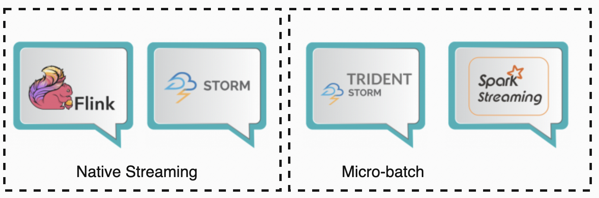
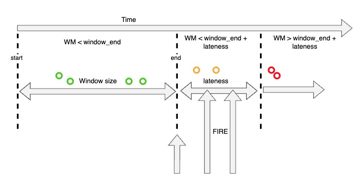

# 引言

Apache Flink(以下简称flink) 是一个旨在提供‘一站式’ 的分布式开源数据处理框架。和Spark的目标一样，都希望提供一个统一功能的计算平台给用户。虽然目标非常类似，但是flink在实现上和spark存在着很大的区别，flink是一个面向流的处理框架，输入在flink中是无界的，流数据是flink中的头等公民。这方面flink和storm有几分相似。那么有spark和storm这样成熟的计算框架存在，为什么flink还能占有一席之地呢？今天我们就从流处理的角度将flink和这两个框架进行一些分析和比较。

# 名词解析

| 名词     | 说明 | 举例    |
|----------|-----|---------------|
| 无边界数据    | 无边界数据通常指的是无限持续生成的数据流，没有明确定义的终点。这样的数据流可能是实时生成的事件、传感器数据、日志记录等，它们源源不断地产生，没有固定的结束点。  | 实时传感器数据，如温度传感器、网络日志，用户点击事件流等。这些数据是持续不断生成的，流式处理系统需要实时处理并适应新的数据产生。      |
| 有边界数据      | 有边界数据是有明确定义的开始和结束点的数据集。这样的数据集在某一时刻是完整的，不再发生变化。传统的批处理任务就是对有边界数据进行处理的典型例子。  | 关系数据库中的表、存储在文件中的数据集等。这些数据集在某一时刻是完整的，可以通过一次性加载到内存中进行批处理分析。 |
| Exactly-Once 语义  |  精确一次（Exactly-Once）处理语义，确保在出现故障或恢复时不会丢失或重复处理事件。这是保证数据处理的一致性的重要特性。 |       |
| 有状态计算 | 有状态的计算指能够处理具有记忆和上下文关联的计算任务。这对于处理事件序列、实时聚合和复杂的模式匹配非常有用。 |
| Sink | Sink是Flink中一种用于将数据从流处理应用程序发送到外部系统的组件，用于定义数据的最终目的地 | File Sink（文件输出）; Kafka Sink; Elasticsearch Sink; JDBC Sink; Custom Sink; |

# 流框架基于的实现方式

本文涉及的流框架基于的实现方式分为两大类。

- 第一类是Native Streaming，这类引擎中所有的data在到来的时候就会被立即处理，一条接着一条（HINT： 狭隘的来说是一条接着一条，但流引擎有时会为提高性能缓存一小部分data然后一次性处理），其中的代表就是storm和flink。

- 第二类则是基于Micro-batch，数据流被切分为一个一个小的批次， 然后再逐个被引擎处理。这些batch一般是以时间为单位进行切分，单位一般是‘秒‘，其中的典型代表则是spark了，不论是老的spark DStream还是2.0以后推出的spark structured streaming都是这样的处理机制；另外一个基于Micro-batch实现的就是storm trident，它是对storm的更高层的抽象，因为以batch为单位，所以storm trident的一些处理变得简单且高效。

# 流框架比较的关键指标

从流处理的角度将flink与spark和storm这两个框架进行比较，会主要关注以下几点，后续的对比也主要基于这几点展开：

- 功能性（Functionality）- 是否能很好解决流处理功能上的痛点 , 比如event time和out of order data。

- 容错性（Fault Tolerance） - 在failure之后能否恢复到故障之前的状态，并输出一致的结果；此外容错的代价也是越低越好，因为其直接影响性能。

- 吞吐量(throughputs)& 延时(latency) - 性能相关的指标，高吞吐和低延迟某种意义上是不可兼得的，但好的流引擎应能兼顾高吞吐&低延时。

# 功能性

## 各类时间的定义
[flink文档中关于各种时间的定义](https://nightlies.apache.org/flink/flink-docs-release-1.2/dev/event_time.html)
- Event time: 指数据或事件真正发生时间，比如用户点击网页时产生一条点击事件的数据，点击时间就是这条数据固有的Event time。理解为每个单独事件在其产生设备上发生的时间。
- Processing time: 指计算框架处理这条数据的时间
- Ingestion Time: 摄入时间是事件进入 Flink 的时间。

    

    spark DStream和storm 1.0以前版本往往都折中地使用processing time来近似地实现event time相关的业务。显然，使用processing time模拟event time必然会产生一些误差， 特别是在产生数据堆积的时候，误差则更明显，甚至导致计算结果不可用。

    在使用event time时，自然而然需要解决由网络延迟等因素导致的迟到或者乱序数据的问题。为了解决这个问题， spark、storm及flink都参考[streaming 102](https://www.oreilly.com/radar/the-world-beyond-batch-streaming-102/)引入了watermark和lateness的概念。

- watermark: 是引擎处理事件的时间进度，代表一种状态，一般随着数据中的event time的增长而增长。比如 watermark(t)代表整个流的event time处理进度已经到达t， 时间是有序的，那么streaming不应该会再收到timestamp t’ < t的数据，而只会接受到timestamp t’ >= t的数据。 如果收到一条timestamp t’ < t的数据， 那么就说明这条数据是迟到的。

- lateness: 表示可以容忍迟到的程度，在lateness可容忍范围内的数据还会参与计算，超过的会被丢弃。

## 窗口操作

### spark structured streaming 和flink对event time处理机制的比较

- Flink
  
  首先，我们结合图来看flink， 时间轴从左往右增大。当watermark WM处于时 间窗口区间内时，即WM ∈ [start, end] , event time落在窗口范围内的任何乱序数据都会被接受；随着WM的增长并超过了窗口的结束时间，但还未超过可容忍的lateness时间范围，即WM ∈ (window_end,window_end+ lateness]， 这时乱序数据仍然可以被接受； 只有当WM超过 window_end+lateness, 即WM ∈ (window_end+ lateness, ∞)， 迟到的数据将会被丢弃。

  

  fiink中watermark的计算也比较灵活，可以选择build-in的（如最大时间戳），也可以通过继承接口自定义实现。此外，用户可以选择周期性更新或者事件触发更新watermark。

- Spark
  
  首先,spark中watermark是通过上一个batch最大的timestamp再减去lateness得到的，即watermark = Max(last batch timestamps) - lateness。当数据的event time大于watermark时，数据会被接受，否则不论这条数据属于哪个窗口都会被丢弃。细节请参考[Window Operations on Event Time](https://spark.apache.org/docs/latest/structured-streaming-programming-guide.html#window-operations-on-event-time)

下面来比较一下两者实现细节上的不同：

- lateness定义: 在spark中，迟到被定义为data的event time和watermark的比较结果，当data的event time < watermark时，data被丢弃；flink中只有在watermark > window_end + lateness的时候，data才会被丢弃。

- watermark更新: spark中watermark是上个batch中的max event time，存在延迟；而在flink中是可以做到每条数据同步更新watermark。

- window触发: flink中window计算会触发一次或多次，第一次在watermark >= window_end后立刻触发（main fire），接着会在迟到数据到来后进行增量触发。spark只会在watermark（包含lateness）过了window_end之后才会触发，虽然计算结果一次性正确，但触发比flink起码多了一个lateness的延迟。

上面三点可见flink在设计event time处理模型还是较优的：watermark的计算实时性高，输出延迟低，而且接受迟到数据没有spark那么受限。

### SQL API方面的对比

待续，网上资料都是较老版本的比对，不太准确，等自己实践过再来总结吧

### Kafka 集成

待续

### 静态数据操作

待续

# 吞吐量

待续

# 总结

待续