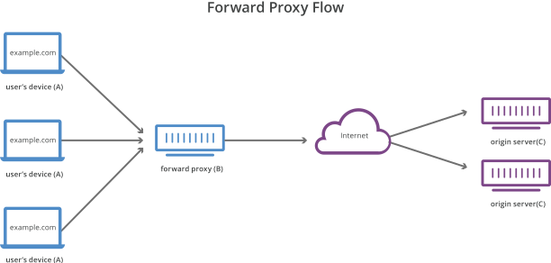
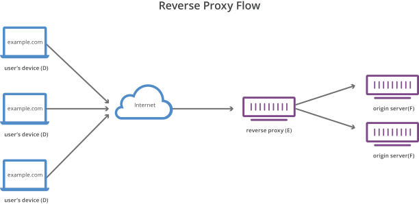

# 什么是反向代理
`反向代理`是位于`Web服务器`前面的服务器，其将`客户端`（例如`Web浏览器`）请求转发到这些`Web服务器`。反向代理通常用于帮助提高安全性、性能和可靠性。为了更好地理解反向代理的工作原理以及它可以提供的好处，我们来首先定义什么是`代理服务器`。

# 什么是代理服务器？
`转发代理`，通常称为`代理`、`代理服务器`或`Web代理`，是位于一组客户端计算机之前的服务器。当这些计算机向`Internet`上的站点和服务发出请求时，代理服务器将拦截这些请求，然后代表客户端与`Web服务器`进行通信，起到中间设备的作用。

例如，典型的转发代理通信中涉及3台计算机：
- A：这是用户的家用计算机
- B：这是一个转发代理服务器
- C：这是网站的源站（用于存储网站数据）

在标准的互联网通信中，`计算机A`将直接与`计算机C`保持联系，`客户端`将请求发送到`源服务器`，并且`源服务器`将响应`客户端`。当存在转发代理时，`A` 将请求发送到 `B`，`B` 随后将请求转发给 `C`。`C` 将向 `B` 发送响应，而 `B` 则将响应转发给 `A`。

为什么要将这个多余的中间设备添加到 Internet 活动中？使用转发代理可能有几个原因：
- 为避免浏览限制: 一些政府、学校和其他组织使用防火墙来使用户访问受限版本的互联网。转发代理可用于绕过这些限制，因为它们使用户可以连接到代理，而不是直接连接到他们正在访问的站点。
- 阻止访问某些内容: 相对的，也可以设置代理以阻止特定用户群访问某些站点。例如，学校网络可能配置为通过启用内容筛选规则的代理连接到 Web，以拒绝转发来自 Facebook 和其他社交媒体网站的响应。
- 保护自己的在线身份—: 在某些情况下，常规互联网用户希望增加在线匿名性，但在其他情况下，互联网用户居住在政府可能对政治异议者施加严重后果的地方。在网络论坛或社交媒体上批评政府可能会导致这些用户受到罚款或监禁。如果持不同政见者使用转发代理连接到他们发布政治敏感评论的网站，则用于发表评论的`IP地址`将更难追溯到持不同政见者。仅`代理服务器`的`IP地址`将对他人可见。

# 反向代理有何不同?
反向代理是位于一个或多个`Web服务器`前面的服务器，拦截来自`客户端`的请求。这与转发代理不同:在转发代理中，`代理`位于`客户端`的前面。使用`反向代理`，当`客户端`将请求发送到网站的`源服务器`时，`反向代理服务器`会在网络边缘拦截这些请求。然后，`反向代理服务器`将向`源服务器`发送请求并从`源服务器`接收响应。

`转发代理`和`反向代理`之间的区别非常细微，但非常重要。简单概括而言，`转发代理`位于客户端的前面，确保没有源站直接与该特定客户端通信；而`反向代理服务器`位于源站前面，确保没有客户端直接与该源站通信。

这一次，所涉及的计算机包括：
- D：任意数量的用户家用计算机
- E：这是反向代理服务器
- F：一台或多台源站
  

通常，来自`D`的所有请求都将直接发送到`F`，而`F`会直接将响应发送到`D`。使用`反向代理`，来自`D`的所有请求都将直接发送给`E`，而`E`会将其请求发送到`F`并从`F`接收响应，然后将适当响应传递给`D`。

下面是反向代理的一些好处：
- 负载均衡: 一个每天吸引数百万用户的热门网站可能无法使用单个源服务器处理所有传入站点流量。但该站点可以分布在不同服务器的池中，让所有服务器都处理同一站点的请求。在这种情况下，反向代理可以提供一种负载均衡解决方案，在不同服务器之间平均分配传入流量，以防止单个服务器过载。如果某台服务器完全无法运转，则其他服务器可以代为处理流量。
- 防范攻击: 配备反向代理后，网站或服务无需透露其源服务器的`IP地址`。这使得攻击者更难利用针对性攻击，例如`DDoS`攻击。这时候，攻击者只能针对反向代理。
- 全局服务器负载平衡(GSLB): 在这种负载均衡形式中，一个网站可以分布在全球各地的多个服务器上，反向代理会将客户端发送到地理位置上最接近它们的服务器。这样可以减少请求和响应传播的距离，从而最大程度地减少加载时间。
- 缓存: 反向代理还可以缓存内容，从而提高速度。例如，如果巴黎的用户访问使用反向代理而`Web服务器`位于洛杉矶的网站，则该用户实际上可能连接到巴黎本地的`反向代理服务器`，然后该本地`反向代理服务器`必须与洛杉矶的`源服务器`进行通信。之后，`代理服务器`可以缓存（或临时保存）响应数据。随后浏览该站点的巴黎用户将从巴黎`反向代理服务器`处获取本地缓存的响应，从而享受到更快的性能。
- SSL加密: 加密和解密每个客户端的`SSL（或 TLS）`通信对于源服务器可能需要耗费大量计算资源。可以配置由反向代理解密所有传入请求并加密所有传出响应，腾出源服务器上的宝贵资源。
  
