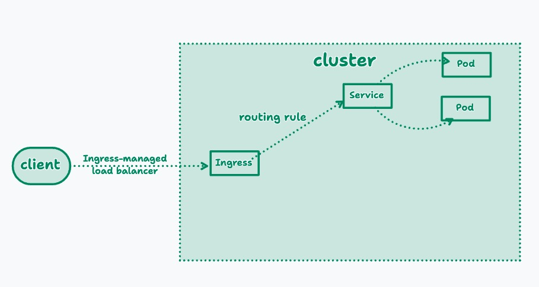
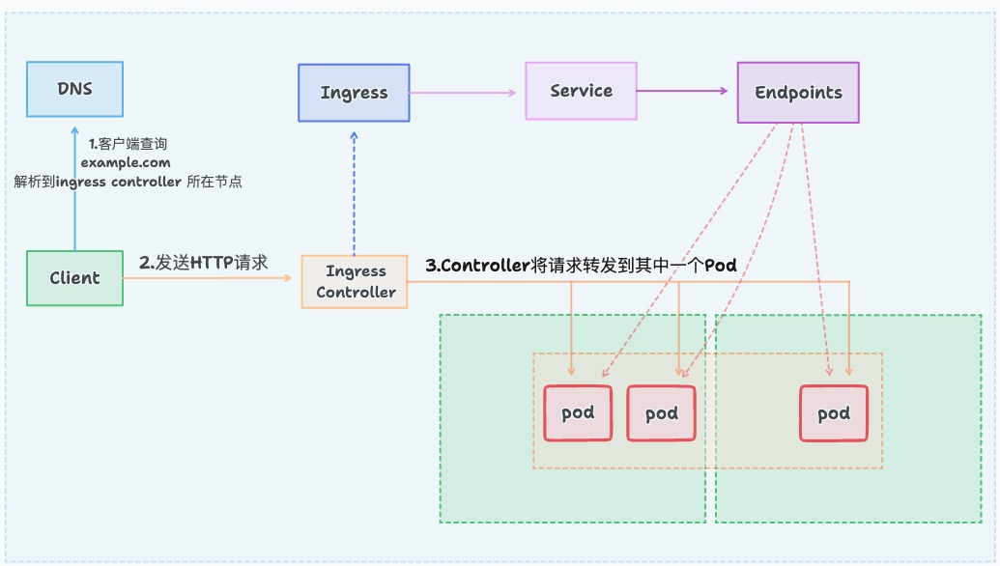
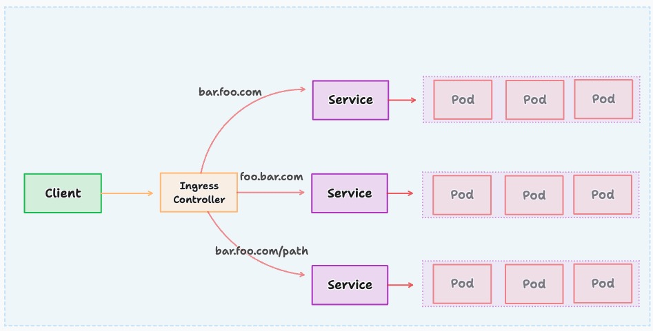
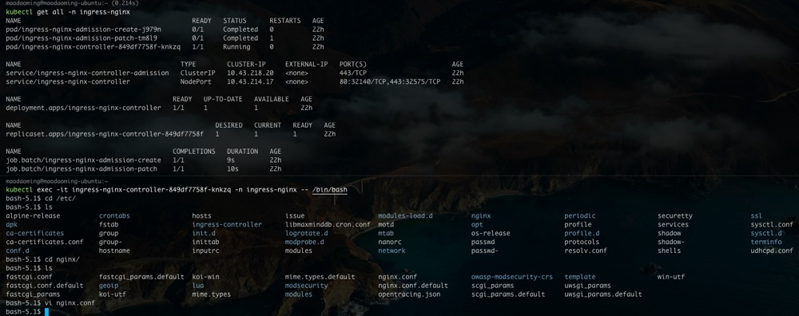

# `Ingress`是什么
`Ingress`公开从集群外部到集群内服务的`http`和`https`路由。流量路由由`Ingress`资源上定义的规则控制。下面是一个将所有流量都发送到同一个`Service`的简单`Ingress`示例：


# `Ingress`的组成
## ingress
`ingress`是一个API对象，通过`yaml`文件来配置，`ingress`对象的作用是定义请求如何发送到`service`的规则，可以理解为配置模板。`ingress`通过`http`或`https`暴露集群内部`service`，给`service`提供外部`URI`、`负载均衡`、`SSL/TLS`能力以及基于域名的反向代理。`ingress`要依靠`ingress-controller`来具体实现以上功能。
## Ingress-controller
`Ingress-controller`是具体实现反向代理及负载均衡的程序，对`ingress`定义的规则进行解析，根据配置的规则来实现请求转发。`ingress-controller`并不是`k8s`自带组件，实际上`ingress-controller`只是一个统称，用户可以选择不同的`ingress-controller`实现，目前，由`k8s`维护的`ingress-controller`只有google云的GCE与ingress-nginx两个，其它还有很多第三方维护的ingress-controller,具体可以参考官方文档。但是不管哪一种`ingress-controller`，实现的机制都大同小异，只是在具体配置上有差异。

一般来说，`ingress-controller`的形式都是一个pod，里面跑着daemon程序和反向代理程序。daemon负责不断监控集群的变化，根据`ingress`对象生成配置到反向代理，比如`ingress-nginx`配置，动态更新`upstream`，并在需要的时候`reload`程序应用新配置。为了方便，后面的例子都以`k8s`官方维护的`ingress-nginx`为例。

## Ingress的工作原理
- ingress-controller通过和kubernetes APIServer交互，动态去感知集群中ingress规则变化；
- 然后读取它，按照自定义的规则，规则就是写明了哪个域名对应哪个service,生成一段nginx配置；
- 再写到inginx-ingress-controller的pod里，这个ingress-controller的pod里运行着一个Nginx服务，控制器会把生成的nginx配置写入到/etc/nginx.conf中；
- 然后reload一下使配置生效。以此达到域名区分配置和动态更新的作用。

Ingress流图


例子如下图：


# 部署
## 下载部署文件和镜像
### 下载ingress-nginx的部署文件
```shell
#需要下载别的版本请求改版本号
wget https://raw.githubusercontent.com/kubernetes/ingress-nginx/controller-v1.3.0/deploy/static/provider/cloud/deploy.yaml
#备注：该文件在github上也可以下载，地址是：https://github.com/kubernetes/ingress-nginx/blob/main/deploy/static/provider/cloud/deploy.yaml
```
### 关于镜像
由于镜像网络问题，会导致yaml文件中的镜像无法下载，解决思路：先在docker hub上查找，下载下来之后，将其推送到私有的harbor镜像服务器上需要下载如下两个镜像：
```shell
cat deploy.yaml |grep image
```
```
image: registry.k8s.io/ingress-nginx/controller:v1.3.0@sha256:d1707ca76d3b044ab8a28277a2466a02100ee9f58a86af1535a3edf9323ea1b5
imagePullPolicy: IfNotPresent
image: registry.k8s.io/ingress-nginx/kube-webhook-certgen:v1.1.1@sha256:64d8c73dca984af206adf9d6d7e46aa550362b1d7a01f3a0a91b20cc67868660
imagePullPolicy: IfNotPresent
image: registry.k8s.io/ingress-nginx/kube-webhook-certgen:v1.1.1@sha256:64d8c73dca984af206adf9d6d7e46aa550362b1d7a01f3a0a91b20cc67868660
imagePullPolicy: IfNotPresent
```

### 修改部署文件
- hostNetwork：是为了打通Cluster和node的网络，让Cluster直接临听node的端口，一般是80和443，不用再通过随机绑定NodePort来访问集群服务。
  > 以前访问：http://www.blockchainof.com:10080/server1/path 现在访问：http://www.blockchainof.com/server1/path 可以看到不需要端口了，因为hostNetwork直接监听node的80端口了
- nodeSelector：在nodeSelector下添加hasIngress: "true"
  > 可以给集群中的node添加标签，然后部署的时候nodeSelector就会根据标签找到具有这个标签的node，只在这部分node上进行部署。
- DaemonSet: 把kind的值从Deployment改为DaemonSet，因为Deployment可能会把多个Pod调度到同一个node（同一个node上会存在pod的多个副本，而DaemonSet最多只有一个），这样比较符合多节点高可用的意义。

修改后的deploy.yaml如下：
```yaml
......
apiVersion: apps/v1
#kind: Deployment
kind: DaemonSet  #这里把Deployment改成DaemonSet
metadata:
  labels:
    app.kubernetes.io/component: controller
    app.kubernetes.io/instance: ingress-nginx
    app.kubernetes.io/name: ingress-nginx
    app.kubernetes.io/part-of: ingress-nginx
    app.kubernetes.io/version: 1.3.0
  name: ingress-nginx-controller
  namespace: ingress-nginx
spec:
  minReadySeconds: 0
  revisionHistoryLimit: 10
  selector:
    matchLabels:
      app.kubernetes.io/component: controller
      app.kubernetes.io/instance: ingress-nginx
      app.kubernetes.io/name: ingress-nginx
  template:
    metadata:
      labels:
        app.kubernetes.io/component: controller
        app.kubernetes.io/instance: ingress-nginx
        app.kubernetes.io/name: ingress-nginx
    spec:
      hostNetwork: true  #这里加一句
      containers:
      - args:
        - /nginx-ingress-controller
        - --publish-service=$(POD_NAMESPACE)/ingress-nginx-controller
        - --election-id=ingress-controller-leader
        - --controller-class=k8s.io/ingress-nginx
        - --ingress-class=nginx
        - --configmap=$(POD_NAMESPACE)/ingress-nginx-controller
        - --validating-webhook=:8443
        - --validating-webhook-certificate=/usr/local/certificates/cert
        - --validating-webhook-key=/usr/local/certificates/key
        env:
...
      nodeSelector:
        kubernetes.io/os: linux
        hasIngress: "true"  # 这里根据标签选择node
...
```

### 给节点增加标签
在上一章节中`deploy.yaml`中`nodeSelector`下增加了`hasIngress: "true"`, 所以对应的，在需要部署`ingress controller`的节点打上`hasIngress`这个标签。
```shell
kubectl label nodes ${k8s-node1} hasIngress=true
kubectl label nodes ${k8s-node2} hasIngress=true
```

### 部署
```shell
kubectl apply -f deploy.yaml 
```
没什么意外的话，等待一段时间完成部署。

# 应用
## 部署服务（以tomcat和nginx为例）
### 创建tomcat-nginx.yaml
```yaml
apiVersion: apps/v1
kind: Deployment
metadata:
  name: nginx-deployment
  namespace: dev
spec:
  replicas: 3
  selector:
    matchLabels:
      app: nginx-pod
  template:
    metadata:
      labels:
        app: nginx-pod
    spec:
      containers:
      - name: nginx
        image: nginx:1.17.1
        ports:
        - containerPort: 80
---
apiVersion: apps/v1
kind: Deployment
metadata:
  name: tomcat-deployment
  namespace: dev
spec:
  replicas: 3
  selector:
    matchLabels:
      app: tomcat-pod
  template:
    metadata:
      labels:
        app: tomcat-pod
    spec:
      containers:
      - name: tomcat
        image: tomcat:8.5-jre10-slim
        ports:
        - containerPort: 8080

---
apiVersion: v1
kind: Service
metadata:
  name: nginx-service
  namespace: dev
spec:
  ports:
    - port: 80
      name: nginx
  clusterIP: None
  selector:
    app: nginx-pod
---
apiVersion: v1
kind: Service
metadata:
  name: tomcat-service
  namespace: dev
spec:
  ports:
    - port: 8080
      name: tomcat
  clusterIP: None
  selector:
    app: tomcat-pod
```
创建
```shell
kubectl apply -f tomcat-nginx.yaml 
```
```
deployment.apps/nginx-deployment created
deployment.apps/tomcat-deployment created
```
查看
```shell
kubectl get svc -n dev
```
```
NAME             TYPE        CLUSTER-IP   EXTERNAL-IP   PORT(S)    AGE
nginx-service    ClusterIP   None         <none>        80/TCP     59m
tomcat-service   ClusterIP   None         <none>        8080/TCP   59m
```
> 服务就已经部署好了

## http代理
### 创建ingress-http.yaml
```yaml
apiVersion: extensions/v1beta1
kind: Ingress
metadata:
  name: ingress-http
  namespace: dev
spec:
  rules:
  - host: nginx.blockchainof.com
    http:
      paths:
      - path: /
        backend:
          serviceName: nginx-service
          servicePort: 80
  - host: tomcat.blockchainof.com
    http:
      paths:
      - path: /
        backend:
          serviceName: tomcat-service
          servicePort: 8080
```
### 创建
```shell
kubectl create -f ingress-http.yaml
```
```
ingress.extensions/ingress-http created
```
### 查看
```shell
kubectl get ing ingress-http -n dev
```
```
NAME           HOSTS                                  ADDRESS   PORTS   AGE
ingress-http   nginx.blockchainof.com,tomcat.blockchainof.com             80      18s
```
### 查看详情
```shell
kubectl describe ing ingress-http -n dev
```
```
Name:             ingress-http
Namespace:        dev

  nginx.blockchainof.com   
                      /   nginx-service:80 (10.244.1.132:80,10.244.1.135:80,10.244.1.139:80)
  tomcat.blockchainof.com  
                      /   tomcat-service:8080 (10.244.1.129:8080,10.244.1.134:8080,10.244.1.140:8080)
Annotations:
Events:
  Type    Reason  Age   From                      Message
  ----    ------  ----  ----                      -------
  Normal  CREATE  48s   nginx-ingress-controller  Ingress dev/ingress-http
```
### 查看ingress-controller的nginx配置是否发生修改
```shell
kubectl exec -it nginx-ingress-controller-7f74f657bd-t8pvt sh -n ingress-nginx
/etc/nginx
```
```shell
cat nginx.conf|grep nginx.blockchainof.com
```
```
	## start server nginx.blockchainof.com
		server_name nginx.blockchainof.com ;
	## end server nginx.blockchainof.com
```

### 查看ingress-controller的svc端口
```shell
kubectl get svc -n ingress-nginx
```