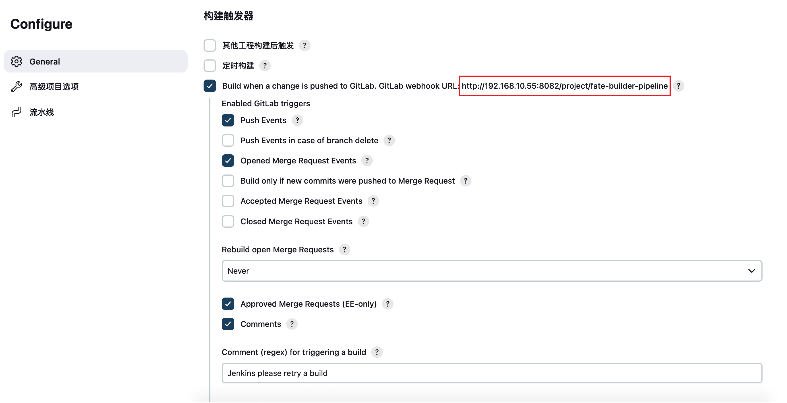
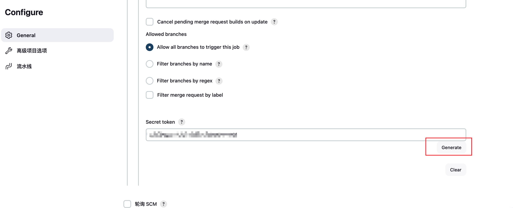

# Jenkins pipeline任务

- 需要安装插件：`Pipeline`

- 创建Pipeline任务，配置`构建触发器`，这个既然是流水线任务，要先有个地方触发这个任务的执行，这里会显示一个`webhook URL`。我们需要实现的目标是，当gitlab上提交代码或者创建`push tag`时，把这些事件通知到jenkins，让它启动这个流水线，所以这里的`webhook URL`就是用来接收gitlab发送的通知用的，但jenkins也不可能无条件接收所有的通知信息，所以这里还有一个`token`，只有`token`可以在配置界面中生成。

  
	TOKEN的生成是在**高级**选项中
	

- 在`gitlab`中配置事件通知
	进入到gitlab中项目的`settings->integrations`
	- 填写`URL`，即jenkins pipeline 任务的 webhook url
	- 填写`Secret Token`，即jenkins pipeline 任务中生成的 token
	- Trigger中根据需要勾选，比如勾选了`Tag push events`，每当你创建了新的tag后，gitlab就会触发（发送通知到webhook url）jenkis pipeline任务启动

- 配置pipeline脚本

	```groovy
	pipeline {
	    agent any
	
	    environment {
	        GIT_URL_FATE_BUILDER = "http://x.x.x.x/YunPCDS/pcds-bfia/pcds-builder.git"
	        GIT_URL_FATE = "http://x.x.x.x/YunPCDS/pcds-bfia/fate.git"
	        GIT_CREDENTIALS_ID = "git帐号在Jenkins中的凭据ID"
	
	        DEST_PATH = '/home/centos/builder'
	
	        // 触发构建的gitlab tag 获取到的值样例： refs/tags/v0.0.1-test
	        GITLAB_TAG_NAME = ""
	        // docker镜像标签
	        DOCKER_IMAGE_TAG = ""
	
	        SUBDIRECTORY_FATE = "fate"
	        SUBDIRECTORY_FATE_BUILDER = "pcds-builder"
	
	        PREFIX = "yunpcds"
	        // DOCKERHUB，用于最后push docker镜像
	        DOCKER_REGISTRY = "x.x.x.x:xxxx"
	        // 服务器唯一标识，用来指定在哪台服务器上执行shell脚本（因为任务中有一个步骤需要在远程服务器上执行shell脚本）
	        HOST_SERVER_NAME = "xxxx"
	        // 设置代理（可选）
	        PROXY = "http://x.x.x.x:xxxx http_proxy=http://x.x.x.x:xxxx all_proxy=socks5://x.x.x.x:xxxx"
	        PCDS_WORKSPACE = ""
	        FATE_DIR = ""
	        BUILD_DIR = ""
	    }
	
	    stages {
	        // 打印所有环境变量，便于查看触发的Tag是哪个环境变量
	        stage('Print All Environment') {
	            steps {
	                script {
	                    sh 'printenv'
	                }
	            }
	        }
	
	        stage('Prepare Gitlab Tag Name') {
	            steps {
	                script {
	                    // 获取触发构建的tag
	                    GITLAB_TAG_NAME = env.gitlabBranch
	                    def tagName = GITLAB_TAG_NAME.replace("refs/tags/", "")
	                    DOCKER_IMAGE_TAG = tagName
	                    echo "Triggered by GitLab tag: ${GITLAB_TAG_NAME}"
	                    echo "Setting DOCKER IMAGE TAG to ${DOCKER_IMAGE_TAG}"
	                    PCDS_WORKSPACE = '/home/centos/jenkins/workspace/${JOB_NAME}'
	                    echo "PCDS_WORKSPACE ==> ${PCDS_WORKSPACE}"
	                    FATE_DIR = '${PCDS_WORKSPACE}/fate'
	                    BUILD_DIR = '${PCDS_WORKSPACE}/pcds-builder/docker-build'
	                }
	            }
	
	        }
	
	        stage('git checkout fate-builder') {
	            steps {
	                dir("${SUBDIRECTORY_FATE_BUILDER}") {
	                    checkout([$class           : 'GitSCM', branches: [[name: "dev-2.1.0"]],
	                              userRemoteConfigs: [[credentialsId: "${GIT_CREDENTIALS_ID}", url: "${GIT_URL_FATE_BUILDER}"]]
	                    ])
	                }
	            }
	        }
	
	        stage('git checkout fate') {
	            steps {
	                dir("${SUBDIRECTORY_FATE}") {
	                    checkout([$class           : 'GitSCM', branches: [[name: "${GITLAB_TAG_NAME}"]],
	                              userRemoteConfigs: [[credentialsId: "${GIT_CREDENTIALS_ID}", url: "${GIT_URL_FATE}"]]
	                    ])
	                }
	            }
	        }
	
	        stage('Docker Build and Push') {
	            steps {
	                sshPublisher(publishers: [sshPublisherDesc(configName: "${HOST_SERVER_NAME}", transfers: [sshTransfer(cleanRemote: false, excludes: '', execCommand: """
	            export PCDS_WORKSPACE=${PCDS_WORKSPACE}
	            echo 'PCDS_WORKSPACE: ${PCDS_WORKSPACE}'
	
	            export FATE_DIR=${FATE_DIR}
	            export BUILD_DIR=${BUILD_DIR}
	
	            cd ${BUILD_DIR}/
	
	            echo 'PROXY: ${PROXY}'
	            export https_proxy=${PROXY}
	
	            PREFIX=${DOCKER_REGISTRY}/${PREFIX} GIT_TAG=${DOCKER_IMAGE_TAG}  bash -x build.sh all
	
	            docker login -u admin -p yunphant ${DOCKER_REGISTRY}
	
	            echo "start push image"
	            PREFIX="${DOCKER_REGISTRY}/${PREFIX}" GIT_TAG="${DOCKER_IMAGE_TAG}"  bash -x build.sh push
	            echo "finish push image"
	
	          """, execTimeout: 7200000, flatten: false, makeEmptyDirs: false, noDefaultExcludes: false, patternSeparator: '[, ]+',
	                        remoteDirectory: "${PCDS_WORKSPACE}", remoteDirectorySDF: false, removePrefix: '', sourceFiles: "")],
	                        usePromotionTimestamp: false, useWorkspaceInPromotion: false, verbose: true)])
	
	                echo 'Docker Build、Push  SUCCESS'
	            }
	        }
	    }
	}
	```
	
	
