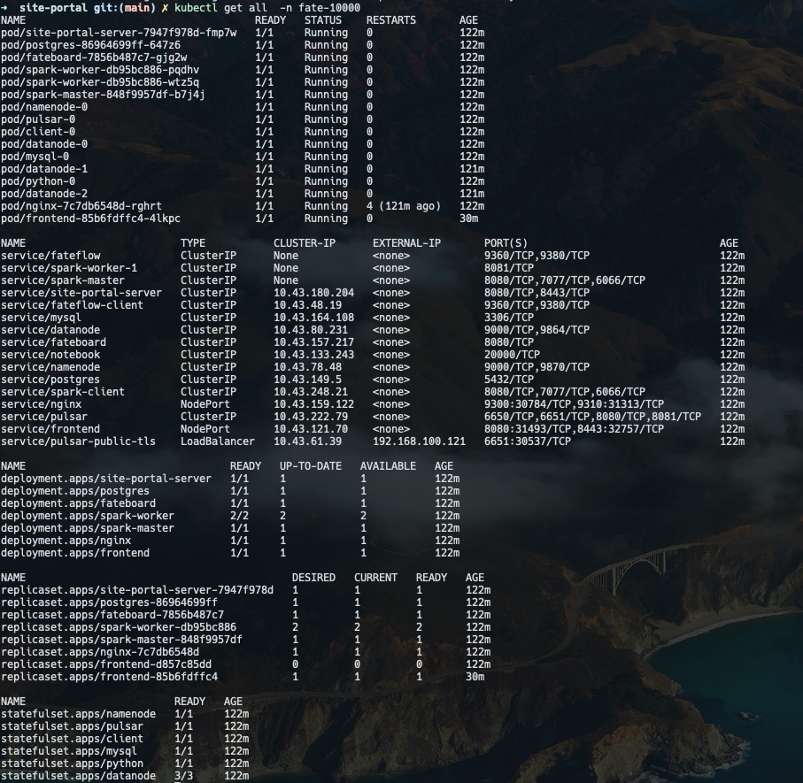
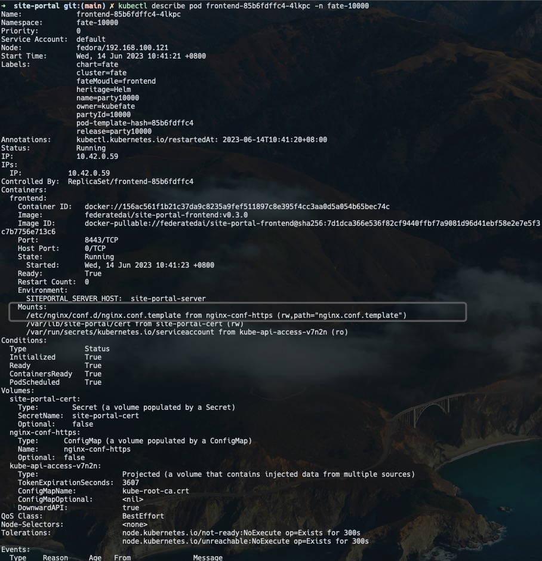
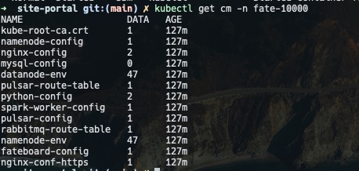
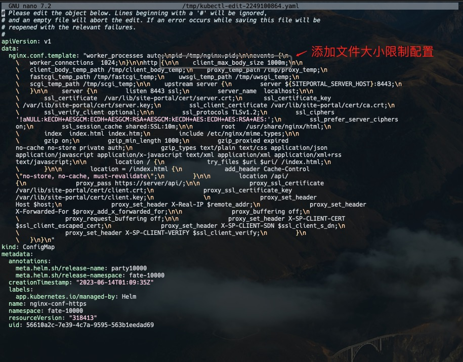
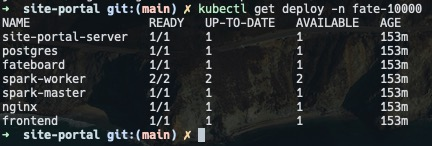

# 背景
部署在k3s中的一个应用，在前端页面中上传文件，出现报错，提示是文件太大。需要修改nginx配置来解决这个问题。这个应用部署在fate-10000命名空间下

# 解决
- 查看一下fate-10000这个命名空间
  ```shell
  kubectl get all  -n fate-10000
  ```
  

- 先查看一下`site-portal`前端`pod`的描述信息：例子中为`fate-10000`命名空间下的`frontend-85b6fdffc4-4lkpc`
  ```shell
  kubectl describe pod frontend-85b6fdffc4-4lkpc -n fate-10000
  ```
  
> 注意图中nginx的配置文件会从nginx-conf-https中获取一些运维自定义的配置，nginx-conf-http是一个configMap, configMap的作用我理解的就是给运维人员后期动态去修改配置，pod从configMap中获取这些自定义的值后就达到了动态修改配置的目的，当然configMap修改后，相关的pod需要重启

- 查看命名空间下的configMap
  ```shell
  kubectl get cm -n fate-10000
  ```
  

- 编辑configMap中的内容
  ```shell
  kubectl edit cm nginx-conf-https -n fate-10000
  ```
  

- 获取deployment
  ```shell
  kubectl get deploy -n fate-10000
  ```
  

- 用另外一种方式确认某个pod是否和某个configMap有关联
  ```shell
  kubectl get deploy frontend -n fate-10000 -o yaml
  ```
  返回如下：
   ```yaml
   apiVersion: apps/v1
   kind: Deployment
   metadata:
   annotations:
      deployment.kubernetes.io/revision: "2"
      meta.helm.sh/release-name: party10000
      meta.helm.sh/release-namespace: fate-10000
   creationTimestamp: "2023-06-14T01:09:35Z"
   generation: 2
   labels:
      app.kubernetes.io/managed-by: Helm
      chart: fate
      cluster: fate
      fateMoudle: frontend
      heritage: Helm
      name: party10000
      owner: kubefate
      partyId: "10000"
      release: party10000
   name: frontend
   namespace: fate-10000
   resourceVersion: "319024"
   uid: e62cf903-86b2-4799-96e1-f366ed4e3395
   spec:
   progressDeadlineSeconds: 600
   replicas: 1
   revisionHistoryLimit: 10
   selector:
      matchLabels:
         fateMoudle: frontend
         name: party10000
         partyId: "10000"
   strategy:
      type: Recreate
   template:
      metadata:
         annotations:
         kubectl.kubernetes.io/restartedAt: "2023-06-14T10:41:20+08:00"
         creationTimestamp: null
         labels:
         chart: fate
         cluster: fate
         fateMoudle: frontend
         heritage: Helm
         name: party10000
         owner: kubefate
         partyId: "10000"
         release: party10000
      spec:
         containers:
         - env:
         - name: SITEPORTAL_SERVER_HOST
            value: site-portal-server
         image: federatedai/site-portal-frontend:v0.3.0
         imagePullPolicy: IfNotPresent
         name: frontend
         ports:
         - containerPort: 8443
            protocol: TCP
         resources: {}
         terminationMessagePath: /dev/termination-log
         terminationMessagePolicy: File
         volumeMounts:
         - mountPath: /var/lib/site-portal/cert
            name: site-portal-cert
         - mountPath: /etc/nginx/conf.d/nginx.conf.template
            name: nginx-conf-https
            subPath: nginx.conf.template
         dnsPolicy: ClusterFirst
         restartPolicy: Always
         schedulerName: default-scheduler
         securityContext: {}
         serviceAccount: default
         serviceAccountName: default
         terminationGracePeriodSeconds: 30
         volumes:
         - name: site-portal-cert
         secret:
            defaultMode: 420
            secretName: site-portal-cert
         - configMap:
            defaultMode: 420
            name: nginx-conf-https
         name: nginx-conf-https
   status:
   availableReplicas: 1
   conditions:
   - lastTransitionTime: "2023-06-14T02:41:23Z"
      lastUpdateTime: "2023-06-14T02:41:23Z"
      message: Deployment has minimum availability.
      reason: MinimumReplicasAvailable
      status: "True"
      type: Available
   - lastTransitionTime: "2023-06-14T01:09:35Z"
      lastUpdateTime: "2023-06-14T02:41:23Z"
      message: ReplicaSet "frontend-85b6fdffc4" has successfully progressed.
      reason: NewReplicaSetAvailable
      status: "True"
      type: Progressing
   observedGeneration: 2
   readyReplicas: 1
   replicas: 1
   updatedReplicas: 1
   ```
  > 注意看其中的 configMap, 就是: nginx-conf-https，所以说明我们可以去改nginx-config-https这个configMap中的值，修改会作用于frontend

- 编辑configMap
```shell
kubectl edit cm nginx-conf-https -n fate-10000
```
上述命令会使用nano打开configMap,可以对configMap进行编辑


- 重启frontend
```shell
kubectl rollout restart deployment/frontend -n fate-10000
```
> 注意这个命令中的 `deployment/frontend`, 命令中需要有`deployment/`加在前面