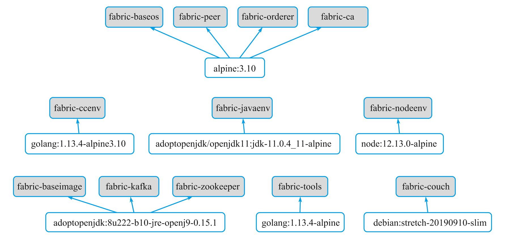
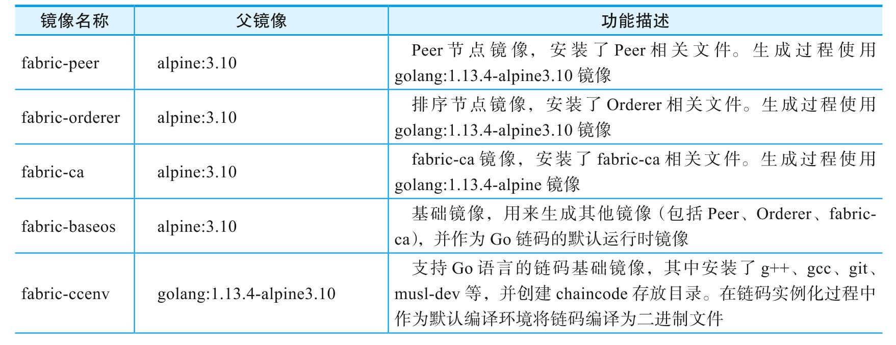
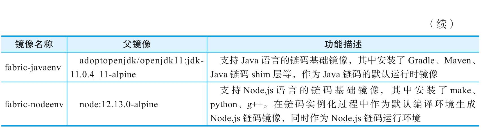
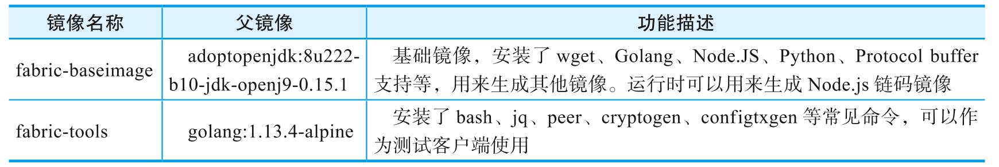
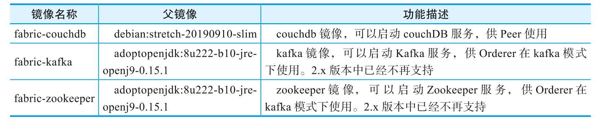
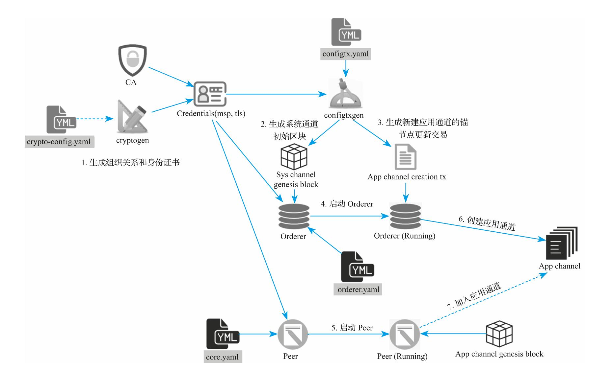
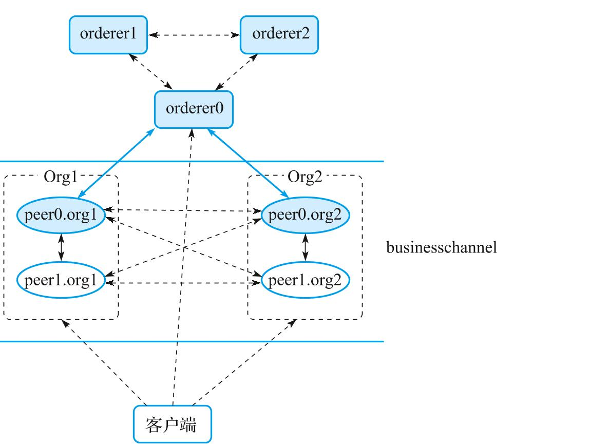

# 网络基本结构
Faric网络中存在四种不同角色的服务节点，彼此协作完成整个区块链系统的记账功能。
- 背书节点(Endorser Peer):一些特殊的Peer节点，对交易提案（Transaction Proposal）进行检查，执行智能合约，计算交易执行结果（读写集合）并对其进行背书。
- 记帐节点(Committer Peer):负责维护账本的Peer节点，检查排序后交易结果的合法性，并更新到本地账本。目前所有Peer默认都是记账节点。
- 排序节点(Orderer):负责接收交易，并对网络中所有交易进行排序，整理为区块结构。记账节点会从排序节点拉取新区块并提交到本地账本。
- 证书节点(CA):提供标准的PKI服务，负责对网络中所有的证书进行管理，包括签发和撤销。不参与网络中的交易过程。

角色划分是Fabric设计的一个特色。根据性能和安全需求，不同的节点可以由不同组织分别管理，共同构建联盟链。

此外，网络支持多个账本绑定对应通道(Channel)。每个通道内的成员可以共享账本，不同通道的账本彼此隔离。客户端可以向通道发送交易，经过共识后被通道内的Peer节点接收并更新到本地账本。

# Fabric中的配置辅助工具
- cryptogen(本地生成组织结构和身份文件)
- configtxgen(生成配置区块和配置交易)
- configtxlator(解析转换配置信息)
- discover(拓扑探测)
- idemixgen(Idemix证书生成)

# fabric项目相关的docker镜像
这些镜像都在hyperledger仓库中，它们之间的相互依赖关系如下图：


根据不同用途，Docker镜像可以大致分为三类：核心镜像、辅助镜像和第三方镜像。
- 核心镜像
   
   提供Fabric网络运行的核心功能，目前包括`fabric-peer`、`fabric-orderer`、`fabric-ca`、`fabric-baseos`、`fabric-ccenv`、`fabric-javaenv`、`fabric-nodeenv`共7个镜像，如下图：
   
   
- 辅助镜像
  
  提供支持功能，目前包括`fabric-baseimage`、`fabric-tools`镜像，如下图
  

- 第3方镜像
  
  主要是由一些第3方开源软件提供支持功能，目前包括`fabric-couchdb`、`fabric-kafka`、`fabric-zookeeper`3个镜像。如下图：
  

# 从源码生成Docker镜像
可以通过如下命令在本地快速生成`fabric-baseos`、`fabric-peer`、`fabric-orderer`、`fabric-ccenv`、`fabric-tools`等多个Docker镜像：
```shell
make docker
```

# 用本地方式启动Fabric网络
启动一个Fabric网络主要包括如下步骤：
- **规划初始网络拓扑**。根据联盟的需求规划拓扑信息，包括联盟成员、排序服务集群、应用通道初始成员等；
- **准备启动配置文件**。包括网络中组织结构和对应的身份证书（可使用`cryptogen`工具或`fabric-ca`完成）、系统通道的初始配置区块文件（可使用`configtxgen`工具完成）。
- **启动排序节点**。使用系统通道的初始区块文件启动排序服务，排序服务启动后自动按照指定配置创建系统通道。
- **启动Peer节点**。不同的组织按照预置角色分别启动Peer节点。
- **创建通道**。客户端使用新建应用通道的配置更新交易文件，向系统通道发送交易，创建新的应用通道。
- **加入通道**。`Peer`节点利用初始区块加入所创建的应用通道。
主要步骤如下图：


# 规划初始网络拓扑
示例网络拓扑如下图所示，包括3个`Orderer`节点和4个`Peer`节点，以及1个客户端操作节点（负责生成相关启动文件，在网络启动后作为客户端执行命令）。

其中，`Orderer`服务采用`Raft`模式，所有节点都加入新建的`businesschannel`中。4个`Peer`节点分属两个组织:`Org1`和`Org2`，也都是应用通道成员。每个组织中的peer0节点作为锚节点负责与其它组织节点分享信息。

