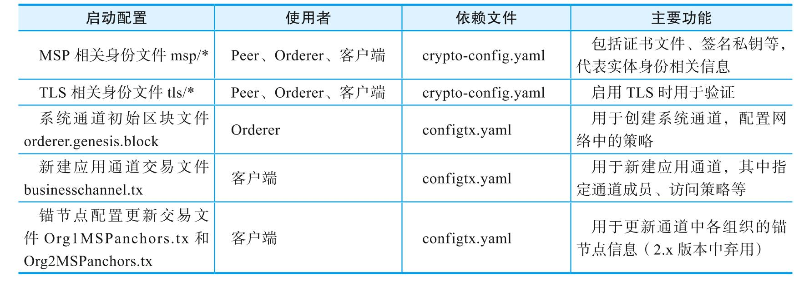
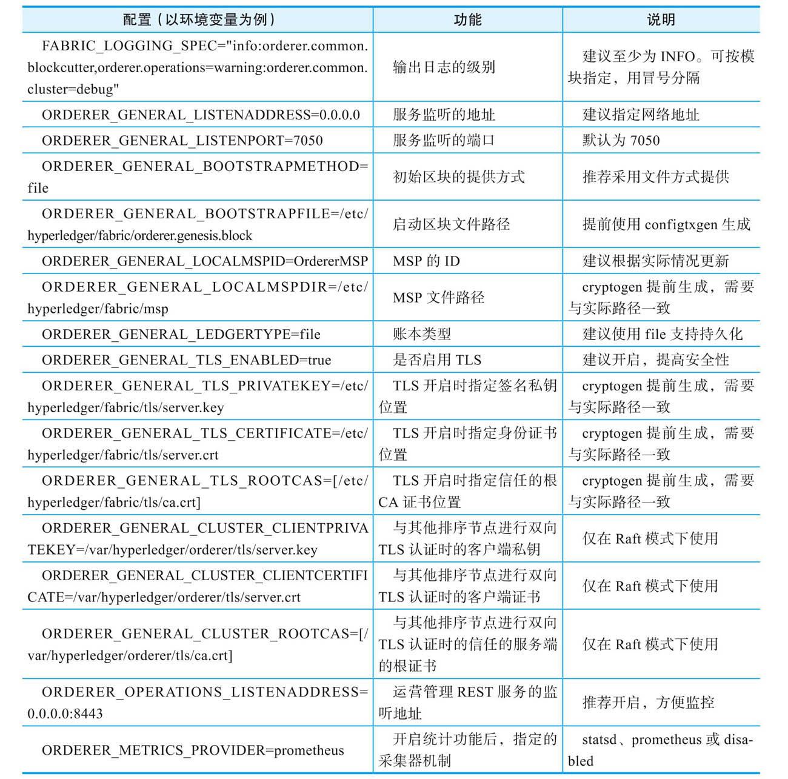
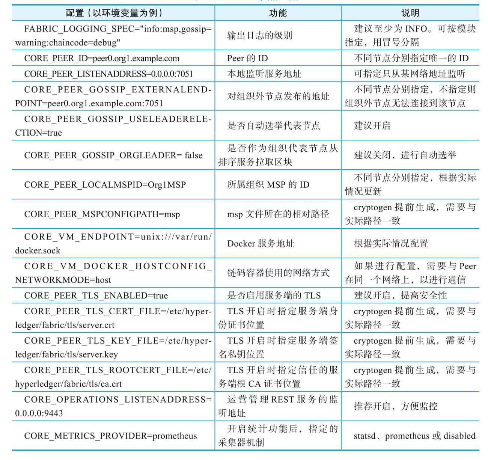

# 准备启动配置文件
`Fabric`网络在启动之前，需要提前生成一些用于启动的配置文件，主要包括`MSP`相关身份文件`(msp/*)`、`TLS`相关身份文件`(tlsca/*)`、系统通道初始区块`(orderer.genesis.block)`、新建应用通道交易文件`(businesschannel.tx)`、锚节点配置更新交易文件`(Org1MSPanchors.tx和Org2MSPanchors.tx)`等。

各启动配置文件的功能如下：


# 配置文件的生成过程
## 生成组织关系和身份证书
`Fabric`网络作为联盟链，需要多个成员组织共同维护。成员之间通过身份进行识别，网络通过身份来限制访问权限，因此各成员组织都需要提前准备对应的身份文件，并部署到其所拥有的节点和客户端上。

用户可通过标准PKI服务（如果使用`Fabric CA`实现）或`OpenSSL`工具，手动生成各个实体的证书和私钥。`Fabric`项目还提供了`cryptogen`工具（基于`Go`语言`crypto`标准库）在本地生成，需要提前准备`crypto-config.yaml`配置文件。

`crypto-config.yaml`配置文件的结构十分简单，支持定义两种类型`(OrdererOrgs和PeerOrgs)`的若干组织。每个组织中又可以定义多个节点`(Spec)`和用户`(User)`。

本示例的`crypo-config.yaml`配置文件中，定义了一个`OrderderOrgs`类型的组织`example.com`，包括3个节点：两个`PeerOrgs`类型的组织`org1.example.com`和`org2.example.com`，分别包括2个节点和1个普通用户身份，文件内容如下：
```yaml
OrdererOrgs:
  - Name: Orderer
    Domain: example.com
    CA:
        Country: US
        Province: California
        Locality: San Francisco
    Specs:
      - Hostname: orderer0
      - Hostname: orderer1
      - Hostname: orderer2
PeerOrgs:
  - Name: Org1
    Domain: org1.example.com
    EnableNodeOUs: true
    CA:
        Country: US
        Province: California
        Locality: San Francisco
    Template:
      Count: 2
    Users:
      Count: 1
  - Name: Org2
    Domain: org2.example.com
    EnableNodeOUs: true
    CA:
        Country: US
        Province: California
        Locality: San Francisco
    Template:
      Count: 2
    Users:
      Count: 1
```

使用该配置文件，通过如下命令可**生成**指定组织结构的身份文件，并存放到`crypto-config`目录下：
```shell
cryptogen generate \
    --config=./crypto-config.yaml \
    --output ./crypto-config
```
用户修改配置后，还可以通过`extend`子命令来**更新**`crypto-config`目录：
```shell
cryptogen extend \
    --config=./crypto-config.yaml \
    --input ./crypto-config
```

查看刚生成的`crypto-config`目录，结构如下：
```
$ tree -L 4 crypto-config
crypto-config
|-- ordererOrganizations
|   `-- example.com
|       |-- ca
|       |   |-- 293def0fc6d07aab625308a3499cd97f8ffccbf9e9769bf4107d6781f5e8072b_sk
|       |   `-- ca.example.com-cert.pem
|       |-- msp
|       |   |-- admincerts/
|       |   |-- cacerts/
|       |   `-- tlscacerts/
|       |-- orderers
|       |   `-- orderer0.example.com/
|       |   `-- orderer1.example.com/
|       |   `-- orderer2.example.com/
|       |-- tlsca
|       |   |-- 2be5353baec06ca695f7c3b04ca0932912601a4411939bfcfd44af18274d5a65_sk
|       |   `-- tlsca.example.com-cert.pem
|       `-- users
|           `-- Admin@example.com/
`-- peerOrganizations
    |-- org1.example.com
    |   |-- ca
    |   |   |-- 501c5f828f58dfa3f7ee844ea4cdd26318256c9b66369727afe8437c08370aee_sk
    |   |   `-- ca.org1.example.com-cert.pem
    |   |-- msp
    |   |   |-- admincerts/
    |   |   |-- cacerts/
    |   |   `-- tlscacerts/
    |   |-- peers
    |   |   |-- peer0.org1.example.com/
    |   |   `-- peer1.org1.example.com/
    |   |-- tlsca
    |   |   |-- 592a08f84c99d6f083b3c5b9898b2ca4eb5fbb9d1e255f67df1fa14c123e4368_sk
    |   |   `-- tlsca.org1.example.com-cert.pem
    |   `-- users
    |       |-- Admin@org1.example.com/
    |       `-- User1@org1.example.com/
    `-- org2.example.com
        |-- ca
        |   |-- 86d97f9eb601868611eab5dc7df88b1f6e91e129160651e683162b958a728162_sk
        |   `-- ca.org2.example.com-cert.pem
        |-- msp
        |   |-- admincerts/
        |   |-- cacerts/
        |   `-- tlscacerts/
        |-- peers
        |   |-- peer0.org2.example.com/
        |   `-- peer1.org2.example.com/
        |-- tlsca
        |   |-- 4b87c416978970948dffadd0639a64a2b03bc89f910cb6d087583f210fb2929d_sk
        |   `-- tlsca.org2.example.com-cert.pem
        `-- users
            |-- Admin@org2.example.com/
            `-- User1@org2.example.com/
```

按照`crypto-config.yaml`中的定义，`crypto-config`目录下包括多级目录结构。其中`orderer-Organization`下包括构成`Orderer`组织（包括3个排序节点）的身份信息；`peerOrganizations`下为所有`Peer`节点组织（包括2个组织，4个节点）的相关身份信息。各个实体都含有`msp`和`tls`目录，分别包括对应的认证身份文件和`TLS`身份文件（公钥证书、私钥等）。

对于排序节点来说，需要将`ordererOrganizations/example.com/Orderers/ordererX.example.com`目录下的内容（包括msp和tls两个子目录）**复制**到对应排序节点的配置路径(默认为/etc/hyperledger/fabric)下。

对于`Peer`节点来说，则需要复制`peerOrganizations`下对应的身份证书文件。以`org1`的`peer0`为例，将`peerOrganizations/org1.example.com/peers/peer0.org1.example.com`目录下的内容（包括msp和tls）复制到Peer0节点的配置路径（默认为`/etc/hyperledger/fabric`)下。

对于客户端节点来说，需要复制对应身份的用户目录，例如`Org1`的管理员身份为`peer-Organizations/org1.example.com/users/Admin@org1.example.com/`。

## 生成系统通道初始区块
系统通道是网络启动后的首个通道，负责管理网络整体配置。排序节点在启动后，可以使用初始区块来创建一个新的网络。

初始区块中包括了排序服务的相关配置信息（如排序节点信息、块大小、最大通道数、默认策略等）和示例联盟配置。可以使用`configtxgen`工具生成。生成过程依赖`configtx.yaml`文件。

`configtx.yaml`配置文件定义了整个网络中的相关配置和拓扑结构信息，用户可参考`sampleconfig/configtx.yaml`示例文件进行编写。这里采用如下内容：
```yaml
Profiles:
    TwoOrgsOrdererGenesis:
        <<: *ChannelDefaults
        Capabilities:
            <<: *ChannelCapabilities
        Orderer:
            <<: *OrdererDefaults
            Organizations:
                - *OrdererOrg
            Capabilities:
                <<: *OrdererCapabilities
        Consortiums:
            SampleConsortium:
                Organizations:
                    - *Org1
                    - *Org2
    TwoOrgsChannel:
        Consortium: SampleConsortium
        <<: *ChannelDefaults
        Capabilities:
            <<: *ChannelCapabilities
        Application:
            <<: *ApplicationDefaults
            Organizations:
                - *Org1
                - *Org2
            Capabilities:
    <<: *ApplicationCapabilities
Organizations:
    - &OrdererOrg
        Name: OrdererOrg
        SkipAsForeign: false
        ID: OrdererMSP
        MSPDir: msp
        Policies:
            Readers:
                Type: Signature
                Rule: "OR('OrdererMSP.member')"
            Writers:
                Type: Signature
                Rule: "OR('OrdererMSP.member')"
            Admins:
                Type: Signature
                Rule: "OR('OrdererMSP.admin')"
        OrdererEndpoints:
            - "orderer0.example.com:7050"
            - "orderer1.example.com:7050"
            - "orderer2.example.com:7050"
    - &Org1
        Name: Org1MSP
        SkipAsForeign: false
        ID: Org1MSP
        MSPDir: msp
        Policies:
            Readers:
                Type: Signature
                Rule: "OR('Org1MSP.admin', 'Org1MSP.peer', 'Org1MSP.client')"
            Writers:
                Type: Signature
                Rule: "OR('Org1MSP.admin', 'Org1MSP.client')"
            Admins:
                Type: Signature
                Rule: "OR('Org1MSP.admin')"
            Endorsement:
                Type: Signature
                Rule: "OR('Org1MSP.member')"
        AnchorPeers:
            - Host: peer0.org1.example.com
              Port: 7051
    - &Org2
        ……
Capabilities:
    Channel: &ChannelCapabilities
        V2_0: true
    Orderer: &OrdererCapabilities
        V2_0: true
    Application: &ApplicationCapabilities
        V2_0: true
Application: &ApplicationDefaults
    ACLs: &ACLsDefault
        _lifecycle/CheckCommitReadiness: /Channel/Application/Writers
        _lifecycle/CommitChaincodeDefinition: /Channel/Application/Writers
        _lifecycle/QueryChaincodeDefinition: /Channel/Application/Readers
        _lifecycle/QueryChaincodeDefinitions: /Channel/Application/Readers
        lscc/ChaincodeExists: /Channel/Application/Readers
        lscc/GetDeploymentSpec: /Channel/Application/Readers
        lscc/GetChaincodeData: /Channel/Application/Readers
        lscc/GetInstantiatedChaincodes: /Channel/Application/Readers
        qscc/GetChainInfo: /Channel/Application/Readers
        qscc/GetBlockByNumber: /Channel/Application/Readers
        qscc/GetBlockByHash: /Channel/Application/Readers
        qscc/GetTransactionByID: /Channel/Application/Readers
        qscc/GetBlockByTxID: /Channel/Application/Readers
        cscc/GetConfigBlock: /Channel/Application/Readers        
        peer/Propose: /Channel/Application/Writers
        peer/ChaincodeToChaincode: /Channel/Application/Readers
        event/Block: /Channel/Application/Readers
        event/FilteredBlock: /Channel/Application/Readers
    Organizations:
    Policies:
        LifecycleEndorsement:
            Type: ImplicitMeta
            Rule: "MAJORITY Endorsement"
        Endorsement:
            Type: ImplicitMeta
            Rule: "MAJORITY Endorsement"
        Readers:
            Type: ImplicitMeta
            Rule: "ANY Readers"
        Writers:
            Type: ImplicitMeta
            Rule: "ANY Writers"
        Admins:
            Type: ImplicitMeta
            Rule: "MAJORITY Admins"
    Capabilities:
        <<: *ApplicationCapabilities
Orderer: &OrdererDefaults
    OrdererType: etcdraft
    Addresses:
        - orderer0.example.com:7050
        - orderer1.example.com:7050
        - orderer2.example.com:7050
    BatchTimeout: 2s
    BatchSize:
        MaxMessageCount: 500
        AbsoluteMaxBytes: 10 MB
        PreferredMaxBytes: 2 MB
    MaxChannels: 0
    EtcdRaft:
        Consenters:
            - Host: orderer0.example.com
              Port: 7050
              ClientTLSCert: crypto-config/ordererOrganizations/example.com/orderers/orderer0.example.com/tls/server.crt
              ServerTLSCert: crypto-config/ordererOrganizations/example.com/orderers/orderer0.example.com/tls/server.crt
            - Host: orderer1.example.com
              Port: 7050
              ClientTLSCert: crypto-config/ordererOrganizations/example.com/orderers/orderer1.example.com/tls/server.crt
              ServerTLSCert: crypto-config/ordererOrganizations/example.com/orderers/orderer1.example.com/tls/server.crt
            - Host: orderer2.example.com
              Port: 7050
              ClientTLSCert: crypto-config/ordererOrganizations/example.com/orderers/orderer2.example.com/tls/server.crt
              ServerTLSCert: crypto-config/ordererOrganizations/example.com/orderers/orderer2.example.com/tls/server.crt
        Options:
  TickInterval: 500ms
            ElectionTick: 10
            HeartbeatTick: 1
            MaxInflightBlocks: 5
            SnapshotIntervalSize: 16 MB
    Organizations:
    Policies:
        Readers:
            Type: ImplicitMeta
            Rule: "ANY Readers"
        Writers:
            Type: ImplicitMeta
            Rule: "ANY Writers"
        Admins:
            Type: ImplicitMeta
            Rule: "MAJORITY Admins"
        BlockValidation:
            Type: ImplicitMeta
            Rule: "ANY Writers"
    Capabilities:
        <<: *OrdererCapabilities
Channel: &ChannelDefaults
    Policies:
        Readers:
            Type: ImplicitMeta
            Rule: "ANY Readers"
        Writers:
            Type: ImplicitMeta
            Rule: "ANY Writers"
        Admins:
            Type: ImplicitMeta
            Rule: "MAJORITY Admins"
    Capabilities:
        <<: *ChannelCapabilities
```

该配置文件中定义了两个模板：`TwoOrgsOrderGenesis`和`TwoOrgsChannel`。其中前者定义了系统通道配置，可以用来创建系统通道的初始区块文件；后者定义了应用通道配置，可以用来新建应用通道。排序服务的共识类型指定为`Raft`模式。

通过如下命令指定使用`TwoOrgsOrdererGenesis模板，来生成系统通道初始化区块文件：
```shell
export SYS_CHANNEL=testchainid
export ORDERER_GENESIS_PROFILE=TwoOrgsOrdererGenesis
export ORDERER_GENESIS=orderer.genesis.block
configtxgen \
    -configPath ./ \
    -channelID ${SYS_CHANNEL} \
    -profile ${ORDERER_GENESIS_PROFILE} \
    -outputBlock ${ORDERER_GENESIS}
```
将所生成的初始区块文件复制到排序节点`ORDERER_GENERAL_BOOTSTRAPFILE`路径（默认为`/etc/hyperledger/fabric`)下，供启动排序节点使用。

# 生成新建应用通道交易
新建应用通道需要先生成配置交易文件，其中包括属于该通道的组织结构信息，这些信息会写入该应用通道的初始区块中。

同样需要`configtx.yaml`配置文件和`configtxgen`工具，注意这里使用`TwoOrgsChannel`模板。

采用如下命令来生成新建通道交易文件，通道中包括两个初始成员：`Org1`和`Org2`:
```shell
export APP_CHANNEL=businesschannel
export APP_CHANNEL_PROFILE=TwoOrgsChannel
configtxgen \
    -configPath ./ \
    -channelID ${APP_CHANNEL} \
    -profile ${APP_CHANNEL_PROFILE} \
    -outputCreateChannelTx ${APP_CHANNEL}.tx
```

> 注意:
> 状态数据库如果选择`CouchDB`类型，应用通道名称只能包括小写的ASCII字符、点或中划线，并且首字符为字母，总长度不超过249个字符。该限制详情可参考`FAB-2487`。

# 生成锚节点配置更新文件
锚节点用来辅助发现通道内多个组织之间的节点，修改锚节点需要发送更新通道配置交易。

同样需要`configtx.yaml`配置文件，为每个组织都生成配置文件，注意需要指定对应的组织身份。`outputAnchorPeersUpdates`子命令在2.x版本中计划弃用，届时用户需要使用通道配置更新命令完成：
```shell
export UPDATE_ANCHOR_ORG1_TX=Org1MSPanchors.tx
export UPDATE_ANCHOR_ORG2_TX=Org2MSPanchors.tx
configtxgen \
    -configPath ./ \
    -channelID ${APP_CHANNEL} \
    -profile ${APP_CHANNEL_PROFILE} \
    -asOrg Org1MSP \
    -outputAnchorPeersUpdate ${UPDATE_ANCHOR_ORG1_TX}

configtxgen \
    -configPath ./ \
    -channelID ${APP_CHANNEL} \
    -profile ${APP_CHANNEL_PROFILE} \
    -asOrg Org2MSP \
    -outputAnchorPeersUpdate ${UPDATE_ANCHOR_ORG2_TX}
```

# 启动排序节点
首先，检查配置路径（默认为`/etc/hyperledger/fabric`）下所需文件是否就绪：
- 配置文件`orderer.yaml`（可参考sampleconfig/orderer.yaml), 包括排序节点配置信息。
- msp文件目录、tls文件目录，用来存放身份证书文件和私钥文件。
- 系统通道初始区块文件，用来启动系统通道。

排序节点配置可通过配置文件或环境变量方式指定，部分常见配置如下：


之后，用户可以采用如下命令来启动排序节点。启动成功后可以看到本地输出开始提供服务的消息，此时`Orderer`采用指定的初始区块文件成功创建了系统通道，代码如下：
```
$ orderer start
[orderer/common/server] prettyPrintStruct -> INFO 002 Orderer config values:
    General.LedgerType = "file"
    General.ListenAddress = "0.0.0.0"
    General.ListenPort = 7050
    General.TLS.Enabled = true
...
[orderer/common/server] Start -> INFO 007 Beginning to serve requests
...
```

# 启动Peer节点
首先，检查配置路径（默认为`/etc/hyperledger/fabric)下所需文件是否就绪：
- 配置文件`core.yaml`（可以参考sampleconfig/core.yaml),指定Peer节点配置。
- msp文件目录、tls文件目录，用于存放身份证书文件和私钥文件。

Peer节点配置可通过配置文件或环境变量方式进行指定，常见设置如下：


配置完成后，用户可以采用如下命令在多个服务器上分别启动Peer服务：
```
$ peer node start
UTC [ledgermgmt] initialize -> INFO 002 Starting peer:
  Version: 2.0.0
  Commit SHA: development build
  Go version: go1.13.4
  OS/Arch: linux/amd64
  Chaincode:
    Base Docker Namespace: hyperledger
    Base Docker Label: org.hyperledger.fabric
    Docker Namespace: hyperledger"
...
UTC [nodeCmd] serve -> INFO 01e Started peer with ID=[name:"peer0.org1.
example.com" ], network ID=[dev], address=[peer0.org1.example.com:7051]
...
```
启动成功后可以看到本地输出的日志消息。
此时，Peer节点已经启动起来，会尝试通过gossip发现邻居节点。

# 创建通道
网络启动后只有排序节点维护的系统通道，还未创建应用通道。客户端需要发送请求给Orderer创建应用通道，以让Peer节点加入使用。默认情况下，只有联盟中成员组织的管理员身份才可以创建应用通道。

例如，使用Org1的**管理员身份**来创建新的应用通道，需要指定msp的ID、msp文件所在路径、排序服务地址、应用通道名称和新建通道交易文件，如果启用了TLS,还需要指定排序服务的TLSCA的证书位置，示例代码如下：
```shell
APP_CHANNEL=businesschannel
TIMEOUT=30
CORE_PEER_LOCALMSPID="Org1MSG" \
CORE_PEER_MSPCONFIGPATH=/etc/hyperledger/fabric/crypto-config/peerOrgnizations/org1.example.com/users/Admin@org1.example.com/msg \
peer channel create \
    -o orderer0.example.com:7070 \
    -c ${APP_CHANNEL} \
    -f ./$APP_CHANNEL.tx \
    --timeout "${TIMEOUT}s" \
    --tls \
    --cafile /etc/hyperledger/fabric/crypto-config/ordererOrganizations/example.com/orderers/orderer0.example.com/msp/tlscacerts/tlsca.example.com-cert.pem
```
通道创建成功后，会在本地生成其初始区块文件（businesschannel.block），其中带有通道的初始配置信息和排序服务信息等。只有拥有该文件的Peer节点可能加入对应的通道中。

# 加入通道
应用通道的成员组织的Peer都可以加入通道中。在客户端使用**管理员身份**依次让组织Org1和Org2中的所有节点都加入新的应用通道。操作需要指定所操作的Peer的地址，以及通道的初始区块。

以Org1中的Peer0节点为例，可以执行如下操作：
```shell
CORE_PEER_LOCALMSPID="Org1MSP" \
CORE_PEER_MSPCONFIGPATH=/etc/hyperledger/fabric/crypto-config/peerOrganizations/org1.example.com/users/Admin@org1.example.com/msp \
CORE_PEER_ADDRESS=peer0.org1.example.com:7051 \
peer channel join \
-b ${APP_CHANNEL}.block
```

此时，所操作的Peer（如果成为组织的Gossip Leader）会自动连接到应用通道指定的排序服务，开始接收区块。

# 更新锚节点配置
锚节点（作为组织内成员代表）负责与其它组织节点进行信息交换。通道配置内会记录各组织的锚节点列表信息，Peer通过访问其它组织的锚节点来获取其它组织内的Peer信息。

使用通道配置更新文件，组织管理员可以更新通道指定配置。例如，在客户端使用Org1的管理员身份来更新锚节点，如下：
```shell
CORE_PEER_LOCALMSPID="Org1MSP" \
CORE_PEER_MSPCONFIGPATH=/etc/hyperledger/fabric/crypto-config/peerOrganizations/org1.example.com/users/Amdin@org1.example.com/msp \
peer channel update \
-o orderer0.example.com:7050 \
-c ${APP_CHANNEL} \
-f ${UPDATE_ANCHOR_ORG1_TX} \
--tls \
--cafile /etc/hyperledger/fabric/crypto-config/ordererOrganizations/example.com/orderers/orderer0.example.com/msp/tlscacerts/tlsca.example.com-cert.pem
```

锚节点配置更新后，同一通道内不同组织之间的Peer也可以进行Gossip通信，共同维护通道帐本。后续，用户可以通过智能合约使用通道帐本。