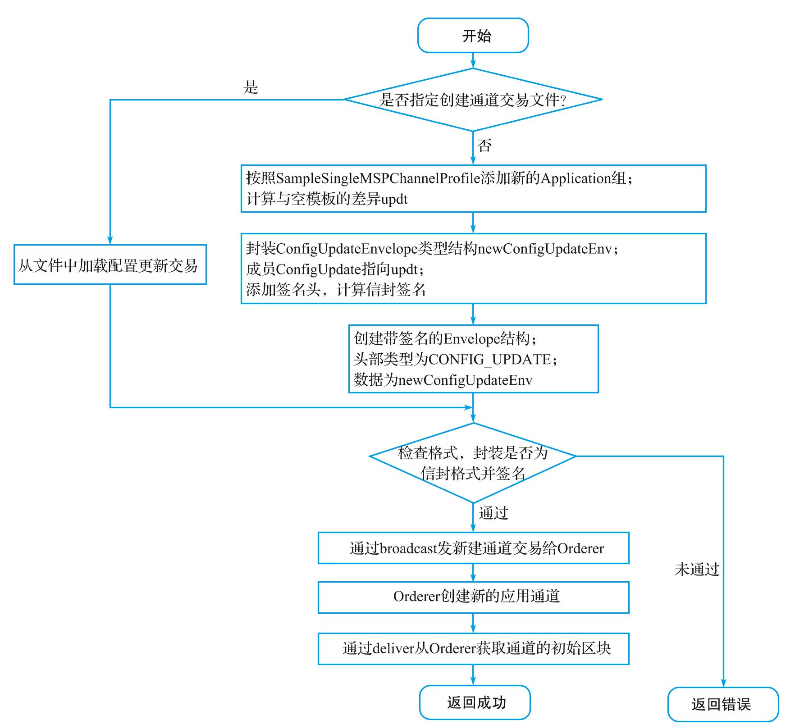
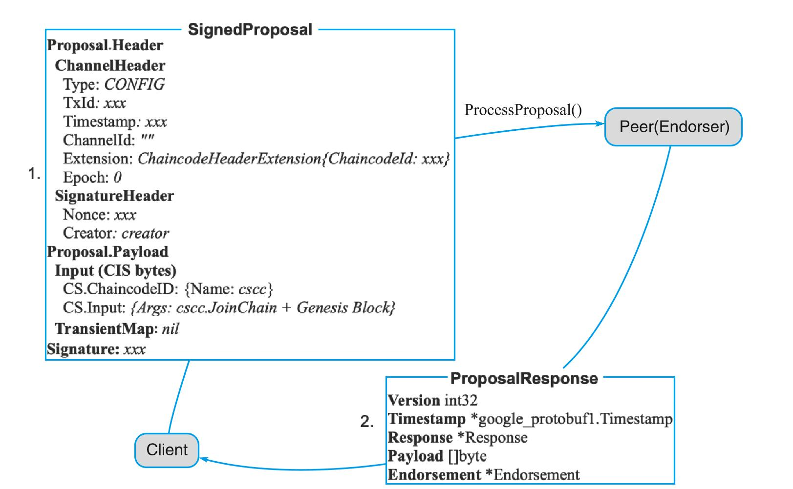

# 管理Fabric网络

## 简介
`Fabric`网络启动后，可以对网络中资源进行管理。要据资源类型的不同，目前主要包括3类操作：
- 通道操作，包括对通道进行创建、加入通道、查询信息、更新配置等操作。
- 节点管理，包括对`Peer`节点进行启动、重置、回滚、暂停、继续、重建DB和升级DB等操作。
- 链码操作，包括链码的生命周期，如打包、安装、批准、提交、升级和调用链码等。

另外，为了提高使用网络的效率，`Fabric`提供了事件通知机制（可以确认交易是否最终提交）和网络信息自动发现功能，并支持对网络进行在线升级。这些都为使用网络提供了便利。下面将具体进行介绍。

## 使用通道
### 通道操作命令
命令行下可以使用`peer channel`命令（实现位于`internal/peer/channel`)进行通道操作，包括`create`, `fetch`, `join`, `list`, `update`, `getinfo`, `signconfigtx`等子命令。其中`create`, `fetch`, `update`命令主要与排序服务打交道；`join`, `list`, `getinfo`与`Peer`节点打交道；`signconfigtx`则为本地处理。

各通道操作命令的功能如下表所示：

可以通过 peer channel<subcommand> --help 来查看具体的命令使用说明。

### 命令选项
`peer channel`命令支持的全局选项如下表：


客户端支持从环境变量中读取操作的默认`Peer`地址和身份信息，可以提前通过环境变量来指定：
```shell
#目标Peer
CORE_PEER_ADDRESS=<peer endpoint>
#连接目标Peer时信任的TLS根证书
CORE_PEER_TLS_ROOTCERT_FILE=<peer tls ca path>
#使用的客户端用户的MSP ID
CORE_PEER_LOCALMSPID=<user msp id>
#使用的客户端用户MSP路径
CORE_PEER_MSPCONFIGPATH=<user msp path>
```
例如，下面的命令指定了对组织org1.example.com的peer0.org1.example.com节点执行相关操作，身份为组织的管理员Admin。代码如下：
```shell
CORE_PEER_ADDRESS=peer0.org1.example.com:7051 \
CORE_PEER_TLS_ROOTCERT_FILE=/etc/hyperledger/fabric/crypto/peerOrganizations/org1.example.com/peers/peer0.org1.example.com/tls/ca.crt \
CORE_PEER_LOCALMSPID="Org1MSP" \
CORE_PEER_MSPCONFIGPATH=/etc/hyperledger/fabric/crypto/peerOrganizations/org1.example.com/users/Admin@org1.example.com/msp \
peer channel <subcommand>
```

### 创建通道
`create`子命令由拥有创建通道权限组织管理员身份来调用，在指定的排序服务上创建新的应用通道，需要提供服务地址。该子命令支持的选项包括：
- -c, --channelID string, 创建通道名称
- -f, --file string, 指定创建通道所用的交易文件
- --outputBlock string, 创建通道成功后，将初始区块写到本地指定文件，默认为./.block。
- -t, --timeout duration, 创建超时，默认为10秒。

一般情况下，通过提前创建的通道配置文件来指定配置信息。如果不指定通道配置文件，则默认采用`SampleConsortium`配置和本地的`MSP`组织来构造配置交易结构。例如，利用事先创建的配置交易文件`channel.tx`来创建新的应用通道`businesschannel`, 命令代码如下：
```shell
APP_CHANNEL="businesschannel"
peer channel create \
-o orderer:7050 \
-c ${APP_CHANNEL} \
-f ./channel.tx \
--timeout 30s
```
加入成功后，本地会产生该应用通道的初始区块文件`businesschannel.block`

创建应用通道的主要过程如下图所示，需要与排序服务交互两次：发起创建通请求到系统通道，然后获取所创建应用通道的初始区块。

创建应用通道的实现流程


主要步骤包括：
- 客户端调用`sendCreateChainTransaction()`,读取指定的配置交易文件（或利用默认配置），构造一个创建应用通道的配置交易结构，添加签名，封装为`Envelope`结构。其中指定通道头部类型为`CONFIG_UPDATE`,核心的数据为`ConfigUpdateEnvelope`结构。
- 客户端发送配置交易到排序服务。
- `Orderder`收到`CONFIG_UPDATE`消息后，检查指定的通道是否存在，若不存在，则创建通道，并构造该应用通道的初始区块。
  - `Orderer`首先检查通道应用（Application）配置中的组织都在创建的联盟（Consortium)内, 配置到组织中。
  - 之后从系统通道中获取`Orderder`相关的配置，并创建应用通道配置。应用配置对应的`mod_policy`为`Admins`。
  - 根据`ChannelCreateionPolicy`指定策略，利用新创建应用通道的成员，进行权限校验。
  - 接下来根据`CONFIG_UPDATE`消息的内容更新获取到的配置信息。所有配置发生变更后版本号都要更新。
  - 创建签名`Proposal`消息（头部类型为`ORDERER_TRANSACTION`),进行共识，指定目标为系统通道。
  - `Orderer`共识完成后提交交易，初始化对应本地结构，完成应用通道的创建过程。
- 客户端从排序服务的`Deliver`服务获取应用通道的初始区块（具体过程类似`fetch`命令），请求类型为`DELIVER_SEEK_INFO`, 核心的数据为`SeekInfo`结构。
- 客户端将收到的区块写入本地的`chainID+".block"`文件。这个文件后续会加入通道的节点中备用。

其中，发往排序服务的`Envelope`消息结构定义如下：
```go
// github.com/hyperledger/fabric-protos-go/common/common.pb.go
type Envelope struct {
  // 序列化的载荷数据，可以为任意内容
  Payload []byte
  // 载荷头部中的消息创建者对载荷的签名
  Signature []byte
}
```
`Envelope`的结构通常如下图所示，其中载荷包括头部和数据两部分。


### 加入通道
`join`子命令会将指定的`Peer`节点加入指定的应用通道中。需要提前拥有所加入应用通道的初始区块文件，并且只有属于通道的某个组织的管理员身份才可以成功执行该操作。加入通道命令主要通过调用`Peer`的配置系统链码进行处理。例如，通过如下命令可将`Peer`节点加入应用通道`businesschannel`中。该子命令支持`-b`, `--blockpath string`选项，用来指定通道初始区块文件路径。代码如下：
```shell
peer channel join \
-b ${APP_CHANNEL}.block

Peer joined the channel!
```
加入应用通道的主要过程如下图，只与`Peer`节点打交道


主要步骤：
- 客户端首先创建一个`ChaincodeSpec`结构，其`input`中的`Args`第一个参数是`cscc.JoinChain`（指定调用配置链码的操作），第二个参数为所加入通道的配置区块。
- 利用`ChaincodeSpec`构造一个`ChaincodeInvocationSpec`结构。
- 利用`ChaincodeInvocationSpec`，创建`Proposal`结构并进行签名，`channel`头部类型为`CONFIG`。
- 客户端通过`gRPC`将`Proposal`签名后发给`Endorser`（所操作的Peer），调用
  `ProcessProposal(ctx context.Context,in *SignedProposal,opts...grpc.CallOption)(*ProposalResponse,error)`方法进行处理。主要通过配置系统链码从配置区块中读取通道内已有成员的TLS CA根证书，加入本地的根证书信任结构中，并进行本地链结构的初始化工作。
  
- 初始化完成后，即可收到来自通道内的`Gossip`消息等。

其中，发送给`Peer`的`SignedProposal`消息十分常见，定义如下：
```go
type SignedProposal struct {
  // 字节码格式的提案内容
  ProposalBytes []byte `protobuf:"bytes,1,opt,name=proposal_bytes,json=proposalBytes,proto3" json:"proposal_bytes,omitempty"`
  // 对提案内容的签名，签名人需要为提案发起者（身份信息包括在提案头部中）
  Signature     []byte `protobuf:"bytes,2,opt,name=signature,proto3" json:"signature,omitempty"`
}
```


`Peer`返回的`ProposalResponse`消息定义如下：
```go
type ProposalResponse struct {
  // 消息协议版本
  Version int32 `protobuf:"varint,1,opt,name=version" json:"version,omitempty"`
  // 消息创建时的时间戳
  Timestamp *google_protobuf1.Timestamp `protobuf:"bytes,2,opt,name=timestamp" json:"timestamp,omitempty"`
  // 返回消息，包括状态、消息、元数据载荷等
  Response *Response `protobuf:"bytes,4,opt,name=response" json:"response,omitempty"`
  // 数据载荷，包括提案的Hash值，和扩展的行动等
  Payload []byte `protobuf:"bytes,5,opt,name=payload,proto3" json:"payload,omitempty"`
  // 背书信息列表，包括背书者的证书，以及其对"载荷+背书者证书"的签名
  Endorsement *Endorsement `protobuf:"bytes,6,opt,name=endorsement" json:"endorsement, omitempty"`
}
```
**注意：执行加入通道命令成功返回，并不确保`Peer`最终能加入通道。**

### 列出所加入的通道
`list`子命令会列出指定的`Peer`节点已经加入的所有应用通道的列表。列出通道命令主要通过调用`Peer`的配置系统链码进行处理。
例如通过如下命令，可以列出本地`Peer`节点已加入的所有应用通道。
```shell
peer channel list

Channels peers has joined to:
    businesschannel
    businesschannel2
```
列出所加入的应用通道的主要过程如下，与加入过程类似，向`Peer`发送请求，注意类型是`ENDORSER_TRANSACTION`。

实现流程如下：


主要步骤：
- 客户端首先创建一个`ChaincodeSpec`结构，其`input`中的`Args`第一个参数是`cscc.GetChannels`(指定调用配置链码的操作)。
- 利用`ChaincodeSpec`构造一个`ChaincodeInvocationSpec`结构
- 利用`ChaincodeInvocationSpec`创建`Proposal`结构并进行签名，`channel`头部类型为`ENDORSER_TRANSACTION`。
- 客户端通过`gRPC`将`Proposal`发给`Endorser`（所操作的Peer），调用`ProcessProposal(ctx context.Context,in *SignedProposal,opts...grpc.CallOption)(*ProposalResponse,error)`方法进行处理。主要是通过配置系统链码查询本地链信息并返回。
- 命令执行成功后，客户端会受到来自Peer端的回复消息，从其中提取出应用通道列表信息并输出。

其中，比较重要的数据结构同样也包括ChaincodeSpec、ChaincodeInvocationSpec、Proposal等，注意channel头部类型以及ChaincodeSpec结构中的数据与加入通道的消息中的略有差异， 如下图：


### 获取某区块
`fetch`子命令会面向排序服务进行查询，获取通道的指定区块，并写入本地文件。命令如下：
```shell
peer channel fetch [outputfile] j[flags]
```

该子命令支持的选项包括：
- --bestEffort 忽略遇到的错误，尽最大努力继续获取区块
- -c, --channelID string 所获取的通道的名称
例如，通过如下命令，可以获取已存在的`businesschannel`应用通道的初始区块，并保存到本地的`businesschannel.block`文件：
```shell
peer channel fetch oldest businesschannel1_0.block \
-c ${APP_CHANNEL} \
-o orderer:7050
```
```shell
peer channel fetch 1 businesschannel1_1.block \
-c ${APP_CHANNEL} \
-o orderer:7050
```
获取区块的主要过程如下图：（以指定区块号为例），从排序服务获取指定的区块。

实现流程

主要步骤：
- 客户端构造`SeekInfo`结构，该结构可以指定要获取的区块范围（如果获取配置区块，先从最新区块中解析配置区块号，然后通过区块号指定）。这里`Start`和`Stop`指定为目标区块。
- 客户端利用`SeekInfo`结构，构造`Envelope`并进行签名，通过`deliverClient`经`gRPC`通道发给排序服务的`Deliver()`接口。
- 从排序服务获取指定通道的区块后，写到本地文件中。

其中，发往排序服务的`Envelope`结构如下：


### 更新通道配置
`update`子命令的执行过程与`create`命令类似，会向排序服务发起更新的配置交易请求。需要提前创建的通道更新配置交易文件指定配置信息，才可执行该命令。该子命令支持选项包括：
- -c, --channelID string 所更新的通道名称。
- -f, --file string 指定更新通道所用的交易文件

如下操作来更新通道中的锚节点配置，首先利用`configtxgen`来创建锚节点配置更新文件，之后使用该更新文件对通道进行配置更新操作：
```shell
configtxgen \
 -profile APP_CHANNEL_PROFILE \
 -outputAnchorPeersUpdate ./update_anchors.tx \
 -channelID ${APP_CHANNEL} \
 -asOrg Org1MSP
```
```shell
peer channel update \
 -c ${APP_CHANNEL} \
 -o orderer:7050 \
 -f ./update_anchors.tx
```

更新应用通道的过程如下，与创建应用通道过程类似，直接发送交易更新请求给排序服务。

实现流程


主要步骤：
- 客户端读取指定的配置交易文件，构造一个更新应用通道的配置交易信封结构，确认通道头部类型为`CONFIG_UPDATE`，通道ID存在且与命令行一致。
- 客户端对更新信封结构进行签名，最终构造签名信封结构，通道头部类型为`CONFIG_UPDATE`。
- 客户端通过`gRPC`发送配置交易到排序服务的`Broadcast`接口。
- 排序服务收到`CONFIG_UPDATE`消息后，判断是配置消息后，进行配置相关处理。
  - 调用`ProcessConf igUpdateMsg()`尝试接受配置，计算新配置结构（封装为`CONFIG`类型的信封结构）和对应的序号；
  - 排序服务将新的配置信封结构发送给后端队列（如Raft或Kafka）进行排序，并响应客户端答复；
  - 排序完成后，排序服务将新的配置交易存放到账本结构中等待Peer节点获取。
- 客户端在发出请求后会接收到响应，但实际请求仍在排序服务异步进行。

### 获取通道基本信息
`getinfo`命令可以向指定的`Peer`节点获取某个通道的基本信息，包括高度、当前Hash、前导区块Hash等。该子命令支持选项`-c`,`--channelID string`，即所获取信息的通道的名称。例如，查询默认Peer节点上businesschannel通道的信息，代码如下：
```shell
$ peer channel getinfo -c ${APP_CHANNEL}

Blockchain info: {"height":7,"currentBlockHash":"bHlVT/swOzeJ8JaTXyhStu40QL4JBx ZBD695FISJf2o=","previousBlockHash":"ViDfGewz/GRg3wDz68dtg4s9NNojtq3ciBB4VcpGBuk="} 
```

获取通道基本信息的主要过程如下图所示，与列出所加入通道命令类似，通过调用Peer的cscc来查询。

实现流程


主要步骤：
- 客户端首先创建一个`ChaincodeSpec`结构，其`input`中的`Args`第一个参数是cscc.Getchannels（指定调用配置链码的操作），第二个参数为所加入通道的配置区块。
- 利用`ChaincodeSpec`构造一个`ChaincodeInvocationSpec`结构。
- 利用`ChaincodeInvocationSpec`，创建`Proposal`结构并进行签名，`channel`头部类型为`ENDORSER_TRANSACTION`。
- 客户端通过`gRPC`将`Proposal`签名后发给`Endorser`（所操作的`Peer`），调用`ProcessProposal(ctx context.Context,in*SignedProposal,opts...grpc.CallOption)(*ProposalResponse,error)`方法进行处理，主要通过配置系统链码获取对应账本的基本信息并返回客户端。

### 对通道配置更新添加签名
`signconfigtx`可以对本地的通道更新交易进行签名，属于客户端本地操作，不与`Peer`或`Orderer`打交道。该子命令支持选项`-f`,`--file string`，即指定所签名的通道配置更新交易文件。例如，对本地的通道配置更新添加签名，代码如下：
```shell
peer channel signconfigtx -f config_delta_env.pb 
```