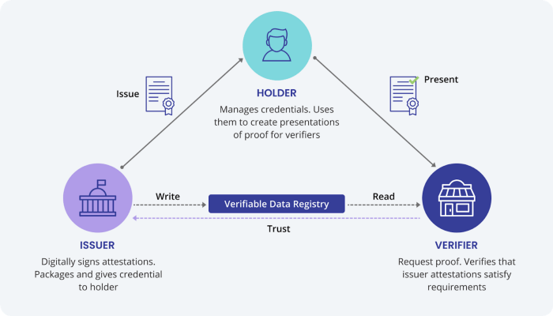
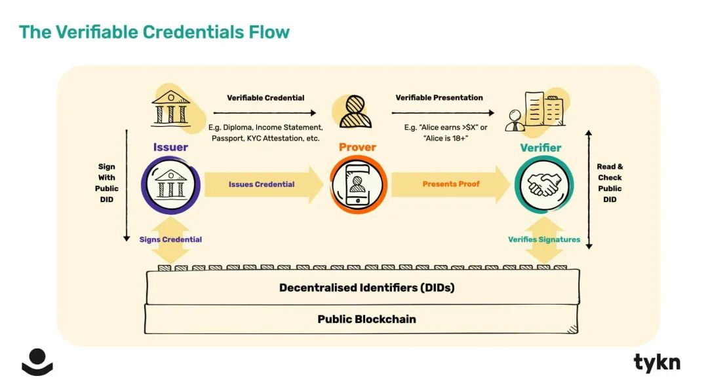
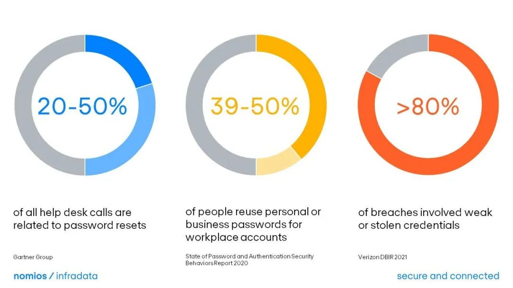
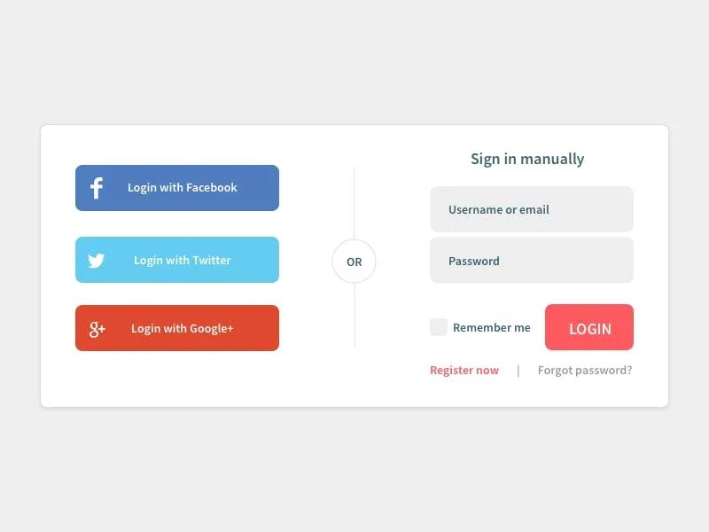
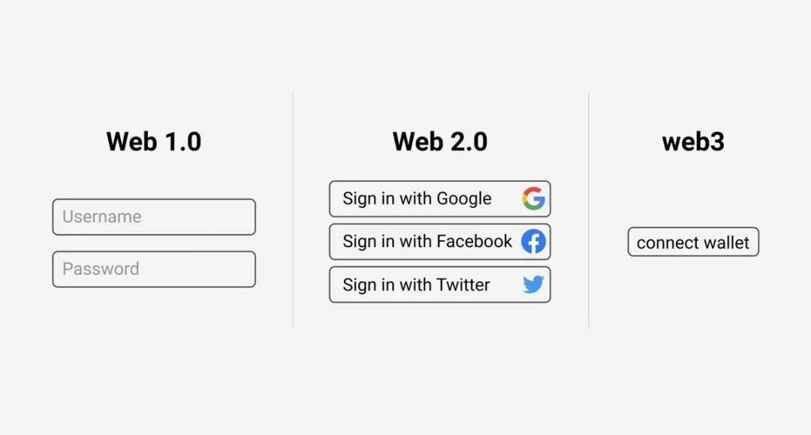
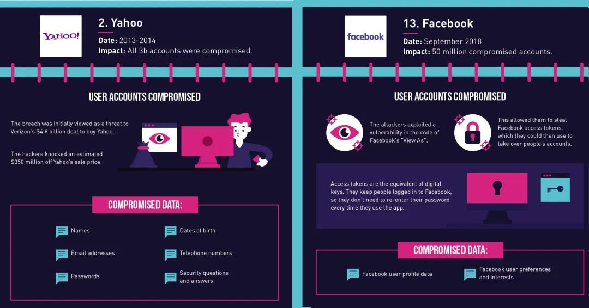
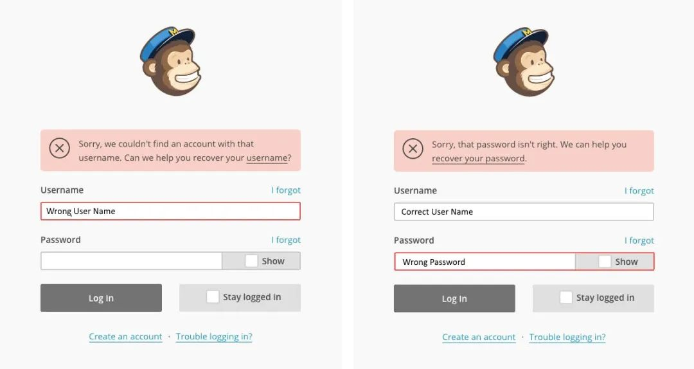
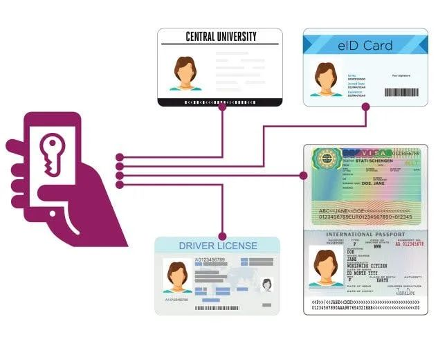

# 导读
今天，我们的生活与使用的应用和服务的联系越来越紧密。使用电子商务进行网上购物，使用社交网络交流，使用电子邮件进行工作沟通，这样的例子不胜枚举。

使用这些服务需要证明我们的身份和授权。虽然我们习惯于提供低级别的身份信息，如姓名和电子邮件地址，但其它服务可能需要一个高级别的身份，如驾驶执照。

然而，目前的身份管理系统有几个缺陷：
- 数据中心化，数据由服务提供者存储用户数据，存储在服务提供者的服务器中。
- 安全风险，因为恶意行为者可能破坏服务器并窃取你的信息。

去中心化身份改进了现有的身份管理标准，让用户对个人数据有更大的控制力。在一个去中心化的身份框架中，个人存储他们的身份信息，并选择与第三方分享哪些信息。因为在去中心化的标识符被存储在区块链网络中，它们是防篡改的，安全的，并且可以被任何人即时验证的。这减少了在服务器中存储身份信息的需要，使用户更容易无缝访问服务。

本文详细解释了去中心化身份意味着什么，它是如何工作的，以及为什么它很重要。本文将涵盖一些关键的概念，如去中心化的标识符和去中心化的认证，并探索现有的去中心化身份项目。

# 去中心化身份意味着什么？
去中心化身份是一种新的身份和访问管理（IAM: Identity and Access Management）形式，不再是用户信息的集中存储。去中心化身份支持个人对其数据的控制，因此它也被称为自我主权身份（SSI: Self-Sovereign Identity)。

通俗地说，去中心化身份允许你拥有自己的身份。那么，它在实践中是如何运作的呢？你的身份是独一无二用来描述你的属性和凭证的集合。一些身份标识可能是自我拥有的，如你的名字、生日、电子邮件地址、用户名。而有些可能是机构颁发的，如大学学位、驾驶执照或护照编号。

在去中心化身份管理中，用户在`数字钱包`中存储凭证和个人信息。就像现实生活中的钱包一样，数字钱包保存着你的身份证明，如你的执照或身份证。

去中心化身份标识将身份信息的存储在分布式的计算机系统中，如分布式账本或区块链（[这里有一个视频介绍](https://www.youtube.com/watch?v=gWfAIYXcyH4))，使用分布式帐本来保存身份要素，使其免于被篡改和盗窃。因此，即使你的身份信息是以电子格式记录的，它也不能被更改、窃取或删除。

分布式账本固有的透明度使身份信息可以立即得到验证，而不一定要依赖发行者。

下面是一个关于去中心化身份如何运作的简要说明：
- 一个组织（交通警察大队）想给你（用户）发一个证书（驾驶执照）。你发送你的钱包地址，这是分布式账本或区块链上用于存储数据的特定位置。然后DMV(交通警察大队，下文使用简写DMV)用其私钥签署交易，将凭证发送到你的数字钱包。
- 现在，你可以在任何时候分享这个凭证，以确定你的身份。例如在完成贷款申请时。使用一个受信任的工具，对方可以检查你的凭证的有效性。在这种情况下，该工具检查公钥和交易细节，以确认发行机构和发行日期。
- 请注意，信息本身并不存储在区块链上。相反，区块链会生成一个不可改变的交易记录，看到信息从发行机构传递给你。这种`数字指纹`（也称为啥希值）对每个凭证来说都是独一无二的，可以可靠地证明你的所有权。

去中心化身份生态系统中的各种参与者包括：
- 用户：拥有和使用身份信息片段的个人。像我们这样的用户可以将各种身份信息保存在数字钱包中，并在需要时分享它们。
- 凭证机构（Issuer）：向用户发放凭证的组织和机构。这可以是地方税务局，雇主，学术机构，以及任何可以发布身份信息的实体。
- 验证人：需要身份信息来建立信任和授予服务访问权的第三方。例如，一家电商网店在允许你购买某些物品之前，可能需要你的年龄或公民身份证明。你提供的任何信息都需要得到适当的验证。
  

# 去中心化身份是如何工作的？
万维网联盟（W3C）将去中心化身份（DID）定义为一种可验证的、去中心化的数字身份形式。DID可以为任何实体创建，包括一个组织、个人，甚至一个设备。

DID旨在由用户控制，存储在一个去中心化的架构中，如点对点网络或分布式账本，而不是一个中心化的登记薄。因此，DID在密码学上是安全的，可以抵御变化，并且可以在不依赖原始发行者的情况下进行验证。

# 去中心化身份和可验证凭证
可验证凭证是对DID的补充，为去中心化身份管理提供支持。W3C将可验证凭证定义为“可验证凭证代表发行人以防篡改和尊重隐私的方式做出的声明”。

当一所大学颁发学术证书时，它是在“申领”接受者已经接受了一定时期的教育。同样，疫苗接种证书是申领人已经接受了疫苗。虽然这些申领已经作为实体文件存在，但在网上使用它们会带来一些问题。让我们想象一下，在KYC(了解你的客户)过程中，需要上传驾驶执照来验证你在KYC注册时的年龄。

- 首先，服务提供者不能确认凭证的真实性。
- 第二，你的私人信息现在被储存在多个服务器上，增加了身份被盗的风险。
- 第三，你需要存存好执照的实体副本，因为如果实体执照丢失了，那么你就无法证明你的身份。
  
可验证凭证可从三个方面解决这些问题：
- 使用`零知识证明`来证明申领数据的有效性而不透露私人信息
- 使用公钥密码学来验证凭证发布机构
- 将信息存储在可验证的数据注册处（区块链、分布式帐本）
  
使用我们最初的例子，你就不需要在KYC期间上传整个驾驶热照。相反，你可以只分享一个可验证凭证的链接。可验证凭证使用零知识证明来保护身份持有人的隐私。零知识证明有助于证明信息的真实性，而不会将整个信息透露给第三方。让我们用驾驶执照的例子来解释`ZK-proof`如何保护你的隐私。服务提供者实际上不会看到驾照上列出的你的出生日期。然而，该证书将通过公钥识别发行者（DMV)。由于DMV只向一定年龄范围内的个人发放执照，那么我们可以假设你的年龄是正确的。下图展示了可验证凭证（VC）如何工作。
  
  
  可验证凭证存储在不可改变的区块链上，这意味着只要你有钱包和私钥，你就可以访问它们。它们不能被破坏、修改、偷窃或删除。更重要的是，它们不在发行机构的控制之下。

  可验证凭证是去中心化身份管理的一个重要组成部分。有了可验证凭证，我们可以创建物理凭证的数字版本，并在网上使用它们，而不必披露超过必要的信息。第三方可以很容易地确认这些凭证的真实性，而不需要依赖发证机构。

# 什么是去中心化认证？
COVID-19的大流行迅速加速了向数字生活方式的转变。现在，你可以选择在家里做银行业务、视频会议、通信和购物等事情。

访问这些平台需要验证你的身份获得使用这些服务的许可以。例如，一个银行网站可能要求你提供一个电子邮件地址和密码。然而，传统的认证可能会有相当多的问题。你不仅要为不同的服务创建多个登录名，而且必须记住每一个登录名，否则有可能失去访问权。用户可能在多个网站上重复使用密码，以使在线认证更容易，但这只会增加身份被盗的风险。如果黑客窃取一个密码，他们可以轻易地在十几个不同的平台上冒充你。

统一登录认证是目前的解决方案之一，旨在使在线认证更容易和更安全。在这里，一组实体同意依靠一个来源来获得身份信息。统一登录认证的一个很好的你例子是用你的Facebook或谷歌帐户（国内通常是微信）登录一个网站。

但统一登录认证并不是银弹。你的身份信息仍然托管在一个中央服务器上（Facebook和Google），所以数据泄漏或身份盗窃的风险仍然存在。

分布式认证是一个较新的概念，用户可以使用可验证凭证来访问在线服务。假设你想访问一个网上银行服务。你可以提交一个来自政府机构的可验证凭证来证明你的身份，而不是提交身份证件。这就不需要银行在授予访问权之前要求并存储你的信息。而且，你将来不需要一个账户来登录，因为服务提供者可以签发一个可验证凭证来进行持续验证。登录网站将佝连接你的数字钱包一样简单！

# 为什么去中心化身份很重要？
去中心化身份有望彻底改变我们的数据共享方式。以下是去中心化身份管理的一些好处：
- 更容易认证
---
去中心化身份可以消除密码和恼人的多因素认证协议。有了无密码认证，使用在线服务变得更容易和更快，因为你不需要输入长密码。组织机构可以快速验证用户身份，而不强迫他们接受繁琐的KYC流程。贷款申请、政府注册、网站注册，所有这些都会更快发生，因为服务提供者可以通过第三方工具来验证你的身份。

- 更好的数据安全
---
如前所述，许多组织要求新用户提交身份信息。这个也不是大问题，但是很多公司在保护用户数据方面被证明是草率的。现代数据中心是黑客的蜜罐，数据泄露已导致企业和消费者的巨大损失。

一个去中心化身份框架消除了集中存储用户信息的需要。在处理个个身份信息（PII:Personally Identifiable Information）时，这一点尤为重要，例如你的医疗记录或信用卡信息。敏感的身份信息将被安全地存储在你的数字钱包中，允许你仅在必要时分享它。

去中心化身份系统也将减少身份盗窃的案例，你的个人信息和凭证不会待在数据仓库里供黑客窃取。你也不需要密码来访问网站，所以网络钓鱼攻击将不可避免地失败。

# 降低数据管理成本
根据统计，全球企业在管理用户数据上的花费占其收入的4-7%，企业每年在数据库管理上花查岗数十亿美元，但这些资金肯定有更好的用途。

去中心化身份让用户存储个人数据，为企业减轻负担。由于没有数据中心需要管理，服务提供者可以减少运营成本，并将资金重新投入到改善服务产品中。

# 监管合规
从欧盟到美国（国内也一样），监管机构正在收紧数据隐私法。不遵守用户隐私保护的企业，或将面临严厉制裁。

去中心化身份框架免除了组织建立数据库来存储用户信息的责任。因此，公司可以更好地遵数据隐私法，避免引起监管机构的愤怒。

# 更丰富的用户体验
想一想为你使用的几十个服务管理不同的身份资料的困难。如果你可以在不同的平台上使用相同的身份，而不用担心重复创建新的登录信息，会怎么样？

有了去中心化身份，一个可互操作的互联网，你可以在不同的网站上使用一个ID，这将成为现实。你将能够通过连接你的钱包在不同的服务之间无缝切换。

# 个人对数据的所有权和控制权
去中心化身份被描述为自我主权身份，因为它把个人数据的控制权放在个人手中。你的私人信息不会成为第三方的财产，被存在中心数据库中。

在一个去中心化身份系统中，你决定哪些信息会被第三方知晓。零知识证明通过消除披露敏感信息的需要来进一步保护你的隐私。例如，你可以证明你的年龄，而无需向服务提供者展示你的地址或国籍。

由于可验证凭证是数字化的，你的身份变得可携带。你不需要随身携带驾驶执照或免疫证书来证明你的疫苗接种情况。

可验证凭证可以独立验证，所以你永远不必依赖发行人来验证你的信息。在任何时候，你的个人信息和凭证都在你的控制之下。

# 加强组织和用户之间的信任
信任是维系公司和客户之间关系的胶水。当双方相互信任时，可以建立互利的关系。

然而，在我们今天的世界上，信任是一种稀缺的商品。消费者不相信公司不会收集他们的数据--而且可能是错误的管理。而组织则对可能进行身份欺诈的用户很警惕，因此他们在提供服务之前需要漫长的验证过程。

去中心化身份可以解决这两个问题，并在用户和服务提供者之间创造前所未有的信任水平。

加密安全和可验证凭证可以帮助公司验证用户身份，加速客户进入。而用户在与服务提供者交互时也不会担心数据泄露和身份被盗，这对每个人来说都是双赢。