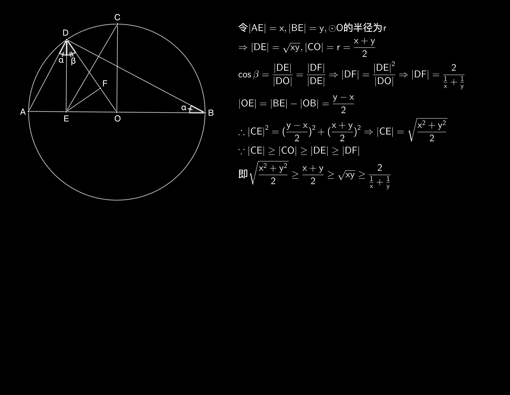

# 引言

本文主要描述射影定理和均值不等式的联系，从而可以从几何层面去理解均值不等式这样的代数式。

# 几何视角

# 代数视角
## 二元
\begin{equation}
\sqrt{\frac{x^2+y^2}{2}} \geq \frac{x+y}{2} \geq \sqrt{xy} \geq \frac{2}{\frac{1}{x}+\frac{1}{y}}
\end{equation}

## n元
\begin{equation}
\sqrt{\frac{\sum_{i=1}^{n}{x_{i}^2}}{n}} \geq \frac{\sum_{i=1}^{n}{x_{i}}}{n} \geq \sqrt[n]{\prod_{i=1}^{n} x_i} \geq \frac{n}{\sum_{i=1}^{n}\frac{1}{ x_{i}}} 
\end{equation}