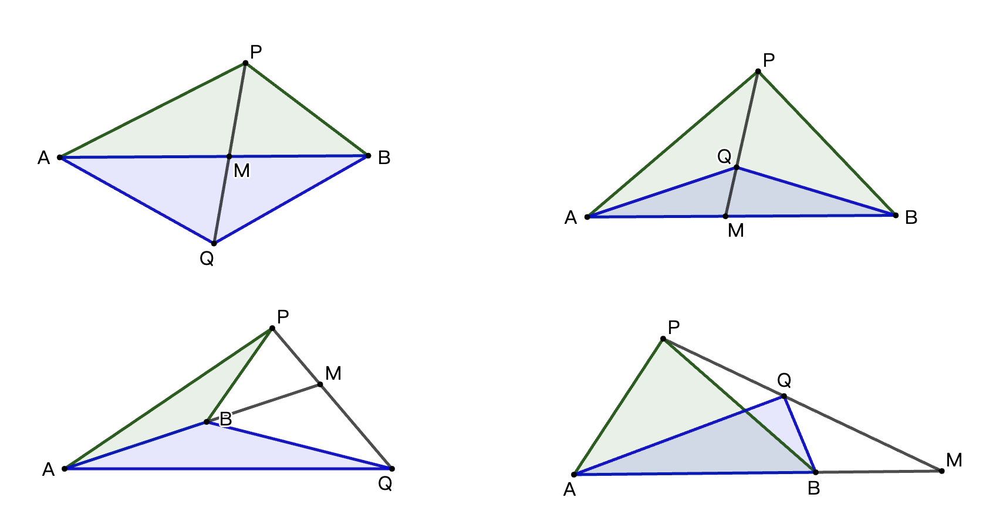
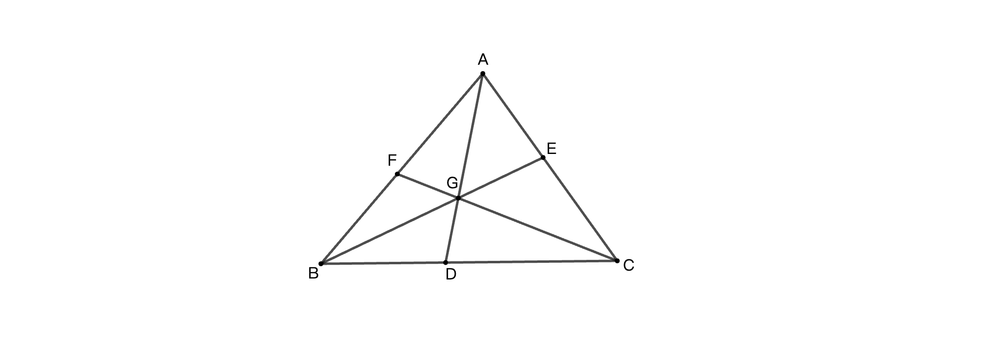
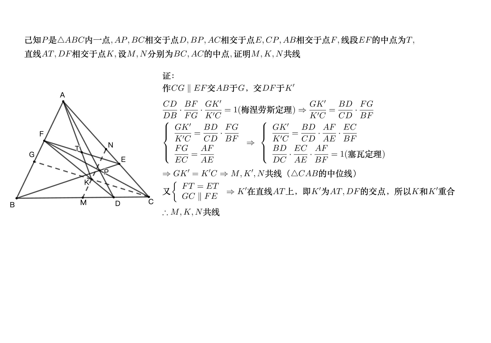

# 定理证明

[张景中](https://www.zhihu.com/search?q=张景中&search_source=Entity&hybrid_search_source=Entity&hybrid_search_extra={"sourceType"%3A"answer"%2C"sourceId"%3A603252421})院士在《新概念几何》中利用「[共边定理](https://www.zhihu.com/search?q=共边定理&search_source=Entity&hybrid_search_source=Entity&hybrid_search_extra={"sourceType"%3A"answer"%2C"sourceId"%3A603252421})」证明「梅涅劳斯定理」和「塞瓦定理」，证明长度均为一行，而且引理本身也是足够简明直观，介绍如下：

- 共边定理

  \begin{equation}
  \begin{aligned}
  &\frac{S_{\triangle PAB}}{S_{\triangle QAB}}=\frac{PM}{QM}
  \end{aligned}
  \end{equation}
  
  该定理有四种情况，如下图：
  
  

- 塞瓦定理（Ceva's theorem）

  三角形内三线交于一点，则有以下关系：

  \begin{equation}
  \begin{aligned}
  &\frac{AF}{FB}\cdot\frac{BD}{DC}\cdot\frac{CE}{EA}=1
  \end{aligned}
  \end{equation}

  \begin{equation}
  \begin{aligned}
  &\frac{AF}{FB}\cdot\frac{BD}{DC}\cdot\frac{CE}{EA}=\frac{S_{\triangle GAC}}{S_{\triangle GBC}}\cdot\frac{S_{\triangle GBA}}{S_{\triangle GAC}}\cdot\frac{S_{\triangle GBC}}{S_{\triangle GBA}}=1
  \end{aligned}
  \end{equation}

- 梅涅劳斯定理（Menelaus' theorem）

	过三角形一边上的点做一直线，分别与其余两边或其延长线所截，则满足一下关系：

	\begin{equation}
	\begin{aligned}
	&\frac{AF}{FB}\cdot\frac{BD}{DC}\cdot\frac{CE}{EA}=1
	\end{aligned}
	\end{equation}
	

  \begin{equation}
  \begin{aligned}
  &\frac{AF}{FB}\cdot\frac{BD}{DC}\cdot\frac{CE}{EA}=\frac{S_{\triangle AED}}{S_{\triangle BED}} \cdot \frac{S_{\triangle BED}}{S_{\triangle CED}}  \cdot \frac{S_{\triangle CED}}{S_{\triangle AED}}=1
  \end{aligned}
  \end{equation}

- 例题

  
