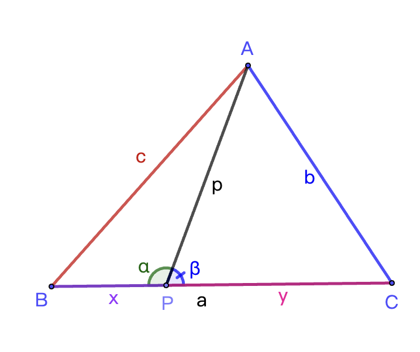
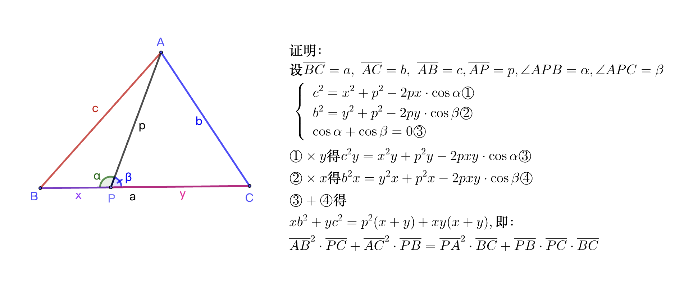

# 斯特瓦尔特定理

**斯图尔特定理**（Stewart's Theorem）或译**史都华定理、斯特瓦尔特定理、斯图沃特定理，又称为阿波罗尼奥斯定理**。

\begin{equation} 
\begin{aligned}
在\triangle ABC 中，在边BC上取任意一点P，则有： \\
\overline{AB}^2\cdot \overline{PC} + \overline{AC}^2 \cdot \overline{PB} = \overline{PA}^2 \cdot \overline{BC} + \overline{BC} \cdot \overline{PB} \cdot \overline{PC} \\
\end{aligned}
\end{equation}

证明过程：

