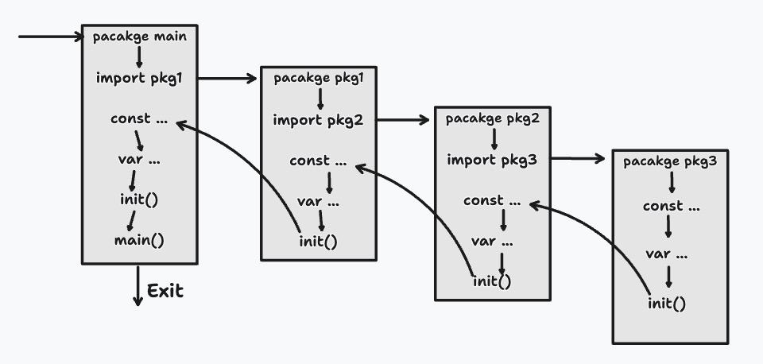

# init函数说明
初始化每个包后，会自动执行`init()`函数，并且执行优先级高于主函数的执行优先级。`init`函数通常用于：
- 变量初始化
- 检查/修复状态
- 注册器
- 运行计算
  
# 包初始化
为了使用导入的程序包，必须首先对其进行初始化。初始化始终在单个线程中执行，并且以程序包依赖关系的顺序执行。这由`Golang`运行时系统控制，如下图所示：
- 初始化导入的包（递归导入）
- 计算并为块中声明的变量分配初始值
- 在包中执行初始化函数



# 示例代码
```go
package main

import "fmt"

var _ int64=s()

func init() {
    fmt.Println("init function")
}

func s() int64 {
    fmt.Println("function s()")
    return 1
}

func main() {
    fmt.Println("main")
}
```
执行结果：
```
function s()
init function
main
```
>即使程序包被多次导入，初始化也只执行1次

## 特性
### 无法引用
init函数不需要传入能数，也不需要返回任何值。与main相比，init没有声明，**因此无法引用**。
```go
package main

import "fmt"

func init() {
    fmt.Println("init")
}
func main() {
    init()
}
```
编译上述代码会报：`undefined: init`

### 一个源文件可以包含多个init函数
```go
package main

import "fmt"

func init() {
    fmt.Println("init1")
}
func init() {
    fmt.Println("init2")
}
func main() {
    fmt.Println("main")
}
```
执行结果：
```
init1
init2
main
```
