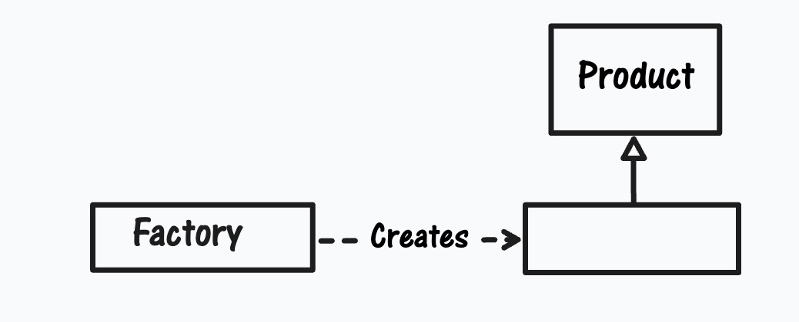
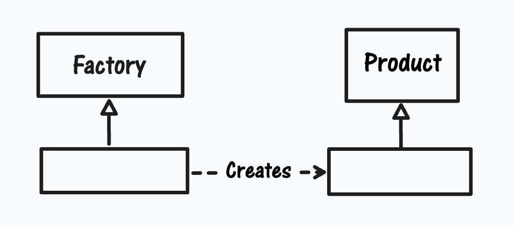
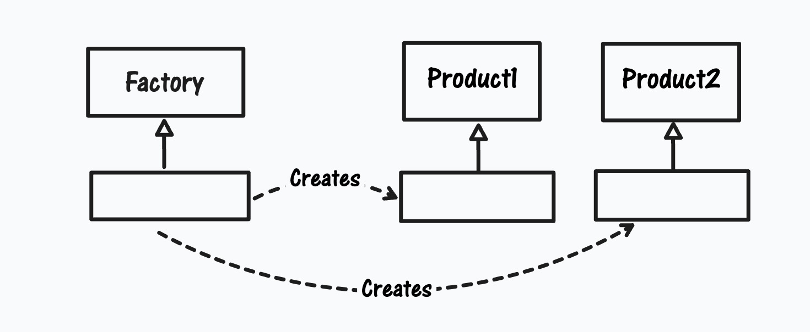
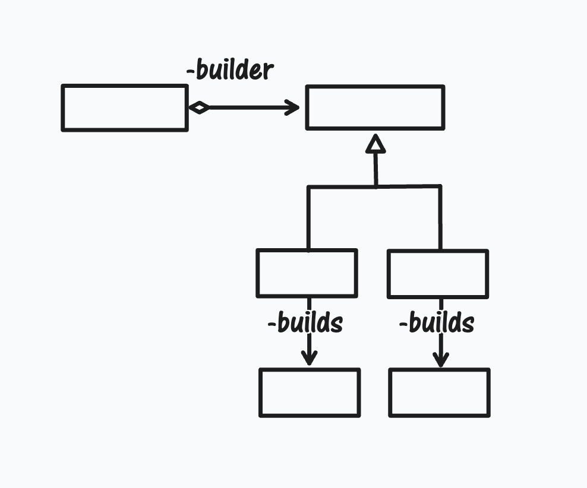
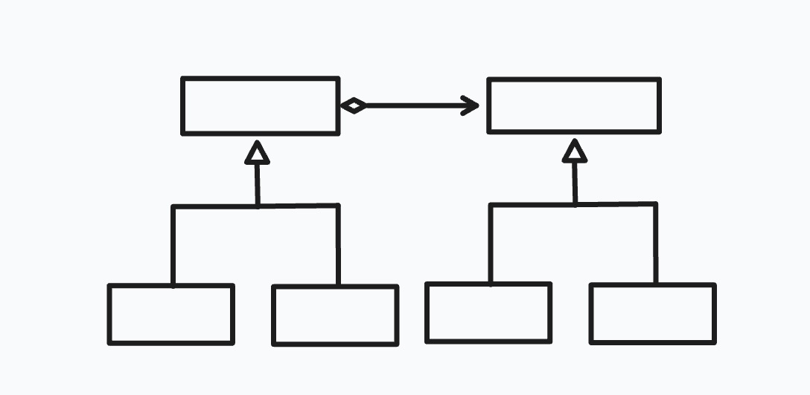
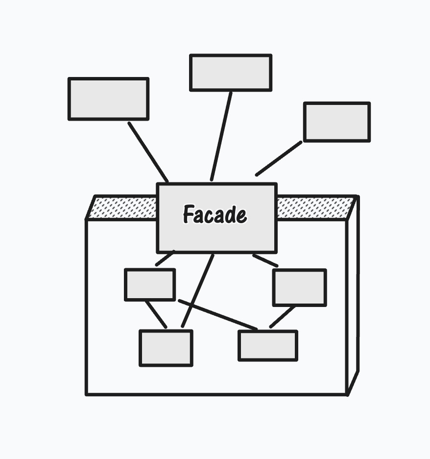
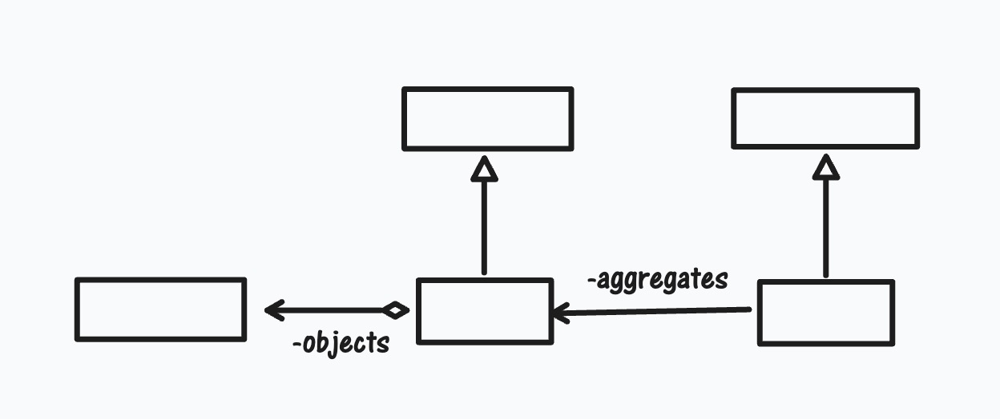

# 设计原则在常用设计模式中的体现

## 策略模式对“开-闭”原则的支持
策略模式讲的是，如果有一组算法，那么就将每一个算法封装起来，使得它们可以互换。策略模式就是从对可变性的封装原则出发，达到“开-闭”原则的范例



classDiagram
class DiscountStrategy {
    <<abstract>>
-price:single
-copies:int
+calculateDiscount():single
}

class NoDiscountStrategy {
    -price:single
    -copies:int
    +calculateDiscount():single
}

class FlatRateStrategy {
    -price:single
    -copies:int
    -amount:single
    +calculateDiscount():single
}

class PercentageStrategy {
    -price:single
    -copies:int
    -percent:single
    +calculateDiscount():single
}

NoDiscountStrategy --|> DiscountStrategy
FlatRateStrategy --|> DiscountStrategy
PercentageStrategy --|> DiscountStrategy



## 简单工厂模式
“开-闭”原则要求系统允许新的产品加入系统中而无需对现有代码进行修改。在简单工厂模式中，这对于产品消费角色是成立的，而对于工厂模式是不成立的。简单工厂模式结构如下图：

## 工厂方法模式
在工厂方法模式中，具体的工厂类都有共同的接口，它们“生产”出很多处于同一等级结构中的产品对象。使得这个系统可以加入新的产品类型（增加产品的具体工厂）。工厂方法模式的简略类图如下：

## 抽象工厂模式
抽象工厂模式封装了产品对象家族的可变性，从而一方面可以使系统动态地决定将哪一个产品族的产品对象实例化，另一方面可以将新的产品引进到已有系统中而不必修改已有的系统。抽象工厂模式的简略图如下：

## 建造模式
建造模式封装了建造一个有内部结构的产品对象的过程，因此这样的系统是向产品内部表象的改变开放的。

## 桥梁模式
桥梁模式是“对可变性的封装原则”的极好例子。在桥梁模式中，具体实现化类代表不同的实现逻辑，但是所有的具体实现化类又有共同的接口。新的实现逻辑可以通过创建新的具体实现化类加入到系统里面。桥梁模式的简略类图如下：

## 门面模式
假设一个系统开始的时候与某一个子系统耦合在一起，后来又不得不换成另外一个子系统，那么门面模式便可以发挥门面模式和适配器模式两种作用，将新的子系统仍然与本系统耦合在一起。这样一来，使用门面模式便可以改变子系统内部功能而不会影响到客户端。门面模式的简略类图如下：

## 迭代子模式
迭代子模式将访问聚集元素的逻辑封装起来，并且使它独立于聚集对象的封装。这就提供了聚集存储逻辑与迭代逻辑独立演变的空间，使系统可以在无需修改消费迭代子的客户端的情况下，对聚集对象的内部结构进行功能扩展。迭代子模式的简略类图如下：

>当学习设计模式的时候，要学会问一个问题：这个设计模式可以对什么样的变换开放，以及它做到这一点所付出的代价是什么。通过这样的思考，可以更加透彻地了解这种模式对“开-闭”原则的支持程度，以及这种设计模式本身。