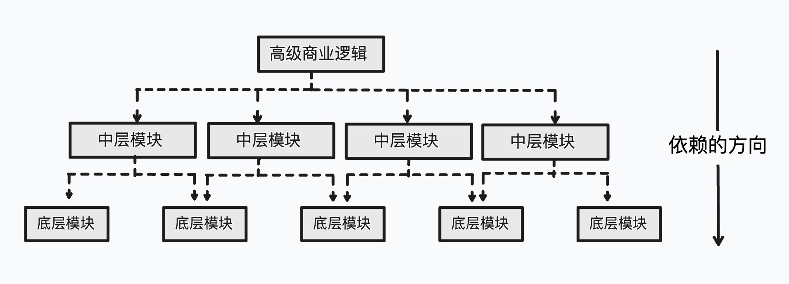
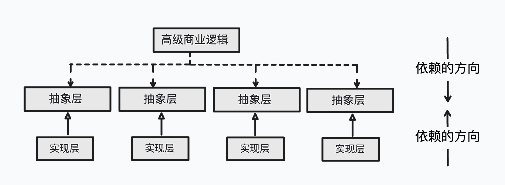

实现“开-闭”原则的关键是抽象化，并且从抽象化导出具体化实现。如果说“开-闭”原则是面向对象设计的目标的话，依赖倒置原则就是这个面向对象设计的主要机制。

# 为何而“倒转”
传统的过程性系统的设计办法倾向于使高层次依赖于低层次的模块；抽象层次依赖于具体层次。倒转原则是要把这个错误的依赖关系倒转过来，这就是“依赖倒转原则”的来由。

抽象层依赖于具体层次的含义是什么呢？抽象层次包含的是应用系统的商务逻辑和宏观的、对整个系统来说重要的战略性决定，是必然性的体现；而具体层次则含有一些次要的与实现有关的算法和逻辑，以及战术性的决定，带有相当大的偶然性选择。具体层次的代码是会经常有变动的，不能避免出现错误。抽象层次依赖于具体层次，使许多具体层次的细节的算法变化立即影响到抽象层次的宏观商务逻辑，导致微观决定宏观，战术决定战略，偶然决定必然。如下图所示：


依赖倒转原则(Dependence Inversion Principle或简称为DIP)，就是要把错误的依赖关系再倒转过来，如下图：

>依赖倒转原则是COM/CORBA/JavaBean以及EJB等构建设计模型背后的基本原则。

# 复用与可维护性的“倒转”
从复用的角度来看，高层次的模块是设计者应当复用的。但是在传统的过程性设计中，复用却侧重于具体层次模块的复用，比如算法的复用、数据结构的复用、函数库的复用等，都不可避免是具体层次模块里面的复用。较高层次的结构依赖于较低层次的结构，较低层次的结构又进一步依赖于更低层次的结构，如此继续，直到依赖于每一行的代码。较低层次上的修改，会造成较高层次的修改，直到高层次逻辑的修改。

同样，传统的做法也强调具体层次上的可维护性，包括一个函数、数据结构等的可维护性，而不是高级层次上的可维护性。

从复用的意义上讲，既然抽象层次含有一个应用系统最重要的宏观商务逻辑，是做战略性判断和决定的地方，那么抽象层次就应当是较为稳定的，应当是复用的重点。由于现有的复用侧重于具体模块和细节的复用，因此“倒转”一词则是指复用应当将复用的重点放在抽象层次上。如果抽象层次的模块相对独立于具体层次的模块的话，那么抽象层次的模块的复用便是相对较为容易的了。

# 依赖倒转原则
## 依赖（或者耦合）关系
- 零耦合(Nil Coupling)关系：如果两个类没有耦合关系，就称之为零耦合。
- 具体耦合(Concrete Coupling)关系：具本性耦合发生在两个具体的（可实例化的）类之间，经由一个类对另一个具体类的直接引用造成
- 抽象耦合(Abstract Coupling)关系：抽象耦合关系发生在一个具体类和一个抽象类（或者Java接口）之间，使两个必须发生关系的类之间存有最大的灵活性。

# 什么是依赖倒转原则
简单地说，依赖倒转原则(Dependency Inversion Principle)要求客户端依赖于抽象耦合。依赖倒转原则的表述是：
- 表述1：抽象不应该依赖于细节；细节应当依赖于抽象。(Abstractions should not depend upon details.Details should depend upon abstractions)
- 表述2：要针对接口编程，不要针对实现编程。（Program to an interface, not an implementation)

针对接口编程的意思就是说，应当使用Java接口和Java抽象类进行变量的类型声明、参量的类型声明、方法的返还类型声明，以及数据类型的转换等。

不要针对实现编程的意思就是说，不应当使用Java具体类进行变量的类型声明、参量的类型声明、方法的返还类型声明，以及数据类型的转换等。

<font color=red>**要保证做到这一点，一个具体类应当只实现接口和抽象类中声明过的方法，而不应当给出多余的方法。**</font>

倒转依赖关系强调一个系统内的实体之间关系的灵活性。基本上，如果设计师希望遵守“开-闭”原则，那么倒转依赖原则便是达到要求的途径。

# 变量的静态类型和真实类型
变量被声明时的类型叫做变量的静态类型(Static Type)，有些地方把静态类型叫做明显类型(Apparent Type)，变量所引用的对象的真实类型叫做变量的实际类型(Actual Type)。例如：
```java
List employees = new Vector();
```
`Vector`是一个具体类（实际类型），而`List`是一个接口（静态类型）。

# 引用对象的抽象类型
在很多情况下，一个Java程序需要引用一个对象。这个时候，如果这个对象有一个抽象类型的话，应当使用这个抽象类型作为变量的静态类型。这就是针对接口编程的含义。

