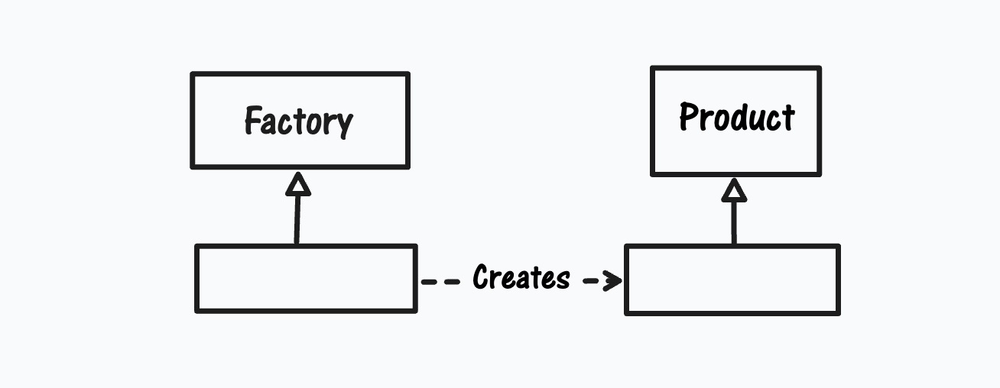
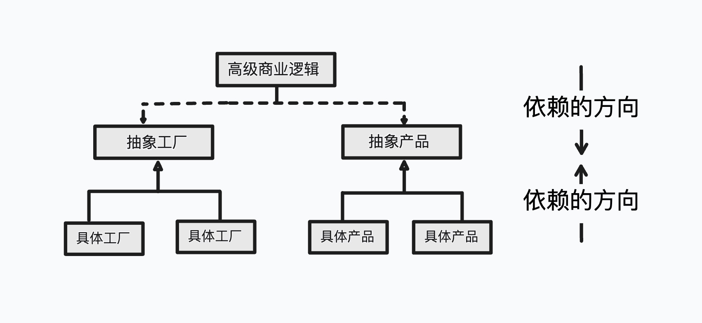
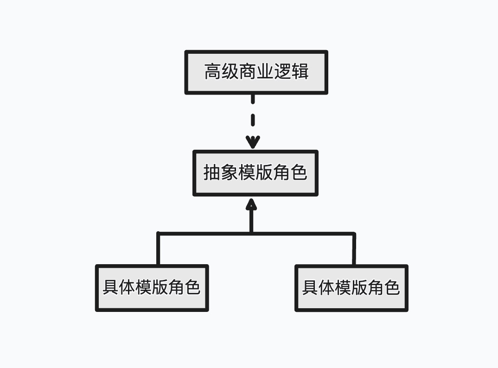
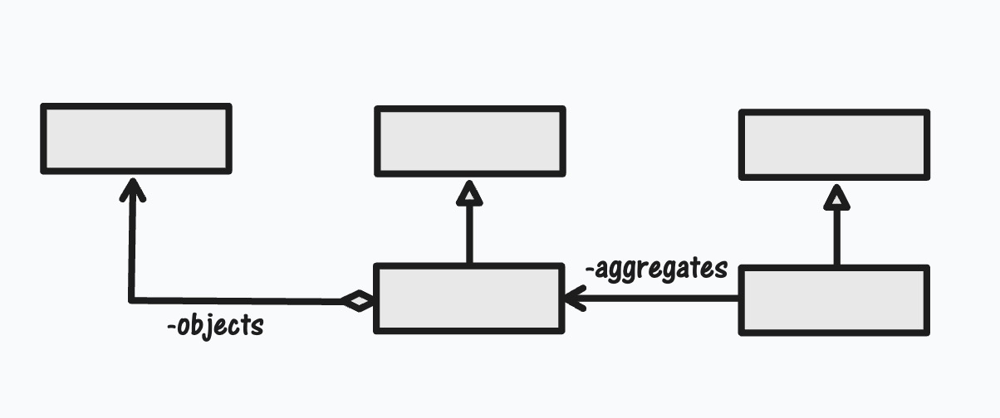
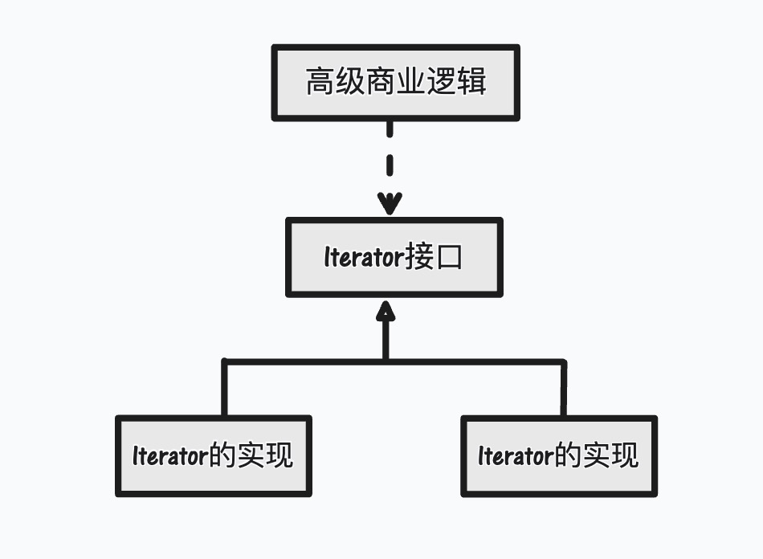

# 前言
以抽象方式耦合是依赖倒转原则的关键。由于抽象耦合关系总要涉及具体类从抽象类继承，并且需要保证任何引用到基类的地方都可以改换成其子类，因此里氏代换原则是依赖倒转原则的基础。

在抽象层次上的耦合虽然有灵活性，但也带来了额外的复杂性。在某些情况下，如果一个具体类发生变化的可能性非常小，那么抽象耦合能发挥的好处便十分有限，这时使用具体耦合反而会更好。

依赖倒转原则是`OO`设计的核心原则，设计模式的研究和应用是以依赖倒转原则为指导原则的。下面就举几个设计模式的例子加以说明。

# 工厂方法模式
正如前面所谈到的，应当使消费一个对象的客户端只依赖于对象的抽象类型，而不是它的具体类型。但是`Java`语言要求在将一个（具体）类实例化的时候，必须调用这个具体类的构造子，所以`Java`语言给出的类的实例化方法无法做到只依赖于抽象类型。

但是设计模式给出了解决这个问题的可行方案，其中最重要的方案就是工厂模式。工厂方法模式是几个工厂模式中最为典型的一个，下图所示就是工厂方法模式的简略类图。

工厂模式将创建一个类的实例的过程封装起来，消费这个实例的客户端仅仅得到实例化的结果，以及这个实例的抽象类型。当然，任何方法都无法回避`Java`语言所要求的`new`关键字和直接调用具体类的构造子的做法。简单工厂模式将这个违反“开-闭”原则以及依赖倒转原则的做法封装到一个类里面，而工厂方法模式将这个违反原则的做法推迟到了具体工厂角色中，如下图所示：

这样，通过适当地封装，工厂模式可以净化大部分的结构，而将违反原则的做法孤立到易于控制的地方。

# 模版方法模式
在模版方法模式里面，有一个抽象类将重要的宏观逻辑以`具体方法`以及`具体构造子`的形式实现，然后声明一些抽象方法来迫子类实现剩余的具体细节上的逻辑。不同的子类可以以不同的方式实现这些抽象方法，从而对**剩余的逻辑**有不同的实现。模版方法模式支持依赖倒转原则，如下图所示。

具体子类不能影响抽象类的宏观逻辑，而抽象逻辑的改变则会导致细节逻辑的改变。

# 迭代子模式
迭代子模式用一个工厂方法向客户端提供一个聚集的内部迭代功能，客户端得到的是一个`Iterator`抽象类型，并不知道迭代子的具体实现以及聚集对象的内部结构。迭代子模式的简略类图如下图所示。

这样一来，聚集的内部结构的改变就不会波及到客户端，从而实现了对抽象接口的依赖，如下图所示。
