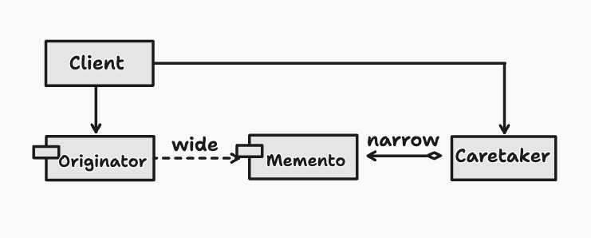
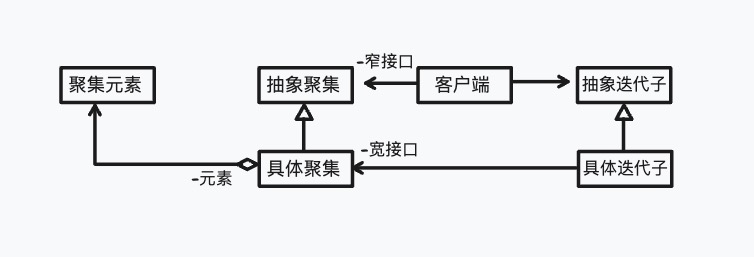

# 引言
接口隔离原则(Interface Segregation Principle, 常常缩写做ISP)，讲的是：使用多个专门的接口比使用单一的总接口要好。换言之，从一个客户类的角度来讲：一个类对另外一个类的依赖性应当是建立在最小的接口上的。

# 什么是接口隔离原则
正如本书在“专题：Java接口”一章中所指出的那样，人们所说的“接口”往往是指两种不同的东西：一种是指Java语言中的有严格定义的Interface结构，比如java.lang.Runnable就是一个Java接口；另一种就是一个类型所具有的方法特征的集合，也称做“接口”，但仅是一种逻辑上的抽象。对应这两种不同的用词，接口隔离原则的表达方式以及含义都有所不同。

## 角色的合理划分
将“接口”理解为一个类所提供的所有方法的特征集合，也就是一种在逻辑上才存在的概念。这样的话，接口的划分就直接带来类型的划分。

一个接口相当于剧本中的一种角色，而此角色在一个舞台上由哪一个演员来演则相当于接口的实现。因此，一个接口应当简单地代表一个角色，而不是多个角色。如果系统涉及到多个角色的话，那么每一个角色都应当由一个特定的接口代表。

为了避免混淆，本书将这种角色划分的原则叫做角色隔离原则。

## 定制服务
将接口理解成为狭义的Java接口，这样一来，接口隔离原则讲的就是为同一个角色提供宽、窄不同的接口，以对付不同的客户端，如下图所示。这种办法在服务行业中叫做定制服务(Customized Service)，这也是本书给这种诠释的一个名字。



classDiagram
class IService1 {
	<<interface>>
}
IService1: +m1()
IService1: +p2()

class IService2 {
	<<interface>>
}
IService2: +m2()
IService2: +p1()

class IService3 {
	<<interface>>
}
IService3: +m1()
IService3: +p1()
IService3: +p2()

IService1 <|-- Service
IService2 <|-- Service
IService3 <|-- Service

Client1 --> IService1
Client2 --> IService2
Client3 --> IService3

Service: +m1()
Service: +m2()
Service: +p1()
Service: +p2()



在上面的示意性类图中，有一个角色Service以及三个不同的客户端。这三个客户端需要的服务都是稍稍不同的，因此系统分别为它们提供了三个不同的Java接口，即IService1，IService2以及IService3。显然，每一个Java接口都仅将客户端需要的接口暴露给客户端，而没有将客户端不需要的行为放到接口中。熟悉适配器模式的读者可以辨认出，这是适配器模式的应用。

## 接口污染
过于臃肿的接口是对接口的污染(Interface Contamination)。

由于每一个接口都代表一个角色，实现一个接口的对象，在它的整个生命周期中都扮演这个角色，因此将角色区分清楚就是系统设计的一个重要工作。因此，一个符合逻辑的推断，不应当将几个不同的角色都交给同一个接口，而应当交给不同的接口。

一个没有经验的设计师往往想节省接口的数目，因此将一些看上去差不多的接口合并。一些人将这看做是代码优化的一部分，这是错误的。

准确而恰当地划分角色以及角色所对应的接口，是面向对象的设计的一个重要的组成部分。将没有关系的接口合并在一起，形成一个臃肿的大接口，是对角色和接口的污染。

## 现迪米特法则的关系
迪米特法则要求任何一个软件实体，除非绝对需要，不然不要与外界通信。即使必须进行通信，也应当尽量限制通信的广度和深度。

显然，定制服务原则拒绝向客户提供不需要提供的行为，是符合迪米特法则的。

# 一个角色隔离原则的例子
本节从代码重构的角度讨论怎样将一个臃肿的角色重新分割成更为合适的较小角色。
## 全文查询引擎的系统设计
本章在这里以一个网站的全文查询引擎的系统设计为例，这个例子取材自一个真实的项目，如果读者使用过AltaVisa公司的文字搜索引擎软件包的话，就会很熟悉本例子的情形。一个动态的资料网站将大量的文件资料存储在文件中或关系数据库里面，用户可以通过输入一个或数个关键词进行全文搜索。这个搜索引擎需要维持一个索引库，在本例子里面索引库以文本文件方式存于文件系统中。在源数据被修改、删除或增加时，搜索引擎要做相应的动作，以保证引擎的索引文件也被相应地更新。
## 反面例子
首先，下图所示为一个不好的解决方案。一个叫做BadExample的接口负责所有的操作，从提供搜索功能到建立索引的功能，甚至包括搜索结果集合的功能均在一个接口内提供。



classDiagram

class Client {
   -indexCursor:Indexer 
   -searcher:Searcher
}

class BadExample {
    <<interface>>
    +first():void
    +last():void
    +next():void
    +previous():void
    +getExcerpt():String
    +getFullRecord():String
    +reIndexAll():void
    +updateIndex():void
    +search(keywords:String[]):void
    +getResultset():void
}

Client o--> BadExample



这个解决方案违反了角色分割原则，把不同功能的接口放在一起，由一个接口给出包括搜索器角色、索引生成器角色以及搜索结果集角色在内的所有角色。

## 角色的分割
那么，遵守接口隔离原则的做法是怎么样的呢？如下图所示：


classDiagram
class Indexer {
    <<interface>>
    +reIndexAll():void
    +updateIndex():void
}
class Searcher {
    <<interface>>
    +search(keywords:String[]):void
    +getResultset():void
}
class FileIndexer {
    +reIndexAll():void
    +updateIndex():void
}
class RdbIndexer {
    +reIndexAll():void
    +updateIndex():void
}
FileIndexer ..|>Indexer
RdbIndexer ..|>Indexer
class Resultset {
    <<interface>>
    +first():void
    +last():void
    +next():void
    +previous():void
    +getExcerpt():String
    +getFullRecord():String
}

Searcher o--> Resultset

class Client {
    -indexCursor:Indexer
    -searcher:Searcher
}

Client o-->Indexer
Client o--Searcher



在图中可以看出，搜索引擎的功能被分割为三个角色：
- 搜索器角色
- 索引生成器角色
- 搜索结果集角色

以索引生成器角色为例，由于索引生成因数据的格式不同而不同，故分为RdbIndexer和FileIndexer两种实现。FileIndexer类代表诸如*.txt、*.html、 *.html、 *.doc 以及 *.pdf等文件类型的数据生成全文索引，而RdbIndexer则针对关系数据库的数据进行全文索引生成。这两个实现扮演的同为索引生成器角色，就好像扮演同样角色的两个不同演员一样。

搜索器角色则是与索引生成器角色完全不同的角色，它提供用户全文搜索功能。用户传进一些关键字，搜索器角色则返回一个Resultset对象。

搜索结果集角色就是Resultset。它给用户提供对集合进行迭代走访的功能，如first()将光标移到集合的第一个元素；last()将光标移到集合的最后一个元素；next()将光标移到集合的下一个元素；previous()将光标移到集合的前一个元素；而getExerpt()则返回当前记录的摘要；而getFullRecord()则将记录的全文返回。

# 定制服务的例子
定制服务(Customized Service)也是一个重要的设计原则。它的意思是说，如果客户端仅仅需要某一些方法的话，那么就应当向客户端提供这些需要的方法，而不要提供不需要的方法。

这样做的效果是什么呢？
- 这样做很整洁。从美学的角度上考虑，这是一个很好的做法。从这样的一个设计可以看出，设计师花了很多的时间在分析和划分这些接口上面。但是这并不是最重要的效果，没有人会仅仅因为美学效果而将这一原则当作面向对象的设计原则。
- 系统的可维护性。向客户端提供public接口是一种承诺，一个public接口一旦提供，就很难撤回。作为软件提供商，没有人愿意做出过多的承诺，特别是不必要的承诺。过多的承诺会给系统的维护造成不必要的负担。如果这些接口仅仅是提供给公司内部的系统使用，那么将这些接口隔离开来，也可以降低维护的成本。因为如果一旦所提供的服务出现变化的话，设计师知道哪些客户端会受到影响，哪些不会受到影响。这显然也是符合迪米特法则的。

## 备忘录模式
备忘录模式(Memento Pattern)的用意是在不破坏封装的条件下，捕捉一个对象的状态，并将之外部化，从而可以在将来合适的时候把这个对象还原到存储起来的状态。备忘录模式的简略类图如下所示：

在这里，不破坏封装是一个关键词。为了做到这一点，必须使备忘录对象向外界提供双重接口，也即一个窄接品和一个宽接口。

宽接口是为发起人角色准备的，因为这个备忘录角色所存储的状态就是属于这个发起人角色的，而且这个角色需要访问备忘录角色所存储的信息以便恢复自己的状态。

窄接口是为包括负责人角色在内的所有其它对象准备的，因为它们不需要、也不应该读取备忘录角色所存储的信息。

换言之，发起人角色和负责人角色就相当于备忘录角色的不同客户端，而这种为不同客户端提供不同接口的做法就是定制服务概念的体现。

## 迭代子模式
迭代子模式提供一个迭代子对象，使得客户端可以顺序地访问一个聚集中的元素，而不必暴露聚集的内部表象。迭代子模式的示意图如下所示：

换言之，上面的这个系统的客户端和系统内部的迭代子对象都需要访问聚集对象，但是它们所需要的访问性质有所不同。前者仅需要通过一个迭代子接口遍历聚集元素，而迭代子对象则需要知道聚集对象的内部结构信息。

因此，聚集对象向不同的客户端提供不同的接口，一个是宽接口，提供给迭代子对象；另一个是窄接口，提供给系统的客户端。