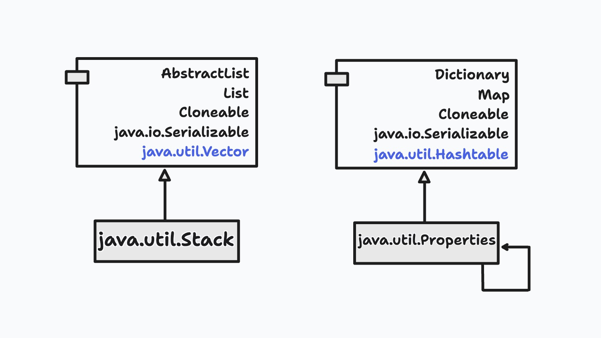

# 合成/聚合复用原则(CARP)
合成/聚合复用原则(Composite/Aggregate Reuse Principle, 或CARP)，经常又叫作合成复用原则(Composite Reuse Principle或CRP)。合成/聚合复用原则就是在一个新的对象里面使用一些已有的对象，使之成为新对象的一部分：新的对象通过向这些对象的委派达到复用已有功能的目的。

这个设计原则有另一个更简短的表述：要尽量使用合成/聚合，尽量不要使用继承。

合成(Composite)一词的使用很广泛，经常导致混淆。为避免这些混淆，不妨先来考察一下“合成”与“聚合”的区别。

## 合成和聚合的区别
合成(Composition)和聚合(Aggregation)均是关联(Association)的特殊种类。聚合用来表示“拥有”关系或者整体与部分的关系；而合成则用来表示一种强得多的“拥有”关系。在一个合成关系里，部分和整体的生命周期是一样的。一个合成的新的对象完全拥有对其组成的支配权，包括它们的创建和湮灭等。使用程序语言的术语来讲，组合而成的新对象对组成部分的内存分配、内存释放有绝对的责任。

更进一步来讲，一个合成的多重性(Multiplicity)不能超过1，换言之，一个合成关系中的成分对象是不能与另一个合成关系共享的。一个成分对象在同一时间内只能属于一个合成关系。如果一个合成关系湮灭了，那么所有的成分对象要么自己湮灭所有的成分对象(这种情况较为普通)，要么就得将这一责任交给别人（这种情况较为罕见）。

用C程序员较易理解的语言来讲，合成是值的聚合(Aggregation by Value), 而通常所说的聚合则是引用的聚合(Aggreation by Reference)。

## 复用的基本种类
在面向对象的设计里，有两种基本的办法可以在不同的环境中复用已有的设计和实现，即通过合成/聚合或通过继承。那么这两种不同的复用方式在可维护性上面有何区别呢？

### 合成/聚合复用
由于合成或聚合可以将已有的对象纳入到新对象中，使之成为新对象的一部分，因此新的对象可以调用已有对象的功能。这样做有下面的好处：
- 新对象存取成分对象的惟一方法是通过成分对象的接口。
- 这种复用是黑箱复用，因为成分对象的内部细节是新对象所看不见的。
- 这种复用支持包装。
- 这种复用所需要的依赖较少。
- 每一个新的类可以将焦点集中在一个任务上。
- 这种复用可以在运行时间内动态进行，新对象可以动态地引用与成分对象类型相同的对象。
一般而言，如果一个角色得到了更多的责任，那么可以使用用合成/聚合关系将新的责任委派到合适的对象。

当然，这种复用也有缺点。其中最主要的缺点就是通过使用这种复用建造的系统会有较多的对象需要管理。

### 通过继承达到复用的目的
合成/聚合作为复用的手段可以应用到几乎任何环境中去。而与合成/聚合不同的是，继承只能应用到很有限的一些环境中去。换言之，尽管继承是一种非常重要的复用手段，但是设计师应当首先考虑使用合成/聚合，而不是继承。

#### 继承的种类
继承是面向对象的语言特有的复用工具，而且是最容易被滥用的复用工具。这里讨论的继承，是指从一个Java类到另一个Java类的实现性继承，也就是实现继承，并不包括接口继承。一个实现继承的例子如下图：



classDiagram

蛋 <|-- 鸡



继承复用通过扩展一个已有对象的实现来得到新的功能，基类明显地捕获共同的属性和方法，而子类通过增加新的属性和方法来扩展超类的实现。继承是类型的复用，比如下面都是继承的例子：
- 男人和女人是人类
- 上推排序(Bubble Sort)是排序程序的一种
- 汽车驾照是官方文件的一种
- 正式雇员和临时雇员均是雇员的一种
- 经理是正式雇员的一种

在面向对象的设计理论早期，设计师十分热衷于继承，好像继承就是最好的复用手段。随着时间的推移和实践经验的积累，人们逐渐认识到了继承关系的缺点。

#### 继承复用的优点
利用继承关系达到复用的做法有下面的优点：
- 新的实现较为容易，因为超类的大部分功能可以通过继承关系自动进入子类。
- 修改或扩展继承而来的实现较为容易
#### 继承复用的缺点
与合成/聚合复用不同的是，继承有多个缺点：
- 继承复用破坏包装，因为继承将超类的实现细节暴露给子类。由于超类的内部细节常常是对子类透明的，因此这种复用是透明的复用，又称“白箱”复用。
- 如果超类的实现发生改变，那么子类的实现也不得不发生改变。因此，当一个基类发生改变时，这种改变会像水中投入石子引起的水波一样，将变化一圈又不圈地传导到一级又一级的子类，使设计师不得不相应地改变这些子类，以适应超类的变化。
- 从超类继承而来的实现是静态的，不可能在运行时间内发生改变，因此没有足够的灵活性。
  
由于以上的这些缺点，尽量使用合成/聚合而不是继承来达到对实现的复用，是非常重要的设计原则。

## 从代码重构的角度理解
在很多情况下，缺乏经验的Java设计师之所以选择继承关系描述两个类之间的关系，是因为对继承关系的理解不够造成的。而要正确地使用继承关系，必须透彻地理解里氏代换原则和Coad法则。

一般来说，对违反里氏代换原则的设计进行重构时，可以采取两个办法：一是加入一个抽象超类，这一办法已经在本书的“里氏代换原则”一章中讨论过了；二是将继承关系改写合成/聚合关系，这一点是本章讨论的重点。

### 区分“Has-A”与“Is-A”
“Is-A”是严格的分类学意义上的定义，意思是一个类是另一个类的“一种”。而”Has-A“则不同，它表示某一个角色具有某一项责任。

导致错误地使用继承而不是合成/聚合的一个常见的原因是错误地把”Has-A“当作”Is-A“。”Is-A“代表一个类是另一个类的一种；”Has-A“代表一个类是另一个类的一个角色，而不是另一个的一个特殊种类。这就是Coad条件的第一条。

请考虑一下下图所示的类图中所描述的例子。”人“被继承到”雇员“、”经理“、“学生”等子类。而实际上，“雇员”、“经理”和“学生”分别描述一种角色，而“人”可以同时有几种不同的角色。比如，一个“人”既然是“经理”，就必然是“雇员”；而此“人”可能同时还参加MBA课程，从而也是一个“学生”。使用继承来实现角色，则只能使每一个“人”具有“Has-A”角色，而且继承是静态的，这会使得一个“人”在成为“雇员”身份后，就永远为“雇员”，不能称为“经理”或“学生”，而这显然是不合理的。



classDiagram

人 <|-- 雇员
人 <|-- 经理
人 <|-- 学生



这一错误的设计源自把“角色”的等级结构与“人”的等级结构混淆起来，把Has-A角色误解为Is-A角色。因此要纠正这一错误，关键是区分“人”和“角色”的区别。下图所示的设计就正确地做到了这一点。



classDiagram
角色 <|-- 雇员
角色 <|-- 经理
角色 <|-- 学生
人 "1" *--> "*" 角色



从上图可以看出，每一个“人”都可以有一个以上的“角色”，所以一个人可以同时是“雇员”，又是“经理”，甚至同时又是“学生”。而且由于“人”与“角色”的耦合是通过合成的，因此，角色可以有动态的变化。一个“人”可以开始是一个“雇员”，然后晋升为“经理”，然后又由于他参加了MBA课程，又成为了“学生”。

这就是说，当一个类是另一个类的角色时，不应当使用继承描述这种关系。

### 与里氏代换原则联合使用
里氏代换原则是继承复用的基石。如果在任何使用B类型的地方都可以使用S类型，那么S类型才能称为B类型的子类型（Subtype），而B类型才能称为S类型的基类型（Base Type）。

换言之，只有当每一个S在任何情况下都是一种B的时候，才可以将S设计成为B的子类。如果两个类的关系是"Has-A“关系而不是”Is-A“关系，这两个类一定违反了里氏代换原则。

只有两个类满足里氏代换原则，才有可能是”Is-A“关系。

### Java语言API中的例子
在Java语言的API中，有几个明显违反这一原则的例子，其中最为著名的就是Stack和Properties。前者被不当地设置为Vector的子类，而Properties被不恰当地设置成Hashtable的子类，

一个Stack不是一个Vector，所以Stack不应当设置成为Vector的子类。同样地，一个性质列（Properties）也不是一个Hashtable。在两种情况下，使用聚合比使用继承关系更合适。

由于Properties继承了Hashtable的行为，因而当p是一个Properties类型的对象时，`p.getProperties(key)`和`p.get(key)`就会给出不同的结果。前者来自于Properties本身，因此会利用默认值；而后者则来自于Hashtable，因此不会利用默认值。

更糟糕的是，由于Properties是Hashtable的子类，因此，客户端可以通过类型的转换，直接使用超类型的行为。比如，Properties假定所有的键和值都是String类型的，如果不是，就会导致运行崩溃。但是，客户端完全可以通过Hashtable提供的行为加入任意类型的键和值。绕过Properties的接口，并导致Properties的内部矛盾和崩溃。

这样一来，Properties其实仅仅是有一些Hashtable的属性的，换言之，这是一个"Has-A”的关系，而不是一个“Is-A”的关系。