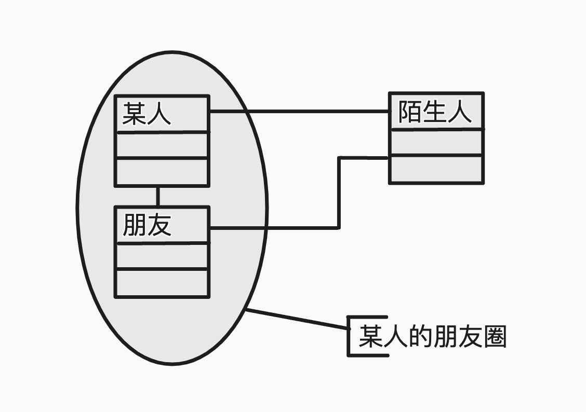
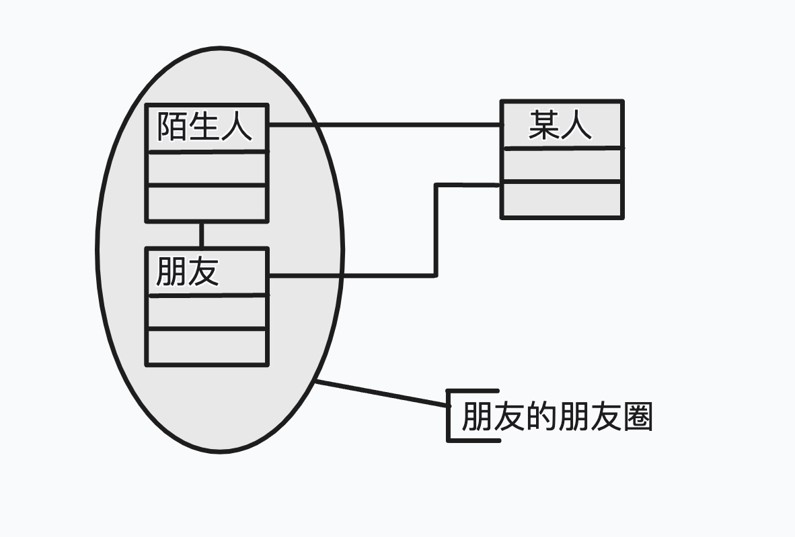
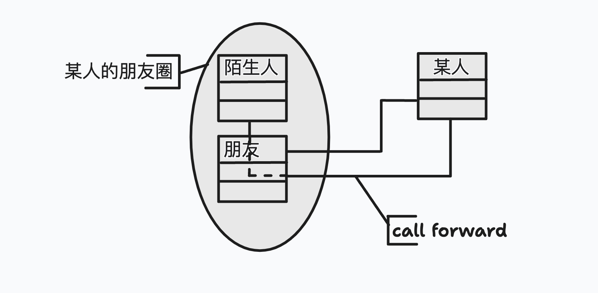
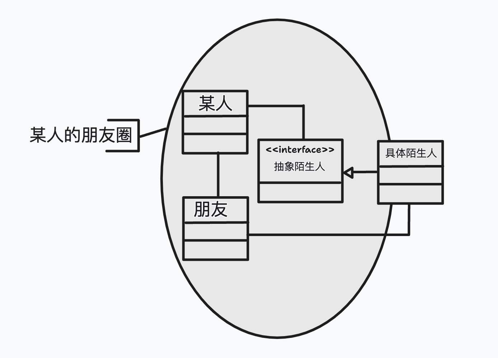
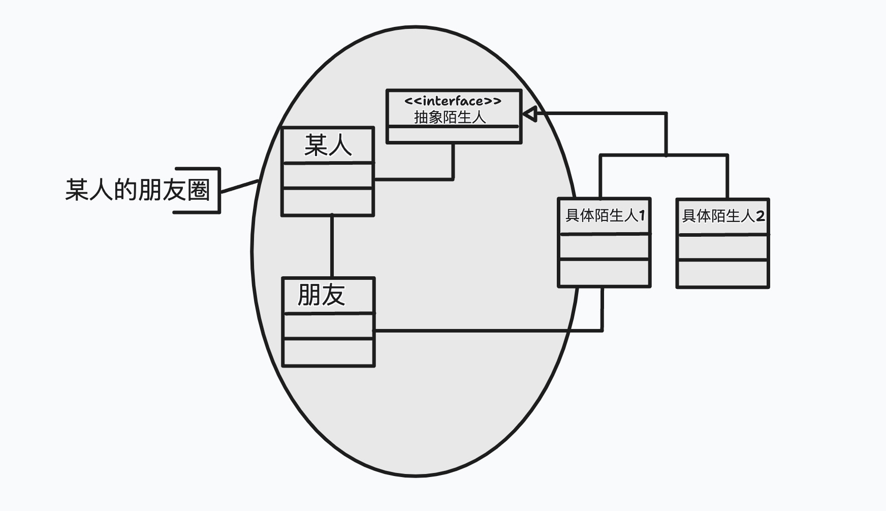

# 迪米特法则（LoD）
迪米特法则(Law of Demeter或简写为LoD)又叫做最少知识原则（Least Knowledge Principle或简写为LKP)，就是说，一个对象应当对其他对象有尽可能少的了解。

迪米特法则最初是用来作为面向对象的系统设计风格的一种法则，于1987年秋天由Ian Holland在美国东北大学（Northeastern University）为一个叫做迪米特（Demeter）的项目设计提出的，因此叫做迪米特法则。这条法则实际上是很多著名系统，比如火星登录软件系统、木星的欧罗巴卫星轨道飞船的软件系统的指导设计原则。

## 迪米特法则的各种表述
没有任何一个其它的OO设计原则像迪米特法则这样有如此之多的表述方式，下面给出的也只是众多的表述中较有代表性的几种：
- 只与你直接的朋友们通信（Only talk to your immediate friends)。
- 不要跟“陌生人”说话（Don't talk to strangers)。
- 每一个软件单位对其它的单位都只有最少的知识，而且局限于那些与本单位密切相关的软件单位

在上面的表述里面，什么是“直接”、“陌生”和“密切”则被有意地模糊化了，以便在不同的环境下可以有不同的解释。

## 狭义的迪米特法则
如果两个类不必彼此直接通信，那么这两个类就不应当发生直接的相互作用。如果其中的一个类需要调用另一个类的某一个方法的话，可以通过第三者转发这个调用。

### 朋友圈与陌生人
如下图所示，“某人”与一个“朋友”组成自己的朋友圈，两个人都需要与一个圈外的“陌生人”发生相互作用。

“朋友”与“陌生人”若是朋友，组成“朋友”的朋友圈如下图所示。

相比较之下，“某人”其实并不需要与“陌生人”直接发生相互作用，但是“朋友”则更需要与“陌生人”发生相互作用。这时候，迪米特法则建议“某人”不要直接与“陌生人”发生相互作用，而是通过“朋友”与之发生直接的相互作用，如下图所示。

这时候，“朋友”实际上起到了将“某人”对“陌生人”的调用转发给“陌生人”的作用。这种传递叫做调用转发（Call Forwarding）。所谓调用转发，需要隐藏“陌生人”的存在，使得“某人”仅知道“朋友”，而不知道“陌生人”；换言之，“某人”会认为他所调用的这个方法是“朋友”的方法。

### 朋友圈的确定
以下条件称为“朋友”条件：
- 当前对象本身（this）
- 以参量形式传入到当前对象方法中的对象
- 当前对象的实例变量直接引用的对象
- 当前对象的实例变量如果是一个聚集，那么聚集中的元素也都是朋友
- 当前对象所创建的对象

任何一个对象，如果满足上面的条件之一，就是当前对象的“朋友”；否则就是“陌生人”

### 不满足迪米特法则的系统
这里要讨论的系统由三个类组成，分别是Someone，Friend和Stranger。其中Someone与Friend是朋友，而Friend与Stranger是朋友。系统的结构图如下：



classDiagram

class Someone {
    +operation1():void
}

class Friend {
    -stranger:Stranger
    +operation2():void
    +provide():Stranger
}

class Stranger {
    +operation3():void
}

Someone ..> Friend

Friend o--> Stranger

Someone ..> Stranger



从上面的类图可以看出，Friend持有一个Stranger对象的引用，这就解释了为什么Friend与Stranger是朋友。为了解释为什么Someone与Friend是朋友，请参见这里给出的Someone的源码：
```java
public class Someone {
    public void operation1(Friend friend) {
        Stranger stranger = friend.provide();
        stranger.operation3();
    }
}
```
可以看出，Someone具有一个方法operation1()，这个方法接受Friend为参量。显然，根据“朋友”的定义，Friend是Someone的朋友。其中Friend的provide()方法会提供自己创建的Stranger的实例，代码如下：
```java
public class Friend {
    private Stranger stranger = new Stranger();
    public void operation2() {

    }
    public Stranger provide() {
        return stranger;
    }
}
```
显然，Someone的方法operation1()不满足迪米特法则。为什么呢？因为这个方法引用了Stranger对象，而Stranger对象不是Someone的朋友。

### 使用迪米特法则进行改造
可以使用迪米特法则对上面的例子进行改造，改造的做法就是调用转发。改造后的情况如下：


classDiagram

class Someone {
    +operation1():void
}

class Friend {
    -stranger:Stranger
    +operation2():void
    +forward():void
}

class Stranger {
    +operation3():void
}

Someone ..> Friend

Friend o--> Stranger


从上面的类图可以看出，与改造前相比，在Someone与Stranger之间的联系已经没有了。Someone不需要知道Stranger的存在就可以做同样的事情。Someone的源代码如下：
```java
public class Someone {
    public void operation1(Friend friend) {
        friend.forward();
    }
}
```
从源代码可以看出，Someone通过调用自己的朋友Friend对象的forward()方法做到了原来需要调用Stranger对象才能够做到的事情。那么这个forward()方法是做什么的呢？代码如下：
```java
public class Friend {
    private Stranger stranger = new Stranger();
    public void operation2() {
        System.out.println("In Friend.operation2()");
    }
    public void forward() {
        stranger.operation3();
    }
}
```
原来Friend类的forward()方法所做的就是以前Someone要做的事情，使用了Stranger的operation3()方法，而这种forward()方法叫做转发方法。由于使用了调用转发，使得调用的具体细节被隐藏在Friend内部，从而使Someone与Stranger之间的直接联系被省略掉了。这样一来，使得系统内部的耦合度降低。在系统的某一个类需要修改时，仅仅会直接影响到这个类的“朋友”们，而不会直接影响到其余部分。

### 狭义的迪米特法则的缺点
遵循狭义的迪米特法则会产生一个明显的缺点：会在系统里造出大量的小方法，散落在系统的各个角落。这些方法仅仅是传递间接的调用，因此与系统的商务逻辑无关。当设计师试图从一张类图看出总体的架构时，这些小的方法会造成迷惑和困扰。

遵循类之间的迪米特法则会使一个系统的局部设计简化，因为每一个局部都不会和远距离的对象有直接的关联。但是，这也会造成系统的不同模块之间的通信效率降低，也会使系统的不同模块之间不容易协调。

### 与依赖倒转原则互补使用
为了克服狭义的迪米特法则的缺点，可以使用依赖倒转原则，引入一个抽象的类型引用“抽象陌生人”对象，使“某人”依赖于“抽象陌生人”。换言之，就是将“抽象陌生人”变成朋友，如下图：


"某人“现在与一个抽象角色建立了朋友关系，这样做的好处是”朋友“可以随时将具体”陌生人“换掉。只要新的具体”陌生人“具有相同的抽象类型，那么”某人“就无法区分它们。这就允许”陌生人“的具体实现可以独立于”某人“而变化，如下图所示。
